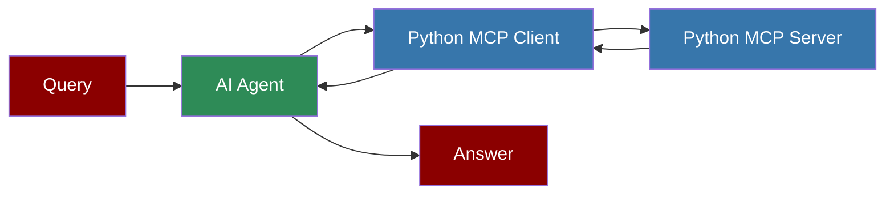

## Custom Python MCP Client



## Overview

The Custom Python MCP Client demonstrates how to integrate a custom Python MCP server with a PraisonAI agent. This client connects to a stock price MCP server to retrieve real-time stock information.

## Quick Start

<Steps>
    <Step title="Install Dependencies">
        Install the required packages:
        ```bash
        pip install praisonaiagents mcp
        ```
    </Step>
    <Step title="Set Up the Server">
        First, set up the Custom Python MCP Server.
    </Step>
    <Step title="Create Custom Python Client">
        Save the code above to a file named `custom-python-client.py`.
```python
from praisonaiagents import Agent, MCP

agent = Agent(
    instructions="""You are a helpful assistant that can check stock prices and perform other tasks.
    Use the available tools when relevant to answer user questions.""",
    llm="gpt-4o-mini",
    tools = MCP("/Users/praison/miniconda3/envs/mcp/bin/python /Users/praison/stockprice/custom-python-server.py")
)

# NOTE: Python Path replace with yours: /Users/praison/miniconda3/envs/mcp/bin/python
# NOTE: custom-python-server.py file path, replace it with yours: /Users/praison/stockprice/custom-python-server.py

agent.start("What is the stock price of Tesla?")
```
    </Step>
    <Step title="Run the Client">
        Execute the client script:
        ```bash
        python custom-python-client.py
        ```
    </Step>
</Steps>

<Note>
  **Requirements**
  - Python 3.10 or higher
  - praisonaiagents and mcp packages
  - A properly configured custom Python MCP server
  - OpenAI API key (for the agent's LLM)
</Note>

## Environment Variables

For better security and flexibility, you can modify the client to use environment variables:

```python
import os
from praisonaiagents import Agent, MCP

# Get paths from environment variables or use defaults
python_path = os.getenv("PYTHON_PATH", "/path/to/python")
server_path = os.getenv("SERVER_PATH", "/path/to/server.py")

agent = Agent(
    instructions="""You are a helpful assistant that can check stock prices and perform other tasks.
    Use the available tools when relevant to answer user questions.""",
    llm="gpt-4o-mini",
    tools=MCP(f"{python_path} {server_path}")
)

agent.start("What is the stock price of Tesla?")
```

This approach allows you to set the paths using environment variables:

```bash
export PYTHON_PATH=/Users/praison/miniconda3/envs/mcp/bin/python
export SERVER_PATH=/Users/praison/stockprice/app.py
```