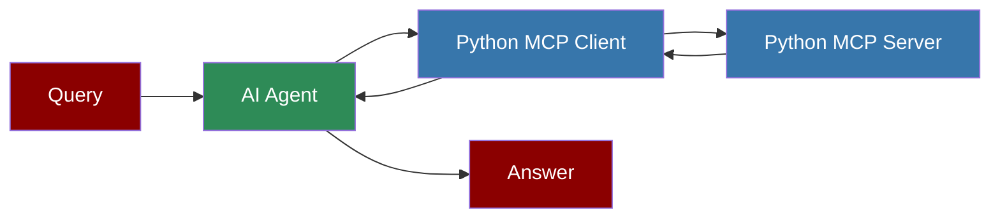

## Custom Python MCP Server



## Overview

The Custom Python MCP Server is a simple implementation of the Model Context Protocol (MCP) that provides stock price information using the yfinance library. This server can be used with PraisonAI agents to retrieve real-time stock prices.

## Server Implementation

Below is the complete implementation of the custom Python MCP server:


## Quick Start

<Steps>
    <Step title="Install Dependencies">
        Install the required packages:
        ```bash
        pip install yfinance mcp
        ```
    </Step>
    <Step title="Save the Server Code">
        Save the code above to a file named `custom-python-server.py`.
```python
import yfinance as yf
from mcp.server.fastmcp import FastMCP

mcp = FastMCP("stock_prices")

@mcp.tool()
async def get_stock_price(ticker: str) -> str:
    """Get the current stock price for a given ticker symbol.
    
    Args:
        ticker: Stock ticker symbol (e.g., AAPL, MSFT, GOOG)
        
    Returns:
        Current stock price as a string
    """
    if not ticker:
        return "No ticker provided"
    try:
        stock = yf.Ticker(ticker)
        info = stock.info
        current_price = info.get('currentPrice') or info.get('regularMarketPrice')
        if not current_price:
            return f"Could not retrieve price for {ticker}"
        return f"${current_price:.2f}"
        
    except Exception as e:
        return f"Error: {str(e)}"

if __name__ == "__main__":
    mcp.run(transport='stdio')
```
    </Step>
</Steps>

<Note>
  **Requirements**
  - Python 3.10 or higher
  - yfinance package
  - mcp package
</Note>
