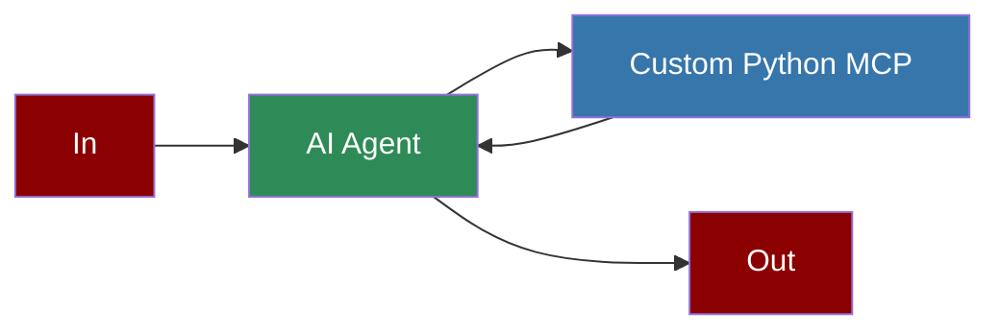

# Custom Python MCP Server



## Quick Start

<Steps>
    <Step title="Create MCP Server">
        Create a new file `app.py` with your custom MCP server implementation:
```python
import yfinance as yf
from mcp.server.fastmcp import FastMCP

mcp = FastMCP("stock_prices")

@mcp.tool()
async def get_stock_price(ticker: str) -> str:
    """Get the current stock price for a given ticker symbol.
    
    Args:
        ticker: Stock ticker symbol (e.g., AAPL, MSFT, GOOG)
        
    Returns:
        Current stock price as a string
    """
    if not ticker:
        return "No ticker provided"
    try:
        stock = yf.Ticker(ticker)
        info = stock.info
        current_price = info.get('currentPrice') or info.get('regularMarketPrice')
        if not current_price:
            return f"Could not retrieve price for {ticker}"
        return f"${current_price:.2f}"
        
    except Exception as e:
        return f"Error: {str(e)}"

if __name__ == "__main__":
    mcp.run(transport='stdio')
```
    </Step>

    <Step title="Install Dependencies">
        Install the required dependencies in a conda environment:
        ```bash
        pip install yfinance mcp
        ```
    </Step>

    <Step title="Create Agent Integration">
        Create a new file `stock_agent.py` with the following code:
```python
from praisonaiagents import Agent, MCP

agent = Agent(
    instructions="""You are a helpful assistant that can check stock prices and perform other tasks.
    Use the available tools when relevant to answer user questions.""",
    llm="gpt-4o-mini",
    tools = MCP("/path/to/python /path/to/app.py")
)

# NOTE: Replace with your actual Python path and app.py file path

agent.start("What is the stock price of Tesla?")
```
    </Step>

    <Step title="Run the Agent">
        Execute your script:
        ```bash
        python stock_agent.py
        ```
    </Step>
</Steps>

<Note>
  **Requirements**
  - Python 3.10 or higher
  - Conda for environment management
  - yfinance package for stock data
  - mcp-python-sdk for MCP server implementation
  - OpenAI API key (for the agent's LLM)
</Note>

## Features

<CardGroup cols={2}>
  <Card title="Custom Tools" icon="wrench">
    Create your own custom tools with Python.
  </Card>
  <Card title="MCP Integration" icon="plug">
    Seamless integration with Model Context Protocol.
  </Card>
  <Card title="Type Hints" icon="code">
    Strong typing for better code reliability.
  </Card>
  <Card title="Async Support" icon="bolt">
    Built-in support for asynchronous functions.
  </Card>
</CardGroup>

## Implementation Details

### FastMCP Class

The `FastMCP` class from the `mcp-python-sdk` package provides a simple way to create MCP servers in Python:

```python
from mcp.server.fastmcp import FastMCP

# Create an MCP server with a name
mcp = FastMCP("my_tools")

# Define a tool using the @mcp.tool decorator
@mcp.tool()
async def my_tool(param1: str, param2: int) -> str:
    """Tool description with clear documentation.
    
    Args:
        param1: Description of param1
        param2: Description of param2
        
    Returns:
        Description of the return value
    """
    # Tool implementation
    return f"Processed {param1} with {param2}"

# Run the server with stdio transport
if __name__ == "__main__":
    mcp.run(transport='stdio')
```

### Agent Integration

To use your custom MCP server with PraisonAI agents, use the `MCP` class to specify the command to run your Python script:

```python
from praisonaiagents import Agent, MCP

agent = Agent(
    instructions="Agent instructions",
    llm="gpt-4o-mini",
    tools=MCP(
        command="python",  # Or full path to Python
        args=["path/to/your/mcp_server.py"]  # Path to your MCP server script
    )
)
```
