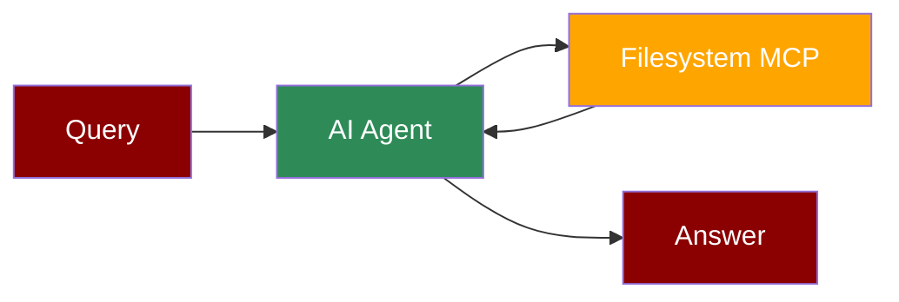

## Add Filesystem Tool to AI Agent



## Quick Start

<Steps>
    <Step title="Install Dependencies">
        Make sure you have Node.js installed, as the MCP server requires it:
        ```bash
        pip install praisonaiagents mcp
        ```
    </Step>
    <Step title="Set API Key">
        Set your OpenAI API key as an environment variable in your terminal:
        ```bash
        export OPENAI_API_KEY=your_openai_api_key_here
        ```
    </Step>

    <Step title="Create a file">
        Create a new file `filesystem_agent.py` with the following code:
        ```python
        from praisonaiagents import Agent, MCP
        import os

        # Define allowed directories for filesystem access
        allowed_dirs = [
            "/Users/username/Desktop",
            "/path/to/other/allowed/dir"
        ]

        # Use a single string command with allowed directories
        filesystem_agent = Agent(
            instructions="""You are a helpful assistant that can interact with the filesystem.
            Use the available tools when relevant to manage files and directories.""",
            llm="gpt-4o-mini",
            tools=MCP("npx -y @modelcontextprotocol/server-filesystem", args=allowed_dirs)
        )

        filesystem_agent.start("List files in the allowed directories")
        ```
    </Step>

    <Step title="Run the Agent">
        Execute your script:
        ```bash
        python filesystem_agent.py
        ```
    </Step>
</Steps>

<Note>
  **Requirements**
  - Python 3.10 or higher
  - Node.js installed on your system
  - OpenAI API key (for the agent's LLM)
  - Read/write access to the specified directories
</Note>
