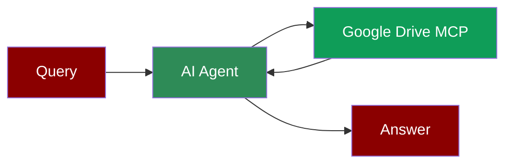

## Add Google Drive Tool to AI Agent



## Quick Start

<Steps>
    <Step title="Install Dependencies">
        Make sure you have Node.js installed, as the MCP server requires it:
        ```bash
        pip install praisonaiagents mcp
        ```
    </Step>
    <Step title="Set up Google Drive Credentials">
        Set your Google Drive credentials path as an environment variable in your terminal:
        ```bash
        export GDRIVE_CREDENTIALS_PATH=path/to/your/gcp-oauth.keys.json
        export OPENAI_API_KEY=your_openai_api_key_here
        ```
    </Step>

    <Step title="Create a file">
        Create a new file `gdrive_agent.py` with the following code:
        ```python
        from praisonaiagents import Agent, MCP
        import os

        # Get the credentials path from environment
        gdrive_credentials = os.getenv("GDRIVE_CREDENTIALS_PATH", "servers/gcp-oauth.keys.json")

        # Use a single string command with Google Drive configuration
        gdrive_agent = Agent(
            instructions="""You are a helpful assistant that can interact with Google Drive.
            Use the available tools when relevant to manage files and folders.""",
            llm="gpt-4o-mini",
            tools=MCP("npx -y @modelcontextprotocol/server-gdrive",
                    env={"GDRIVE_CREDENTIALS_PATH": gdrive_credentials})
        )

        gdrive_agent.start("List files in my Google Drive")
        ```
    </Step>

    <Step title="Run the Agent">
        Execute your script:
        ```bash
        python gdrive_agent.py
        ```
    </Step>
</Steps>

<Note>
  **Requirements**
  - Python 3.10 or higher
  - Node.js installed on your system
  - Google Drive API credentials (OAuth keys)
  - OpenAI API key (for the agent's LLM)
</Note>
