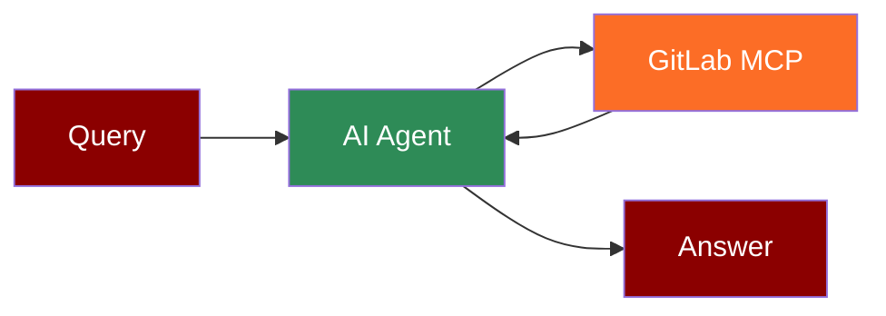

## Add GitLab Tool to AI Agent



## Quick Start

<Steps>
    <Step title="Install Dependencies">
        Make sure you have Node.js installed, as the MCP server requires it:
        ```bash
        pip install praisonaiagents mcp
        ```
    </Step>
    <Step title="Set API Keys">
        Set your GitLab credentials as environment variables in your terminal:
        ```bash
        export GITLAB_PERSONAL_ACCESS_TOKEN=your_gitlab_token_here
        export GITLAB_API_URL=https://gitlab.com/api/v4
        export OPENAI_API_KEY=your_openai_api_key_here
        ```
    </Step>

    <Step title="Create a file">
        Create a new file `gitlab_agent.py` with the following code:
        ```python
        from praisonaiagents import Agent, MCP
        import os

        # Use the API token and URL from environment or set directly
        gitlab_token = os.getenv("GITLAB_PERSONAL_ACCESS_TOKEN")
        gitlab_api_url = os.getenv("GITLAB_API_URL", "https://gitlab.com/api/v4")

        # Use a single string command with environment variables
        gitlab_agent = Agent(
            instructions="""You are a helpful assistant that can interact with GitLab.
            Use the available tools when relevant to answer user questions.""",
            llm="gpt-4o-mini",
            tools=MCP("npx -y @modelcontextprotocol/server-gitlab", 
                    env={
                        "GITLAB_PERSONAL_ACCESS_TOKEN": gitlab_token,
                        "GITLAB_API_URL": gitlab_api_url
                    })
        )

        gitlab_agent.start("List my GitLab projects")
        ```
    </Step>

    <Step title="Run the Agent">
        Execute your script:
        ```bash
        python gitlab_agent.py
        ```
    </Step>
</Steps>

<Note>
  **Requirements**
  - Python 3.10 or higher
  - Node.js installed on your system
  - GitLab Personal Access Token
  - OpenAI API key (for the agent's LLM)
</Note>
