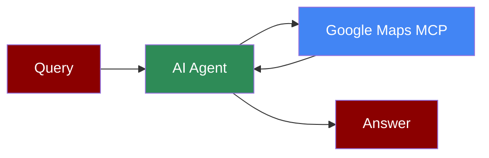

## Add Google Maps Tool to AI Agent



## Quick Start

<Steps>
    <Step title="Install Dependencies">
        Make sure you have Node.js installed, as the MCP server requires it:
        ```bash
        pip install praisonaiagents mcp
        ```
    </Step>
    <Step title="Set API Key">
        Set your Google Maps API key as an environment variable in your terminal:
        ```bash
        export GOOGLE_MAPS_API_KEY=your_google_maps_api_key_here
        export OPENAI_API_KEY=your_openai_api_key_here
        ```
    </Step>

    <Step title="Create a file">
        Create a new file `google_maps_agent.py` with the following code:
        ```python
        from praisonaiagents import Agent, MCP
        import os

        # Get the API key from environment
        maps_api_key = os.getenv("GOOGLE_MAPS_API_KEY")

        # Use a single string command with Google Maps configuration
        maps_agent = Agent(
            instructions="""You are a helpful assistant that can interact with Google Maps.
            Use the available tools when relevant to handle location-based queries.""",
            llm="gpt-4o-mini",
            tools=MCP("npx -y @modelcontextprotocol/server-google-maps",
                    env={"GOOGLE_MAPS_API_KEY": maps_api_key})
        )

        maps_agent.start("Find nearby restaurants in London")
        ```
    </Step>

    <Step title="Run the Agent">
        Execute your script:
        ```bash
        python google_maps_agent.py
        ```
    </Step>
</Steps>

<Note>
  **Requirements**
  - Python 3.10 or higher
  - Node.js installed on your system
  - Google Maps API key
  - OpenAI API key (for the agent's LLM)
</Note>
