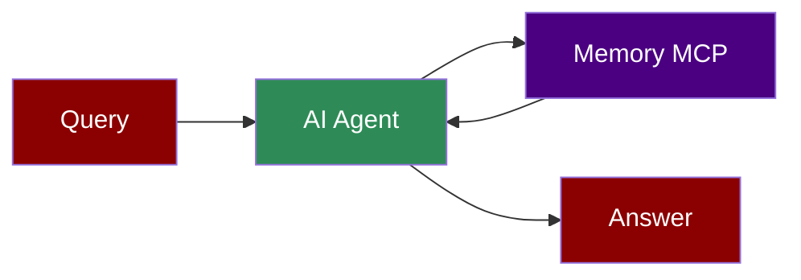

## Add Memory Tool to AI Agent



## Quick Start

<Steps>
    <Step title="Install Dependencies">
        Make sure you have Node.js installed, as the MCP server requires it:
        ```bash
        pip install praisonaiagents mcp
        ```
    </Step>
    <Step title="Set API Key">
        Set your OpenAI API key as an environment variable in your terminal:
        ```bash
        export OPENAI_API_KEY=your_openai_api_key_here
        ```
    </Step>

    <Step title="Create a file">
        Create a new file `memory_agent.py` with the following code:
        ```python
        from praisonaiagents import Agent, MCP
        import os

        # Get the memory file path from environment
        memory_file_path = os.getenv("MEMORY_FILE_PATH", "/path/to/custom/memory.json")

        # Use a single string command with Memory configuration
        memory_agent = Agent(
            instructions="""You are a helpful assistant that can store and retrieve information.
            Use the available tools when relevant to manage memory operations.""",
            llm="gpt-4o-mini",
            tools=MCP("npx -y @modelcontextprotocol/server-memory",
                    env={"MEMORY_FILE_PATH": memory_file_path})
        )

        memory_agent.start("Store this conversation in memory")
        ```
    </Step>

    <Step title="Run the Agent">
        Execute your script:
        ```bash
        python memory_agent.py
        ```
    </Step>
</Steps>

<Note>
  **Requirements**
  - Python 3.10 or higher
  - Node.js installed on your system
  - OpenAI API key (for the agent's LLM)
  - Write access to the specified memory file path
</Note>
