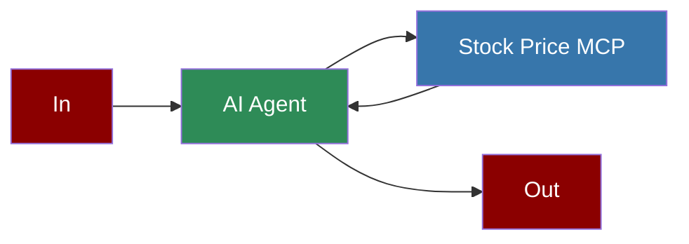

## Add Ollama Python Tool to AI Agent



## Quick Start

<Steps>
    <Step title="Set Up Ollama">
        Make sure you have Ollama installed and running locally:
        ```bash
        # Install Ollama from https://ollama.ai/
        # Pull the llama3.2 model
        ollama pull llama3.2
        ```
    </Step>

    <Step title="Create a file">
        Create a new file `ollama_stock.py` with the following code:
        ```python
        from praisonaiagents import Agent, MCP

        stock_agent = Agent(
            instructions="""You are a Stock Price Assistant.""",
            llm="ollama/llama3.2",
            tools=MCP("/Users/praison/miniconda3/envs/mcp/bin/python /Users/praison/stockprice/app.py")
        )

        # NOTE: Python Path replace with yours: /Users/praison/miniconda3/envs/mcp/bin/python
        # NOTE: app.py file path, replace it with yours: /Users/praison/stockprice/app.py

        stock_agent.start("What is the Stock Price of Apple?")
        ```
    </Step>

    <Step title="Install Dependencies">
        Make sure you have the required packages installed:
        ```bash
        pip install "praisonaiagents[llm]" yfinance mcp
        ```
    </Step>

    <Step title="Run the Agent">
        Execute your script:
        ```bash
        python ollama_stock.py
        ```
    </Step>
</Steps>

<Note>
  **Requirements**
  - Python 3.10 or higher
  - Ollama installed and running locally
  - yfinance and mcp packages installed
</Note>

## Features

<CardGroup cols={2}>
  <Card title="Local LLM" icon="server">
    Run models locally using Ollama without relying on external APIs.
  </Card>
  <Card title="Stock Data" icon="chart-line">
    Retrieve real-time stock price information using the yfinance library.
  </Card>
  <Card title="Python MCP" icon="python">
    Use Python-based MCP servers for custom tool functionality.
  </Card>
  <Card title="Privacy-Focused" icon="shield-alt">
    Keep sensitive data local with on-device inference.
  </Card>
</CardGroup>
