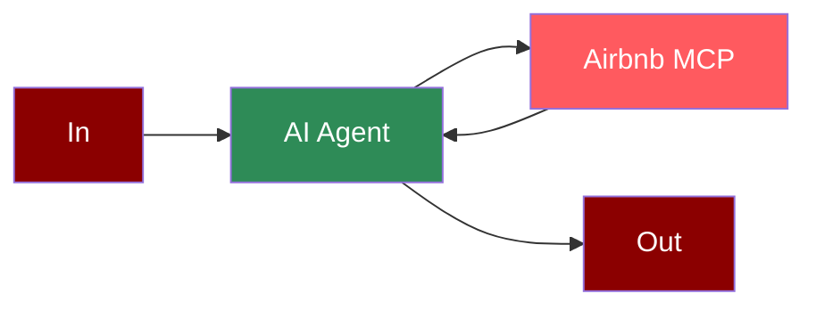

## Add Ollama Tool to AI Agent



## Quick Start

<Steps>
    <Step title="Set Up Ollama">
        Make sure you have Ollama installed and running locally:
        ```bash
        # Install Ollama from https://ollama.ai/
        # Pull the llama3.2 model
        ollama pull llama3.2
        ```
    </Step>

    <Step title="Create a file">
        Create a new file `ollama_airbnb.py` with the following code:
        ```python
        from praisonaiagents import Agent, MCP

        search_agent = Agent(
            instructions="""You help book apartments on Airbnb.""",
            llm="ollama/llama3.2",
            tools=MCP("npx -y @openbnb/mcp-server-airbnb --ignore-robots-txt")
        )

        search_agent.start("MUST USE airbnb_search Tool to Search. Search for Apartments in Paris for 2 nights. 04/28 - 04/30 for 2 adults. All Your Preference")
        ```
    </Step>

    <Step title="Install Dependencies">
        Make sure you have Node.js installed, as the MCP server requires it:
        ```bash
        pip install "praisonaiagents[llm]"
        ```
    </Step>

    <Step title="Run the Agent">
        Execute your script:
        ```bash
        python ollama_airbnb.py
        ```
    </Step>
</Steps>

<Note>
  **Requirements**
  - Python 3.10 or higher
  - Node.js installed on your system
  - Ollama installed and running locally
</Note>

## Features

<CardGroup cols={2}>
  <Card title="Local LLM" icon="server">
    Run models locally using Ollama without relying on external APIs.
  </Card>
  <Card title="MCP Integration" icon="plug">
    Seamless integration with Model Context Protocol.
  </Card>
  <Card title="Airbnb Search" icon="hotel">
    Search for accommodations on Airbnb with natural language queries.
  </Card>
  <Card title="Privacy-Focused" icon="shield-alt">
    Keep sensitive data local with on-device inference.
  </Card>
</CardGroup>
