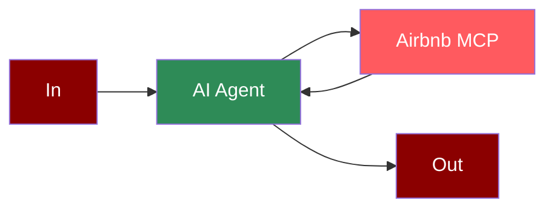

## Add OpenAI Tool to AI Agent



## Quick Start

<Steps>
    <Step title="Set API Key">
        Set your OpenAI API key as an environment variable in your terminal:
        ```zsh
        export OPENAI_API_KEY=your_openai_api_key_here
        ```
    </Step>

    <Step title="Create a file">
        Create a new file `openai_airbnb.py` with the following code:
        ```python
        from praisonaiagents import Agent, MCP
        import os

        # Get API key from environment variable
        openai_api_key = os.environ.get("OPENAI_API_KEY")

        search_agent = Agent(
            instructions="""You help book apartments on Airbnb.""",
            llm="gpt-4o-mini",
            tools=MCP(
                command="npx",
                args=["-y", "@openbnb/mcp-server-airbnb", "--ignore-robots-txt"],
                env={"OPENAI_API_KEY": openai_api_key}
            )
        )

        search_agent.start("I want to book an apartment in Paris for 2 nights. 03/28 - 03/30 for 2 adults")
        ```
    </Step>

    <Step title="Install Dependencies">
        Make sure you have Node.js installed, as the MCP server requires it:
        ```zsh
        pip install praisonaiagents
        ```
    </Step>

    <Step title="Run the Agent">
        Execute your script:
        ```zsh
        python openai_airbnb.py
        ```
    </Step>
</Steps>

<Note>
  **Requirements**
  - Python 3.10 or higher
  - Node.js installed on your system
  - OpenAI API key (for the agent's LLM)
</Note>

## Gradio UI 

```python
from praisonaiagents import Agent, MCP
import gradio as gr
import os

# Get API key from environment variable
openai_api_key = os.environ.get("OPENAI_API_KEY")

def search_airbnb(query):
    agent = Agent(
        instructions="You help book apartments on Airbnb.",
        llm="gpt-4o-mini",
        tools=MCP(
            command="npx",
            args=["-y", "@openbnb/mcp-server-airbnb", "--ignore-robots-txt"],
            env={"OPENAI_API_KEY": openai_api_key}
        )
    )
    result = agent.start(query)
    return f"## Airbnb Search Results\n\n{result}"

demo = gr.Interface(
    fn=search_airbnb,
    inputs=gr.Textbox(placeholder="I want to book an apartment in Paris for 2 nights..."),
    outputs=gr.Markdown(),
    title="Airbnb Booking Assistant",
    description="Enter your booking requirements below:"
)

if __name__ == "__main__":
    demo.launch()
```

## Features

<CardGroup cols={2}>
  <Card title="GPT-4o-mini" icon="brain">
    Uses OpenAI's efficient GPT-4o-mini model for optimal performance.
  </Card>
  <Card title="MCP Integration" icon="plug">
    Seamless integration with Model Context Protocol.
  </Card>
  <Card title="Airbnb Search" icon="hotel">
    Search for accommodations on Airbnb with natural language queries.
  </Card>
  <Card title="Environment Variables" icon="key">
    Securely pass API keys using environment variables.
  </Card>
</CardGroup>
