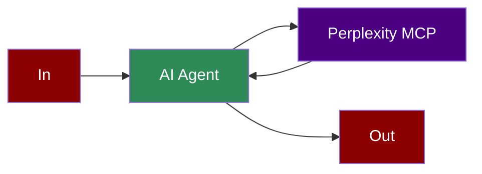

## Add Perplexity Search Tool to AI Agent



## Quick Start

<Steps>
    <Step title="Set API Key">
        Set your Perplexity API key as an environment variable in your terminal:
        ```bash
        export PERPLEXITY_API_KEY=your_perplexity_api_key_here
        ```
    </Step>

    <Step title="Create a file">
        Create a new file `perplexity_search.py` with the following code:
        ```python
        from praisonaiagents import Agent, MCP
        import os

        # Get API key from environment variable
        api_key = os.getenv("PERPLEXITY_API_KEY")

        agent = Agent(
            instructions="You are a helpful assistant that can search the web for information. Use the available tools when relevant to answer user questions.",
            llm="gpt-4o-mini",
            tools=MCP("uvx perplexity-mcp", 
                env={"PERPLEXITY_API_KEY": api_key, "PERPLEXITY_MODEL": "sonar" })
        )
        
        result = agent.start("What is the latest news on AI?, Pass only the query parameter to the tool")

        print(result)
        ```
    </Step>

    <Step title="Install Dependencies">
        Make sure you have the required packages installed:
        ```bash
        pip install "praisonaiagents[llm]"
        ```
    </Step>

    <Step title="Run the Agent">
        Execute your script:
        ```bash
        python perplexity_search.py
        ```
    </Step>
</Steps>

<Note>
  **Requirements**
  - Python 3.10 or higher
  - Perplexity API key
</Note>

## Features

<CardGroup cols={2}>
  <Card title="Web Search" icon="globe">
    Search the web for real-time information using Perplexity's powerful search API.
  </Card>
  <Card title="Sonar Model" icon="radar">
    Utilize Perplexity's Sonar model for high-quality search results.
  </Card>
  <Card title="MCP Integration" icon="plug">
    Seamless integration with Model Context Protocol.
  </Card>
  <Card title="Environment Variables" icon="key">
    Securely pass API keys using environment variables.
  </Card>
</CardGroup>
