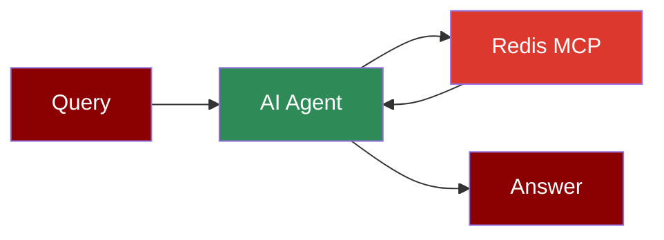

## Add Redis Tool to AI Agent



## Quick Start

<Steps>
    <Step title="Install Dependencies">
        Make sure you have Node.js installed, as the MCP server requires it:
        ```bash
        pip install praisonaiagents mcp
        ```
    </Step>
    <Step title="Set up Redis">
        Ensure you have Redis running locally or specify your Redis connection URL.
    </Step>

    <Step title="Create a file">
        Create a new file `redis_agent.py` with the following code:
        ```python
        from praisonaiagents import Agent, MCP
        import os

        # Redis connection string
        redis_url = "redis://localhost:6379"

        # Use a single string command with Redis configuration
        redis_agent = Agent(
            instructions="""You are a helpful assistant that can interact with Redis.
            Use the available tools when relevant to manage Redis operations.""",
            llm="gpt-4o-mini",
            tools=MCP("npx -y @modelcontextprotocol/server-redis", args=[redis_url])
        )

        redis_agent.start("Set a key-value pair in Redis")
        ```
    </Step>

    <Step title="Run the Agent">
        Execute your script:
        ```bash
        python redis_agent.py
        ```
    </Step>
</Steps>

<Note>
  **Requirements**
  - Python 3.10 or higher
  - Node.js installed on your system
  - Redis server running locally or remotely
  - OpenAI API key (for the agent's LLM)
</Note>
