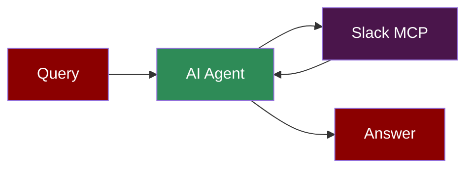

## Add Slack Tool to AI Agent



## Quick Start

<Steps>
    <Step title="Install Dependencies">
        Make sure you have Node.js installed, as the MCP server requires it:
        ```bash
        pip install praisonaiagents mcp
        ```
    </Step>
    <Step title="Set API Keys">
        Set your Slack credentials as environment variables in your terminal:
        ```bash
        export SLACK_BOT_TOKEN=your_slack_bot_token_here
        export SLACK_TEAM_ID=your_slack_team_id_here
        export OPENAI_API_KEY=your_openai_api_key_here
        ```
    </Step>

    <Step title="Create a file">
        Create a new file `slack_agent.py` with the following code:
        ```python
        from praisonaiagents import Agent, MCP
        import os

        # Get Slack credentials from environment
        slack_token = os.getenv("SLACK_BOT_TOKEN")
        slack_team_id = os.getenv("SLACK_TEAM_ID")

        # Use a single string command with Slack configuration
        slack_agent = Agent(
            instructions="""You are a helpful assistant that can interact with Slack.
            Use the available tools when relevant to manage Slack communications.""",
            llm="gpt-4o-mini",
            tools=MCP("npx -y @modelcontextprotocol/server-slack",
                    env={
                        "SLACK_BOT_TOKEN": slack_token,
                        "SLACK_TEAM_ID": slack_team_id
                    })
        )

        slack_agent.start("Send a message to the general channel")
        ```
    </Step>

    <Step title="Run the Agent">
        Execute your script:
        ```bash
        python slack_agent.py
        ```
    </Step>
</Steps>

<Note>
  **Requirements**
  - Python 3.10 or higher
  - Node.js installed on your system
  - Slack Bot Token and Team ID
  - OpenAI API key (for the agent's LLM)
</Note>
