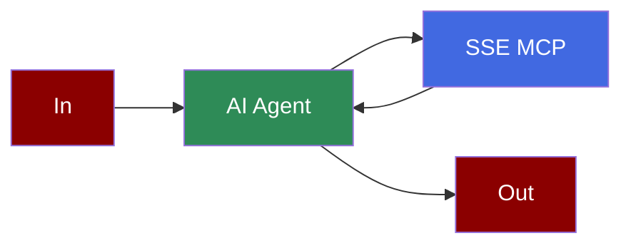

## Add SSE Tool to AI Agent



## Quick Start

<Steps>
    <Step title="Create a client file">

```python
from praisonaiagents import Agent, MCP

search_agent = Agent(
    instructions="""You are a weather agent that can provide weather information for a given city.""",
    llm="gpt-4o-mini",
    tools=MCP("http://localhost:8080/sse")
)

search_agent.start("What is the weather in London?")
```

    </Step>
    <Step title="Set Up SSE MCP Server">

```python
# python mcp-sse-direct-server.py --host 127.0.0.1 --port 8080
from typing import Any
import httpx
from mcp.server.fastmcp import FastMCP
from starlette.applications import Starlette
from mcp.server.sse import SseServerTransport
from starlette.requests import Request
from starlette.routing import Mount, Route
from mcp.server import Server
import uvicorn
import argparse
import logging
import os
import inspect

# Set up logging based on environment variable
log_level = os.environ.get("LOGLEVEL", "info").upper()
logging.basicConfig(level=getattr(logging, log_level))
logger = logging.getLogger("mcp-server")

# Initialize FastMCP server for simple tools (SSE)
mcp = FastMCP("simple-tools")

@mcp.tool()
async def get_greeting(name: str) -> str:
    """Get a personalized greeting.

    Args:
        name: Name of the person to greet
    """
    logger.debug(f"get_greeting called with name: {name}")
    return f"Hello, {name}! Welcome to our MCP SSE server."

@mcp.tool()
async def get_weather(city: str) -> str:
    """Get a simulated weather report for a city.

    Args:
        city: Name of the city
    """
    logger.debug(f"get_weather called with city: {city}")
    # This is a mock implementation
    weather_data = {
        "Paris": "Sunny with a temperature of 22°C",
        "London": "Rainy with a temperature of 15°C",
        "New York": "Cloudy with a temperature of 18°C",
        "Tokyo": "Clear skies with a temperature of 25°C",
        "Sydney": "Partly cloudy with a temperature of 20°C"
    }
    
    return weather_data.get(city, f"Weather data not available for {city}")

def create_starlette_app(mcp_server: Server, *, debug: bool = False) -> Starlette:
    """Create a Starlette application that can serve the provided mcp server with SSE."""
    sse = SseServerTransport("/messages/")

    async def handle_sse(request: Request) -> None:
        logger.debug(f"SSE connection request received from {request.client}")
        async with sse.connect_sse(
                request.scope,
                request.receive,
                request._send,  # noqa: SLF001
        ) as (read_stream, write_stream):
            await mcp_server.run(
                read_stream,
                write_stream,
                mcp_server.create_initialization_options(),
            )

    return Starlette(
        debug=debug,
        routes=[
            Route("/sse", endpoint=handle_sse),
            Mount("/messages/", app=sse.handle_post_message),
        ],
    )

if __name__ == "__main__":
    mcp_server = mcp._mcp_server  # noqa: WPS437
    
    parser = argparse.ArgumentParser(description='Run MCP SSE-based server')
    parser.add_argument('--host', default='localhost', help='Host to bind to')
    parser.add_argument('--port', type=int, default=8080, help='Port to listen on')
    args = parser.parse_args()

    print(f"Starting MCP SSE server on {args.host}:{args.port}")
    
    # Hardcode the tool names since we know what they are
    tool_names = ["get_greeting", "get_weather"]
    print(f"Available tools: {', '.join(tool_names)}")
    
    # Bind SSE request handling to MCP server
    starlette_app = create_starlette_app(mcp_server, debug=True)

    uvicorn.run(starlette_app, host=args.host, port=args.port) 
```
    </Step>

    <Step title="Install Dependencies">
        Make sure you have the required packages installed:
        ```bash
        pip install "praisonaiagents[llm]" mcp starlette uvicorn httpx
        ```
    </Step>
    <Step title="Export API Key">
        ```bash
        export OPENAI_API_KEY="your_api_key"
        ```
    </Step>

    <Step title="Run the Server and Agent">
        First, start the SSE server:
        ```bash
        python mcp-sse-direct-server.py --host 127.0.0.1 --port 8080
        ```
        
        Then, in a new terminal, run the agent:
        ```bash
        python weather_agent.py
        ```
    </Step>
</Steps>

<Note>
  **Requirements**
  - Python 3.10 or higher
  - MCP server dependencies
</Note>

## Alternative LLM Integrations

### Using Groq with SSE

```python
from praisonaiagents import Agent, MCP

weather_agent = Agent(
    instructions="""You are a weather agent that can provide weather information for a given city.""",
    llm="groq/llama-3.2-90b-vision-preview",
    tools=MCP("http://localhost:8080/sse")
)

weather_agent.start("What is the weather in London?")
```

### Using Ollama with SSE

```python
from praisonaiagents import Agent, MCP

weather_agent = Agent(
    instructions="""You are a weather agent that can provide weather information for a given city.""",
    llm="ollama/llama3.2",
    tools=MCP("http://localhost:8080/sse")
)

weather_agent.start("What is the weather in London? Use get_weather tool, city is the required parameter.")
```

## Gradio UI Integration

Create a Gradio UI for your weather service:

```python
from praisonaiagents import Agent, MCP
import gradio as gr

def get_weather_info(query):
    weather_agent = Agent(
        instructions="""You are a weather agent that can provide weather information for a given city.""",
        llm="gpt-4o-mini",
        tools=MCP("http://localhost:8080/sse")
    )

    result = weather_agent.start(query)
    return f"## Weather Information\n\n{result}"

demo = gr.Interface(
    fn=get_weather_info,
    inputs=gr.Textbox(placeholder="What's the weather in London?"),
    outputs=gr.Markdown(),
    title="Weather MCP Agent",
    description="Ask about the weather in any major city:"
)

if __name__ == "__main__":
    demo.launch()
```

## Features

<CardGroup cols={2}>
  <Card title="Real-time Updates" icon="bolt">
    Receive server-sent events in real-time from your AI agent.
  </Card>
  <Card title="Multi-Agent Support" icon="users">
    Combine SSE with other MCP tools for complex workflows.
  </Card>
  <Card title="Multiple LLM Options" icon="brain">
    Use with OpenAI, Groq, Ollama, or other supported LLMs.
  </Card>
  <Card title="Gradio UI" icon="window">
    Create user-friendly interfaces for your SSE integrations.
  </Card>
</CardGroup>
