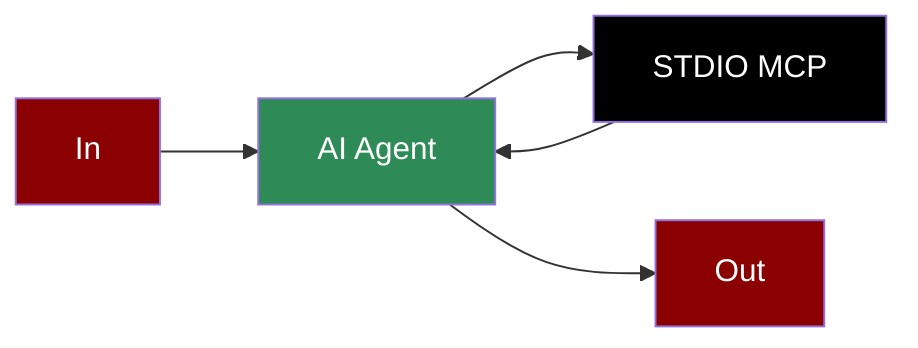

## Add STDIO Tool to AI Agent



## Quick Start

<Steps>
    <Step title="Create a client file">
        Create a new file `calculator_client.py` with the following code:
        ```python
        from praisonaiagents import Agent, MCP

        calculator_agent = Agent(
            instructions="""You are a calculator agent that can perform basic arithmetic operations.""",
            llm="gpt-4o-mini",
            tools=MCP("python calculator_server.py")
        )

        calculator_agent.start("What is 25 * 16?")
        ```
    </Step>

    <Step title="Set Up STDIO MCP Server">
        Create a file `calculator_server.py` with the following code:
        ```python
        # calculator_server.py
        from mcp.server.fastmcp import FastMCP
        import logging
        import sys

        # Set up logging
        logging.basicConfig(level=logging.INFO, filename="calculator_server.log")
        logger = logging.getLogger("calculator-server")

        # Initialize FastMCP server for simple tools
        mcp = FastMCP("calculator-tools")

        @mcp.tool()
        def add(a: float, b: float) -> float:
            """Add two numbers.

            Args:
                a: First number
                b: Second number
            
            Returns:
                The sum of a and b
            """
            logger.info(f"Adding {a} + {b}")
            return a + b

        @mcp.tool()
        def subtract(a: float, b: float) -> float:
            """Subtract b from a.

            Args:
                a: First number
                b: Second number
            
            Returns:
                The result of a - b
            """
            logger.info(f"Subtracting {b} from {a}")
            return a - b

        @mcp.tool()
        def multiply(a: float, b: float) -> float:
            """Multiply two numbers.

            Args:
                a: First number
                b: Second number
            
            Returns:
                The product of a and b
            """
            logger.info(f"Multiplying {a} * {b}")
            return a * b

        @mcp.tool()
        def divide(a: float, b: float) -> float:
            """Divide a by b.

            Args:
                a: First number (numerator)
                b: Second number (denominator)
            
            Returns:
                The result of a / b
            """
            if b == 0:
                raise ValueError("Cannot divide by zero")
            logger.info(f"Dividing {a} / {b}")
            return a / b

        if __name__ == "__main__":
            # Run the MCP server using STDIO transport
            mcp.run()
        ```
    </Step>

    <Step title="Install Dependencies">
        Make sure you have the required packages installed:
        ```bash
        pip install "praisonaiagents[llm]" mcp
        ```
    </Step>
    <Step title="Export API Key">
        ```bash
        export OPENAI_API_KEY="your_api_key"
        ```
    </Step>

    <Step title="Run the Agent">
        Run the agent which will automatically start the calculator server:
        ```bash
        python calculator_client.py
        ```
    </Step>
</Steps>

<Note>
  **Requirements**
  - Python 3.10 or higher
  - MCP package
</Note>

## Alternative LLM Integrations

### Using Groq with STDIO

```python
from praisonaiagents import Agent, MCP

calculator_agent = Agent(
    instructions="""You are a calculator agent that can perform basic arithmetic operations.""",
    llm="groq/llama-3.2-90b-vision-preview",
    tools=MCP("python calculator_server.py")
)

calculator_agent.start("What is 144 divided by 12?")
```

### Using Ollama with STDIO

```python
from praisonaiagents import Agent, MCP

calculator_agent = Agent(
    instructions="""You are a calculator agent that can perform basic arithmetic operations.""",
    llm="ollama/llama3.2",
    tools=MCP("python calculator_server.py")
)

calculator_agent.start("What is 15 + 27? Use the add tool with parameters a and b.")
```

## Gradio UI Integration

Create a Gradio UI for your calculator service:

```python
from praisonaiagents import Agent, MCP
import gradio as gr

def calculate(query):
    calculator_agent = Agent(
        instructions="""You are a calculator agent that can perform basic arithmetic operations.""",
        llm="gpt-4o-mini",
        tools=MCP("python calculator_server.py")
    )

    result = calculator_agent.start(query)
    return f"## Calculation Result\n\n{result}"

demo = gr.Interface(
    fn=calculate,
    inputs=gr.Textbox(placeholder="What is 25 * 16?"),
    outputs=gr.Markdown(),
    title="Calculator MCP Agent",
    description="Ask any arithmetic question:"
)

if __name__ == "__main__":
    demo.launch()
```

## Features

<CardGroup cols={2}>
  <Card title="Simple Integration" icon="plug">
    Use standard input/output for easy integration with any tool or service.
  </Card>
  <Card title="Cross-Platform" icon="laptop">
    Works on any operating system that supports Python.
  </Card>
  <Card title="Multiple LLM Options" icon="brain">
    Use with OpenAI, Groq, Ollama, or other supported LLMs.
  </Card>
  <Card title="Gradio UI" icon="window">
    Create user-friendly interfaces for your STDIO integrations.
  </Card>
</CardGroup>
