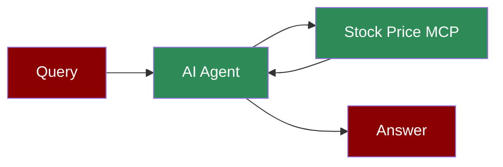

## Add Stock Price Tool to AI Agent



## Quick Start

<Steps>
    <Step title="Install Dependencies">
        Create a conda environment and install the required packages:
        ```bash
        zsh -c "source $(conda info --base)/etc/profile.d/conda.sh && conda create -n windsurf python=3.10 -y"
        zsh -c "source $(conda info --base)/etc/profile.d/conda.sh && conda activate windsurf && pip install praisonaiagents mcp yfinance"
        ```
    </Step>
    <Step title="Set API Key">
        Set your OpenAI API key as an environment variable in your terminal:
        ```bash
        export OPENAI_API_KEY=your_openai_api_key_here
        ```
    </Step>

    <Step title="Create the MCP Server">
        Create a new file `stock_price_server.py` with the following code:
        ```python
        import yfinance as yf
        from mcp.server.fastmcp import FastMCP

        mcp = FastMCP("stock_prices")

        @mcp.tool()
        async def get_stock_price(ticker: str) -> str:
            """Get the current stock price for a given ticker symbol.
            
            Args:
                ticker: Stock ticker symbol (e.g., AAPL, MSFT, GOOG)
                
            Returns:
                Current stock price as a string
            """
            if not ticker:
                return "No ticker provided"
            try:
                stock = yf.Ticker(ticker)
                info = stock.info
                current_price = info.get('currentPrice') or info.get('regularMarketPrice')
                if not current_price:
                    return f"Could not retrieve price for {ticker}"
                return f"${current_price:.2f}"
                
            except Exception as e:
                return f"Error: {str(e)}"

        if __name__ == "__main__":
            mcp.run(transport='stdio')
        ```
    </Step>

    <Step title="Create the Agent">
        Create a new file `stock_price_agent.py` with the following code:
        ```python
        from praisonaiagents import Agent, MCP
        import os

        # Get the path to your Python interpreter and the server file
        python_path = os.getenv("PYTHON_PATH", "/path/to/your/python")
        server_path = os.getenv("SERVER_PATH", "/path/to/your/stock_price_server.py")

        # Create the agent with the stock price MCP tool
        agent = Agent(
            instructions="""You are a helpful assistant that can check stock prices.
            Use the available tools when relevant to answer user questions.""",
            llm="gpt-4o-mini",
            tools=MCP(f"{python_path} {server_path}")
        )

        agent.start("What is the stock price of Tesla?")
        ```
    </Step>

    <Step title="Run the Agent">
        Execute your script:
        ```bash
        zsh -c "source $(conda info --base)/etc/profile.d/conda.sh && conda activate windsurf && python stock_price_agent.py"
        ```
    </Step>
</Steps>

<Note>
  **Requirements**
  - Python 3.10 or higher
  - yfinance package
  - mcp-python-sdk package
  - praisonaiagents package
  - OpenAI API key (for the agent's LLM)
</Note>

## Gradio UI Example

You can also create a simple web UI for your stock price agent using Gradio:

```python
from praisonaiagents import Agent, MCP
import gradio as gr
import os

# Get the path to your Python interpreter and the server file
python_path = os.getenv("PYTHON_PATH", "/path/to/your/python")
server_path = os.getenv("SERVER_PATH", "/path/to/your/stock_price_server.py")

# Create the agent with the stock price MCP tool
agent = Agent(
    instructions="""You are a helpful assistant that can check stock prices.
    Use the available tools when relevant to answer user questions.""",
    llm="gpt-4o-mini",
    tools=MCP(f"{python_path} {server_path}")
)

def chat(message, history):
    return agent.chat(message)

demo = gr.ChatInterface(
    chat,
    title="Stock Price Assistant",
    description="Ask about any stock price and get real-time information",
    theme="soft"
)

if __name__ == "__main__":
    demo.launch()
```

Install Gradio with:
```bash
zsh -c "source $(conda info --base)/etc/profile.d/conda.sh && conda activate windsurf && pip install gradio"
```
