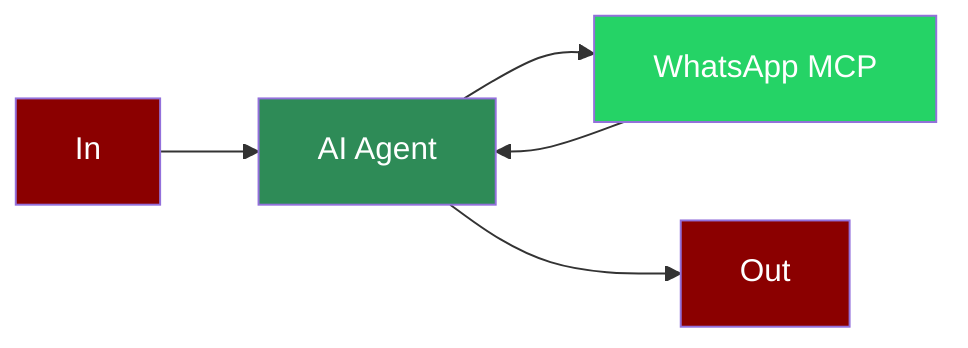

## Add WhatsApp Tool to AI Agent



## Quick Start

<Steps>
    <Step title="Set Up WhatsApp MCP Server">
        Clone and set up the WhatsApp MCP server:
        ```bash
        git clone https://github.com/lharries/whatsapp-mcp.git
        cd whatsapp-mcp
        cd whatsapp-bridge
        go run main.go
        ```
    </Step>
    <Step title="Create a file">
        Create a new file `whatsapp_message.py` with the following code:
        ```python
        from praisonaiagents import Agent, MCP

        whatsapp_agent = Agent(
            instructions="Whatsapp Agent",
            llm="gpt-4o-mini",
            tools=MCP("python /path/to/whatsapp-mcp/whatsapp-mcp-server/main.py")
        )

        whatsapp_agent.start("Send Hello to Mervin Praison")
        ```
        
        Note: Replace `/path/to/whatsapp-mcp` with the actual path to your WhatsApp MCP server.
    </Step>

    <Step title="Install Dependencies">
        Make sure you have the required packages installed:
        ```bash
        pip install "praisonaiagents[llm]" mcp gradio
        ```
    </Step>
    <Step title="Export API Key">
        ```bash
        export OPENAI_API_KEY="your_api_key"
        ```
    </Step>

    <Step title="Run the Agent">
        Execute your script:
        ```bash
        python whatsapp_message.py
        ```
    </Step>
</Steps>

<Note>
  **Requirements**
  - Python 3.10 or higher
  - WhatsApp MCP server set up and configured
</Note>

## Multi-Agent Integration

You can also combine WhatsApp with other MCP tools, such as Airbnb search:

```python
from praisonaiagents import Agent, Agents, MCP

airbnb_agent = Agent(
    instructions="""Search for Apartments in Paris for 2 nights on Airbnb. 04/28 - 04/30 for 2 adults""",
    llm="gpt-4o-mini",
    tools=MCP("npx -y @openbnb/mcp-server-airbnb --ignore-robots-txt")
)

whatsapp_agent = Agent(
    instructions="""Send AirBnb Search Result to 'Mervin Praison'""",
    llm="gpt-4o-mini",
    tools=MCP("python /path/to/whatsapp-mcp/whatsapp-mcp-server/main.py")
)

agents = Agents(agents=[airbnb_agent, whatsapp_agent])

agents.start()
```

## Alternative LLM Integrations

### Using Groq with WhatsApp

```python
from praisonaiagents import Agent, MCP

whatsapp_agent = Agent(
    instructions="Whatsapp Agent",
    llm="groq/llama-3.2-90b-vision-preview",
    tools=MCP("python /path/to/whatsapp-mcp/whatsapp-mcp-server/main.py")
)

whatsapp_agent.start("Send Hello to Mervin Praison")
```

### Using Ollama with WhatsApp

```python
from praisonaiagents import Agent, MCP

whatsapp_agent = Agent(
    instructions="Whatsapp Agent",
    llm="ollama/llama3.2",
    tools=MCP("python /path/to/whatsapp-mcp/whatsapp-mcp-server/main.py")
)

whatsapp_agent.start("Send Hello to Mervin Praison. Use send_message tool, recipient and message are the required parameters.")
```

## Gradio UI Integration

Create a Gradio UI for your WhatsApp and Airbnb integration:

```python
from praisonaiagents import Agent, Agents, MCP
import gradio as gr

def search_airbnb(query):
    airbnb_agent = Agent(
        instructions=query+" on Airbnb",
        llm="gpt-4o-mini",
        tools=MCP("npx -y @openbnb/mcp-server-airbnb --ignore-robots-txt")
    )

    whatsapp_agent = Agent(
        instructions="""Send AirBnb Search Result to 'Mervin Praison'. Don't include Phone Number in Response, but include the AirBnb Search Result""",
        llm="gpt-4o-mini",
        tools=MCP("python /path/to/whatsapp-mcp/whatsapp-mcp-server/main.py")
    )

    agents = Agents(agents=[airbnb_agent, whatsapp_agent])

    result = agents.start()
    return f"## Airbnb Search Results\n\n{result}"

demo = gr.Interface(
    fn=search_airbnb,
    inputs=gr.Textbox(placeholder="I want to book an apartment in Paris for 2 nights..."),
    outputs=gr.Markdown(),
    title="WhatsApp MCP Agent",
    description="Enter your booking requirements below:"
)

if __name__ == "__main__":
    demo.launch()
```

## Features

<CardGroup cols={2}>
  <Card title="WhatsApp Messaging" icon="message">
    Send messages to WhatsApp contacts directly from your AI agent.
  </Card>
  <Card title="Multi-Agent Support" icon="users">
    Combine WhatsApp with other MCP tools for complex workflows.
  </Card>
  <Card title="Multiple LLM Options" icon="brain">
    Use with OpenAI, Groq, Ollama, or other supported LLMs.
  </Card>
  <Card title="Gradio UI" icon="window">
    Create user-friendly interfaces for your WhatsApp integrations.
  </Card>
</CardGroup>
