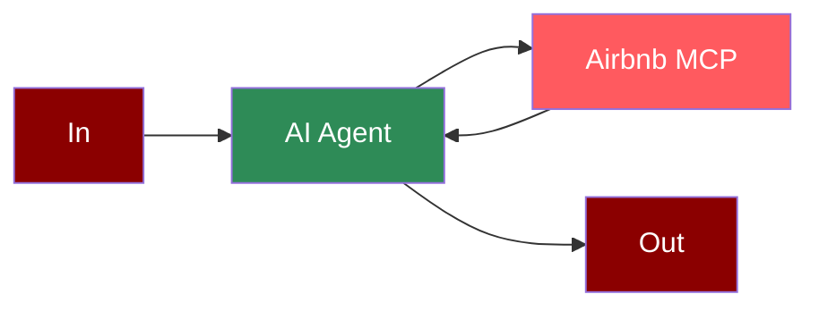

## Add XAI Tool to AI Agent



## Quick Start

<Steps>
    <Step title="Set API Key">
        Set your XAI API key as an environment variable in your terminal:
        ```bash
        export XAI_API_KEY=your_xai_api_key_here
        ```
    </Step>

    <Step title="Create a file">
        Create a new file `xai_airbnb.py` with the following code:
        ```python
        from praisonaiagents import Agent, MCP

        search_agent = Agent(
            instructions="""You help book apartments on Airbnb.""",
            llm="xai/grok-2-latest",
            tools=MCP("npx -y @openbnb/mcp-server-airbnb --ignore-robots-txt")
        )

        search_agent.start("MUST USE airbnb_search Tool to Search. Search for Apartments in Paris for 2 nights. 04/28 - 04/30 for 2 adults. All Your Preference")
        ```
    </Step>

    <Step title="Install Dependencies">
        Make sure you have Node.js installed, as the MCP server requires it:
        ```bash
        pip install "praisonaiagents[llm]"
        ```
    </Step>

    <Step title="Run the Agent">
        Execute your script:
        ```bash
        python xai_airbnb.py
        ```
    </Step>
</Steps>

<Note>
  **Requirements**
  - Python 3.10 or higher
  - Node.js installed on your system
  - XAI API key (for the Grok model)
</Note>

## Features

<CardGroup cols={2}>
  <Card title="Grok Integration" icon="robot">
    Uses XAI's Grok model for advanced natural language understanding.
  </Card>
  <Card title="MCP Integration" icon="plug">
    Seamless integration with Model Context Protocol.
  </Card>
  <Card title="Airbnb Search" icon="hotel">
    Search for accommodations on Airbnb with natural language queries.
  </Card>
  <Card title="NPM Package" icon="js">
    Leverages the official Airbnb MCP server package.
  </Card>
</CardGroup>
