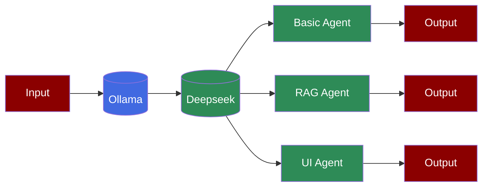

Learn how to use Deepseek models with PraisonAI Agents through Ollama integration for basic queries, RAG applications, and interactive UI implementations.

## Prerequisites

<Steps>
    <Step title="Install Ollama">
        First, install Ollama on your system:
        ```bash
        curl -fsSL https://ollama.com/install.sh | sh
        ```
    </Step>

    <Step title="Pull Deepseek Model">
        Pull the Deepseek model from Ollama:
        ```bash
        ollama pull deepseek-r1
        ```
    </Step>

    <Step title="Install Package">
        Install PraisonAI Agents:
        ```bash
        pip install "praisonaiagents[knowledge]" ollama streamlit
        ```

        <Note> 
        Streamlit for UI is optional.
        Ollama is required for Local RAG Agents.
        praisonaiagents[knowledge] is for RAG Agents. praisonaiagents is for Basic Agents.
        </Note>
    </Step>

    <Step title="Set Environment">
        Set Ollama as your base URL:
        ```bash
        export OPENAI_BASE_URL=http://localhost:11434/v1
        export OPENAI_API_KEY=fake-key
        ```
    </Step>
</Steps>

## Basic Usage

The simplest way to use Deepseek with PraisonAI Agents:

```python
from praisonaiagents import Agent

agent = Agent(instructions="You are helpful Assisant", llm="deepseek-r1")

agent.start("Why sky is Blue?")
```

## RAG Implementation

Use Deepseek with RAG capabilities for knowledge-based interactions:

```python
from praisonaiagents import Agent

config = {
    "vector_store": {
        "provider": "chroma",
        "config": {
            "collection_name": "praison",
            "path": ".praison"
        }
    },
    "llm": {
        "provider": "ollama",
        "config": {
            "model": "deepseek-r1:latest",
            "temperature": 0,
            "max_tokens": 8000,
            "ollama_base_url": "http://localhost:11434",
        },
    },
    "embedder": {
        "provider": "ollama",
        "config": {
            "model": "nomic-embed-text:latest",
            "ollama_base_url": "http://localhost:11434",
            "embedding_dims": 1536
        },
    },
}

agent = Agent(
    name="Knowledge Agent",
    instructions="You answer questions based on the provided knowledge.",
    knowledge=["kag-research-paper.pdf"], # Indexing
    knowledge_config=config,
    user_id="user1",
    llm="deepseek-r1"
)

agent.start("What is KAG in one line?") # Retrieval
```

## Interactive UI with Streamlit

Create an interactive chat interface using Streamlit:

```python
import streamlit as st
from praisonaiagents import Agent

def init_agent():
    config = {
        "vector_store": {
            "provider": "chroma",
            "config": {
                "collection_name": "praison",
                "path": ".praison"
            }
        },
        "llm": {
            "provider": "ollama",
            "config": {
                "model": "deepseek-r1:latest",
                "temperature": 0,
                "max_tokens": 8000,
                "ollama_base_url": "http://localhost:11434",
            },
        },
        "embedder": {
            "provider": "ollama",
            "config": {
                "model": "nomic-embed-text:latest",
                "ollama_base_url": "http://localhost:11434",
                "embedding_dims": 1536
            },
        },
    }
    
    return Agent(
        name="Knowledge Agent",
        instructions="You answer questions based on the provided knowledge.",
        knowledge=["kag-research-paper.pdf"],
        knowledge_config=config,
        user_id="user1",
        llm="deepseek-r1"
    )

st.title("Knowledge Agent Chat")

if "agent" not in st.session_state:
    st.session_state.agent = init_agent()
    st.session_state.messages = []

if "messages" in st.session_state:
    for message in st.session_state.messages:
        with st.chat_message(message["role"]):
            st.markdown(message["content"])

prompt = st.chat_input("Ask a question...")

if prompt:
    st.session_state.messages.append({"role": "user", "content": prompt})
    with st.chat_message("user"):
        st.markdown(prompt)

    with st.chat_message("assistant"):
        response = st.session_state.agent.start(prompt)
        st.markdown(response)
        st.session_state.messages.append({"role": "assistant", "content": response}) 
```

## Running the UI

<Steps>
    <Step title="Install Streamlit">
        Install Streamlit if you haven't already:
        ```bash
        pip install streamlit
        ```
    </Step>

    <Step title="Save and Run">
        Save the UI code in a file (e.g., `app.py`) and run:
        ```bash
        streamlit run app.py
        ```
    </Step>
</Steps>

## Features

<CardGroup cols={2}>
  <Card title="Local Deployment" icon="server">
    Run Deepseek models locally through Ollama.
  </Card>
  <Card title="RAG Capabilities" icon="database">
    Integrate with vector databases for knowledge retrieval.
  </Card>
  <Card title="Interactive UI" icon="desktop">
    Create chat interfaces with Streamlit integration.
  </Card>
  <Card title="Custom Configuration" icon="gear">
    Configure model parameters and embedding settings.
  </Card>
</CardGroup>

## Troubleshooting

<CardGroup cols={2}>
  <Card title="Ollama Issues" icon="triangle-exclamation">
    If Ollama isn't working:
    - Check if Ollama is running
    - Verify model is downloaded
    - Check port availability
  </Card>

  <Card title="Performance Issues" icon="gauge-high">
    If responses are slow:
    - Check system resources
    - Adjust max_tokens
    - Monitor memory usage
  </Card>
</CardGroup>

<Note>
  For optimal performance, ensure your system meets the minimum requirements for running Deepseek models locally through Ollama.
</Note>
