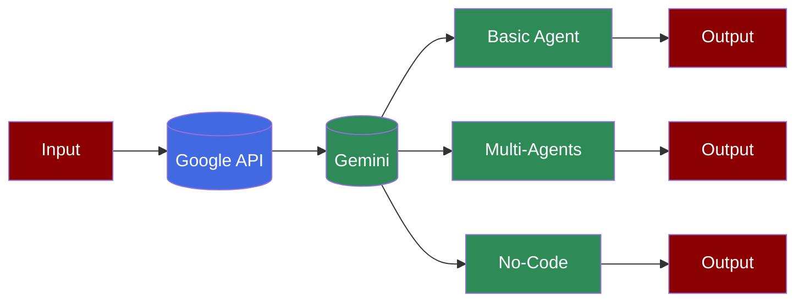

## Prerequisites

<Steps>
    <Step title="Install Package">
        First, install PraisonAI Agents:
        ```bash
        pip install "praisonaiagents[llm]"
        ```

        <Note>
        praisonaiagents[llm] includes all Google Gemini dependencies.
        For No-Code implementation, also install: pip install langchain-google-genai
        </Note>
    </Step>

    <Step title="Set API Key">
        Set your Gemini API key:
        ```bash
        export GEMINI_API_KEY=xxxxxxxxxxx
        ```
    </Step>

    <Step title="Code">
```python
from praisonaiagents import Agent

agent = Agent(
    instructions="You are a helpful assistant",
    llm="gemini/gemini-1.5-flash-8b",
    self_reflect=True,
    verbose=True
)

agent.start("Why sky is Blue?")
```
    </Step>
</Steps>

## Code Implementation

### Basic Usage

The simplest way to use Gemini with PraisonAI Agents:

```python
from praisonaiagents import Agent

agent = Agent(
    instructions="You are a helpful assistant",
    llm="gemini/gemini-1.5-flash-8b",
    self_reflect=True,
    verbose=True
)

agent.start("Why sky is Blue?")
```

### Multi-Agent Setup

Create multiple agents working together:

```python
from praisonaiagents import Agent, Task, PraisonAIAgents

agent = Agent(
    instructions="You are a helpful assistant",
    llm="gemini/gemini-1.5-flash-8b",
    self_reflect=True,
    verbose=True
)

task = Task(
    description="Why sky is Blue?",
    agent=agent,
)

agents = PraisonAIAgents(
  agents=[agent],
  tasks=[task],
)

agents.start()
```

<Note>
  This uses Litellm to connect to Google Gemini.
</Note>

## Alternative Setup

### Using Environment Variables

<AccordionGroup>
  <Accordion title="Google Gemini" defaultOpen> 
    ```bash
    export OPENAI_API_KEY=xxxxxxxxxxx
    export OPENAI_BASE_URL=https://generativelanguage.googleapis.com/v1beta/openai/
    ```
  </Accordion>
</AccordionGroup>

## No-Code Implementation

### Setup
```bash
pip install langchain-google-genai
export GOOGLE_API_KEY=xxxxxxxxxx
```

### YAML Configuration

Create an `agents.yaml` file:

```yaml
framework: crewai
topic: create movie script about cat in mars
roles:
  researcher:
    backstory: Skilled in finding and organizing information, with a focus on research
      efficiency.
    goal: Gather information about Mars and cats
    role: Researcher
    llm:  
      model: "google/gemini-1.5-flash-001"
    tasks:
      gather_research:
        description: Research and gather information about Mars, its environment,
          and cats, including their behavior and characteristics.
        expected_output: Document with research findings, including interesting facts
          and information.
    tools:
    - ''
```

## Additional Resources

| PraisonAI Chat | PraisonAI Code | PraisonAI (Multi-Agents) |
| --- | --- | --- |
| [Litellm](https://litellm.vercel.app/docs/providers) | [Litellm](https://litellm.vercel.app/docs/providers) | [Models](../models.md) |