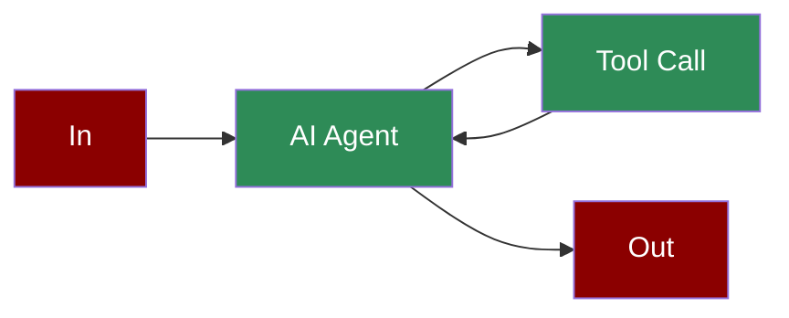

A workflow demonstrating how to create and use class-based tools that can be integrated with AI agents to extend their capabilities with custom functionality.

## Quick Start

<Steps>
    <Step title="Install Package">
        First, install the PraisonAI Agents package:
        ```bash
        pip install praisonaiagents
        ```
    </Step>

    <Step title="Set API Key">
        Set your OpenAI API key and EXA API key as environment variables in your terminal:
        ```bash
        export OPENAI_API_KEY=your_api_key_here
        export EXA_API_KEY=your_exa_api_key_here
        ```
    </Step>

    <Step title="Create a file">
        Create a new file `app.py` with the basic setup:
        ```python
        from praisonaiagents import Agent, Task, PraisonAIAgents
        import os
        import requests
        from typing import Any, Dict, List, Optional
        from pydantic import BaseModel, Field

        class EXASearchTool(BaseModel):
            """Wrapper for EXA Search API."""
            search_url: str = "https://api.exa.ai/search"
            headers: Dict = {
                "accept": "application/json",
                "content-type": "application/json",
            }
            max_results: Optional[int] = None

            def run(self, query: str) -> str:
                """Run query through EXA and return concatenated results."""
                payload = {
                    "query": query,
                    "type": "magic",
                }

                headers = self.headers.copy()
                headers["x-api-key"] = os.environ['EXA_API_KEY']

                response = requests.post(self.search_url, json=payload, headers=headers)
                results = response.json()
                
                if 'results' in results:
                    return self._parse_results(results['results'])
                return ""

            def results(self, query: str, max_results: Optional[int] = None) -> List[Dict[str, Any]]:
                """Run query through EXA and return metadata."""
                payload = {
                    "query": query,
                    "type": "magic",
                }

                headers = self.headers.copy()
                headers["x-api-key"] = os.environ['EXA_API_KEY']

                response = requests.post(self.search_url, json=payload, headers=headers)
                results = response.json()
                
                if 'results' in results:
                    return results['results'][:max_results] if max_results else results['results']
                return []

            def _parse_results(self, results: List[Dict[str, Any]]) -> str:
                """Parse results into a readable string format."""
                strings = []
                for result in results:
                    try:
                        strings.append('\n'.join([
                            f"Title: {result['title']}",
                            f"Score: {result['score']}",
                            f"Url: {result['url']}",
                            f"ID: {result['id']}",
                            "---"
                        ]))
                    except KeyError:
                        continue

                content = '\n'.join(strings)
                return f"\nSearch results: {content}\n"

        # Create an agent with the tool
        agent = Agent(
            name="SearchAgent",
            role="Research Assistant",
            goal="Search for information about 'AI Agents Framework'",
            backstory="I am an AI assistant that can search GitHub.",
            tools=[EXASearchTool],
            self_reflect=False
        )

        # Create task to demonstrate the tool
        task = Task(
            name="search_task",
            description="Search for information about 'AI Agents Framework'",
            expected_output="Information about AI Agents Framework",
            agent=agent
        )

        # Create and start the workflow
        agents = PraisonAIAgents(
            agents=[agent],
            tasks=[task],
            verbose=True
        )

        agents.start()
        ```
    </Step>

    <Step title="Start Agents">
        Type this in your terminal to run your agents:
        ```bash
        python app.py
        ```
    </Step>
</Steps>

<Note>
  **Requirements**
  - Python 3.10 or higher
  - OpenAI API key. Generate OpenAI API key [here](https://platform.openai.com/api-keys)
  - EXA API key for search functionality
  - Basic understanding of Python and Pydantic
</Note>

## Understanding Tools as Class

<Card title="What are Class-based Tools?" icon="question">
  Class-based tools enable:
  - Custom functionality encapsulation
  - Reusable tool components
  - Type-safe tool interfaces
  - Complex API integrations
</Card>

## Features

<CardGroup cols={2}>
  <Card title="Pydantic Integration" icon="check-square">
    Built-in validation and type safety with Pydantic models.
  </Card>
  <Card title="API Wrapping" icon="globe">
    Easily wrap external APIs as agent tools.
  </Card>
  <Card title="Method Flexibility" icon="code">
    Support for multiple methods within a single tool.
  </Card>
  <Card title="Type Hints" icon="brackets-curly">
    Strong typing for better code reliability.
  </Card>
</CardGroup>

## Configuration Options

```python
# Create a custom tool class
class CustomTool(BaseModel):
    """Custom tool with configuration options."""
    api_url: str = Field(default="https://api.example.com")
    headers: Dict[str, str] = Field(default_factory=dict)
    max_retries: int = Field(default=3)

    def run(self, input_data: str) -> str:
        """Main execution method."""
        # Tool implementation
        return "Result"

    def configure(self, **kwargs):
        """Update tool configuration."""
        for key, value in kwargs.items():
            if hasattr(self, key):
                setattr(self, key, value)

# Use the tool with an agent
agent = Agent(
    name="CustomAgent",
    role="Tool User",
    goal="Use custom tool functionality",
    tools=[CustomTool],
    verbose=True
)
```

## Troubleshooting

<CardGroup cols={2}>
  <Card title="Tool Issues" icon="triangle-exclamation">
    If tool execution fails:
    - Check API credentials
    - Verify network connectivity
    - Enable verbose logging
  </Card>

  <Card title="Type Errors" icon="bug">
    If type validation fails:
    - Review input types
    - Check Pydantic model
    - Verify method signatures
  </Card>
</CardGroup>

## Next Steps

<CardGroup cols={2}>
  <Card title="Function Tools" icon="function" href="./function-tools">
    Learn about function-based tools
  </Card>
  <Card title="API Tools" icon="cloud" href="./api-tools">
    Explore API integration tools
  </Card>
</CardGroup>

<Note>
  For optimal results, ensure your tool classes are well-documented and follow Pydantic best practices for model definition.
</Note>
