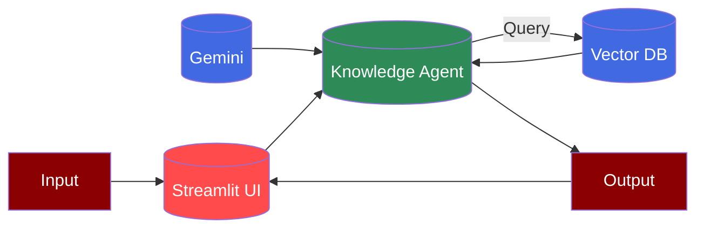

## Prerequisites

<Steps>
    <Step title="Install Package">
        Install required packages:
        ```bash
        pip install "praisonaiagents[llm]" streamlit
        ```

        <Note>
        streamlit for UI<br />
        praisonaiagents[llm] for Gemini model access (It uses Litellm)
        </Note>
    </Step>

    <Step title="Setup Environment">
        Configure environment:
        ```bash
        export GOOGLE_API_KEY=your-api-key
        ```
        
        <Note>
        Get your API key from [Google AI Studio](https://makersuite.google.com/app/apikey)
        </Note>
    </Step>

    <Step title="Create File">
        Create a new file called `app.py` and add the following code:
    </Step>

    <Step title="Run Application">
        Start the Streamlit application:
        ```bash
        streamlit run app.py
        ```
    </Step>
</Steps>

## Code

```python
import streamlit as st
from praisonaiagents import Agent

st.title("Gemini 2.0 Thinking AI Agent")

# Initialize the agent
@st.cache_resource
def get_agent():
    llm_config = {
        "model": "gemini/gemini-2.0-flash-thinking-exp-01-21",
        "response_format": {"type": "text"}
    }
    
    return Agent(
        instructions="You are a helpful assistant",
        llm=llm_config
    )

agent = get_agent()

# Create text area input field
user_question = st.text_area("Ask your question:", height=150)

# Add ask button
if st.button("Ask"):
    if user_question:
        with st.spinner('Thinking...'):
            result = agent.start(user_question)
            st.write("### Answer")
            st.write(result)
    else:
        st.warning("Please enter a question") 
```

## Features

<CardGroup cols={2}>
  <Card title="Interactive Chat" icon="comments">
    Real-time chat interface with message history.
  </Card>
  <Card title="Knowledge Base" icon="database">
    RAG capabilities with ChromaDB integration.
  </Card>
  <Card title="Model Integration" icon="server">
    Uses Google's Gemini Pro model.
  </Card>
  <Card title="Session Management" icon="clock-rotate-left">
    Maintains chat history in session state.
  </Card>
</CardGroup>

<Note>
  Make sure you have a valid Google API key and sufficient quota for using Gemini models.
</Note>