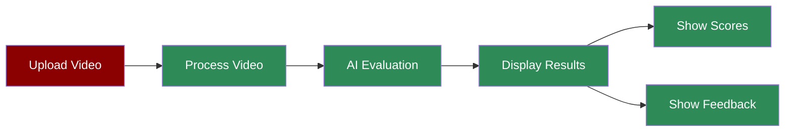

## What is the Hackathon Judge Streamlit App?

The Hackathon Judge Streamlit App provides a user-friendly web interface for evaluating hackathon projects through video demonstrations. It combines the power of AI evaluation with an interactive dashboard to display comprehensive project assessments, scores, and feedback.

## Features

<CardGroup cols={2}>
  <Card title="Video Upload" icon="upload">
    Easy-to-use interface for uploading project demonstration videos.
  </Card>
  <Card title="Real-time Processing" icon="spinner">
    Live processing and evaluation of uploaded videos.
  </Card>
  <Card title="Interactive Dashboard" icon="chart-simple">
    Visual presentation of scores and metrics.
  </Card>
  <Card title="Detailed Feedback" icon="comments">
    Comprehensive display of evaluation results and recommendations.
  </Card>
  <Card title="Market Analysis" icon="briefcase">
    Visual presentation of market potential and scalability.
  </Card>
</CardGroup>

## Quick Start

<Steps>
    <Step title="Install Dependencies">
        Install the required packages:
        ```bash
        pip install streamlit praisonaiagents
        ```
    </Step>

    <Step title="Set API Key">
        Set your OpenAI API key as an environment variable:
        ```bash
        export OPENAI_API_KEY=your_api_key_here
        ```
    </Step>

    <Step title="Create the App">
        Create a new file `hackathon_judge_app.py` with the following code:
```python
import streamlit as st
import os
from praisonaiagents import Agent, Task, PraisonAIAgents
from pydantic import BaseModel
from typing import List, Dict
import tempfile
import json

class ProjectEvaluation(BaseModel):
    innovation_score: int  # 0-100
    technical_complexity: int # 0-100  
    presentation_quality: int # 0-100
    user_experience: int # 0-100
    completeness: int # 0-100
    overall_score: int # 0-100
    key_strengths: List[str]
    areas_for_improvement: List[str]
    notable_features: List[str]
    technical_highlights: List[str]
    recommendations: List[str]
    market_potential: str
    scalability_assessment: str

# Set page config
st.set_page_config(
    page_title="Hackathon Project Evaluator",
    page_icon="🏆",
    layout="wide"
)

# Create Vision Analysis Agent
@st.cache_resource
def get_hackathon_judge():
    return Agent(
        name="HackathonJudge",
        role="Technical Project Evaluator",
        goal="Evaluate hackathon projects through video demonstrations",
        backstory="""You are an experienced hackathon judge and technical expert.
        You excel at evaluating innovation, technical implementation, and presentation quality.
        You provide constructive feedback and identify both strengths and areas for improvement.""",
        llm="gpt-4o-mini",  # Using vision-capable model
        self_reflect=False,
        knowledge=""
    )

def evaluate_project(video_path: str) -> ProjectEvaluation:
    """
    Evaluate a hackathon project based on its video demonstration
    """
    hackathon_judge = get_hackathon_judge()
    
    evaluation_task = Task(
        name="project_evaluation",
        description="""Analyze this hackathon project video demonstration and provide a comprehensive evaluation:
        
        1. Score the following aspects (0-100):
           - Innovation and Creativity
           - Technical Complexity
           - Presentation Quality
           - User Experience
           - Project Completeness
           
        2. Identify:
           - Key strengths and standout features
           - Areas that could be improved
           - Notable technical implementations
           - Market potential and scalability
           
        3. Provide:
           - Specific recommendations for improvement
           - Technical suggestions
           - Potential future enhancements""",
        expected_output="Detailed project evaluation with scores and feedback",
        agent=hackathon_judge,
        output_pydantic=ProjectEvaluation,
        images=[video_path]  # Video input for multimodal analysis
    )

    # Initialize and run evaluation
    agents = PraisonAIAgents(
        agents=[hackathon_judge],
        tasks=[evaluation_task],
        process="sequential",
        verbose=True
    )
    
    response = agents.start()
    
    try:
        # If response contains task_results, extract the Pydantic model directly
        if isinstance(response, dict) and 'task_results' in response:
            task_output = response['task_results'][0]
            if hasattr(task_output, 'pydantic'):
                return task_output.pydantic
            elif hasattr(task_output, 'raw'):
                # Extract JSON from raw string if it's wrapped in ```json
                raw_text = task_output.raw
                if raw_text.startswith('```json'):
                    raw_text = raw_text.split('\n', 1)[1].rsplit('\n', 1)[0]
                evaluation_data = json.loads(raw_text)
            else:
                evaluation_data = json.loads(task_output) if isinstance(task_output, str) else task_output
        elif isinstance(response, str):
            evaluation_data = json.loads(response)
        elif isinstance(response, dict) and 'task_status' in response:
            content = response['task_status']
            if isinstance(content, dict):
                evaluation_data = content
            else:
                evaluation_data = json.loads(content) if isinstance(content, str) else content
        else:
            evaluation_data = response
            
        # Create and return ProjectEvaluation instance
        return ProjectEvaluation(
            innovation_score=int(evaluation_data.get('innovation_score', 0)),
            technical_complexity=int(evaluation_data.get('technical_complexity', 0)),
            presentation_quality=int(evaluation_data.get('presentation_quality', 0)),
            user_experience=int(evaluation_data.get('user_experience', 0)),
            completeness=int(evaluation_data.get('completeness', 0)),
            overall_score=int(evaluation_data.get('overall_score', 0)),
            key_strengths=evaluation_data.get('key_strengths', []),
            areas_for_improvement=evaluation_data.get('areas_for_improvement', []),
            notable_features=evaluation_data.get('notable_features', []),
            technical_highlights=evaluation_data.get('technical_highlights', []),
            recommendations=evaluation_data.get('recommendations', []),
            market_potential=str(evaluation_data.get('market_potential', '')),
            scalability_assessment=str(evaluation_data.get('scalability_assessment', ''))
        )
    except Exception as e:
        print(f"Debug - Raw response: {response}")
        print(f"Error processing response: {e}")
        raise

# Title and description
st.title("🏆 Hackathon Judge Agent")
st.markdown("""
Upload your hackathon project demonstration video for an AI-powered evaluation.
Get comprehensive feedback on various aspects of your project.
""")

# File uploader
uploaded_file = st.file_uploader("Choose a video file", type=['mp4', 'avi', 'mov', 'mkv'])

if uploaded_file:
    # Create a temporary file to store the video
    with tempfile.NamedTemporaryFile(delete=False, suffix='.'+uploaded_file.name.split('.')[-1]) as tmp_file:
        tmp_file.write(uploaded_file.getvalue())
        video_path = tmp_file.name

    with st.spinner("🤖 AI is evaluating your project..."):
        try:
            # Evaluate the project
            result = evaluate_project(video_path)
            
            # Display results
            st.header("Overall Score")
            st.metric("Overall Score", f"{result.overall_score}/100")
            
            # Display detailed scores
            st.header("Detailed Scores")
            col1, col2, col3 = st.columns(3)
            with col1:
                st.metric("Innovation", f"{result.innovation_score}/100")
                st.metric("Technical Complexity", f"{result.technical_complexity}/100")
            with col2:
                st.metric("Presentation", f"{result.presentation_quality}/100")
                st.metric("User Experience", f"{result.user_experience}/100")
            with col3:
                st.metric("Completeness", f"{result.completeness}/100")

            # Display qualitative feedback
            st.header("Key Strengths")
            for strength in result.key_strengths:
                st.write(f"• {strength}")
            
            st.header("Areas for Improvement")
            for area in result.areas_for_improvement:
                st.write(f"• {area}")
            
            st.header("Technical Highlights")
            for highlight in result.technical_highlights:
                st.write(f"• {highlight}")
            
            st.header("Notable Features")
            for feature in result.notable_features:
                st.write(f"• {feature}")
            
            st.header("Recommendations")
            for rec in result.recommendations:
                st.write(f"• {rec}")
            
            # Market Analysis
            st.header("Market Analysis")
            col1, col2 = st.columns(2)
            with col1:
                st.subheader("Market Potential")
                st.write(result.market_potential)
            with col2:
                st.subheader("Scalability Assessment")
                st.write(result.scalability_assessment)

        except Exception as e:
            st.error(f"Error evaluating the project: {str(e)}")
        finally:
            # Clean up the temporary file
            os.unlink(video_path)
else:
    # Display placeholder content
    st.info("👆 Upload a video file to get started!") 
```
    </Step>

    <Step title="Run the App">
        Start the Streamlit app:
        ```bash
        streamlit run hackathon_judge_app.py
        ```
    </Step>
</Steps>

## Understanding the Interface

The Streamlit app provides an intuitive interface with the following sections:

- **Video Upload**: Drag and drop or browse to upload your project demo video
- **Overall Score**: A prominent display of the project's overall rating
- **Detailed Scores**:
  - Innovation Score
  - Technical Complexity
  - Presentation Quality
  - User Experience
  - Project Completeness
- **Qualitative Feedback**:
  - Key Strengths
  - Areas for Improvement
  - Technical Highlights
  - Notable Features
  - Recommendations
- **Market Analysis**:
  - Market Potential
  - Scalability Assessment

## Next Steps

<CardGroup>
  <Card title="Streamlit Docs" icon="book" href="https://docs.streamlit.io">
    Learn more about Streamlit features
  </Card>
  <Card title="PraisonAI Docs" icon="bolt" href="/introduction">
    Explore PraisonAI capabilities
  </Card>
  <Card title="Examples" icon="code" href="/examples">
    View more example applications
  </Card>
</CardGroup>
