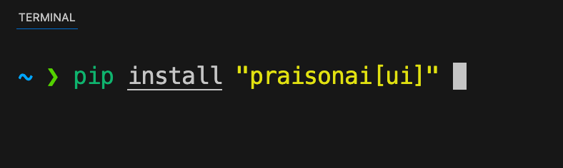
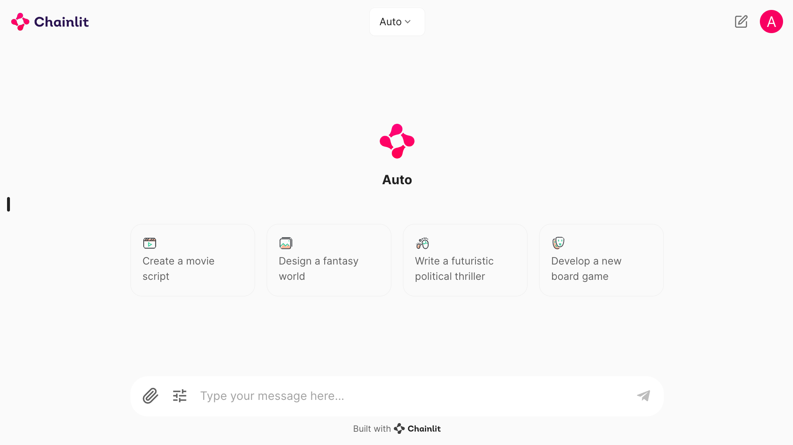
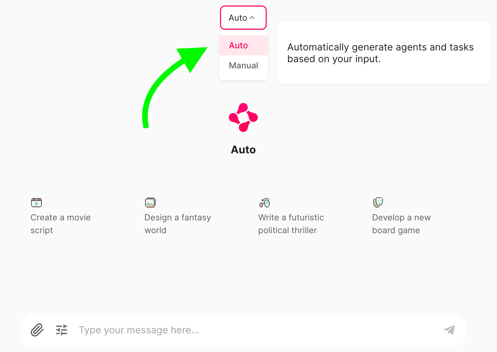
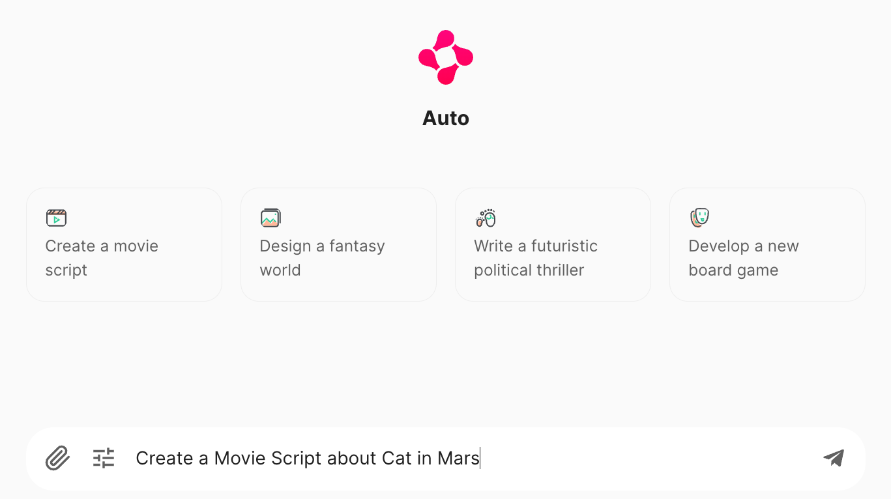
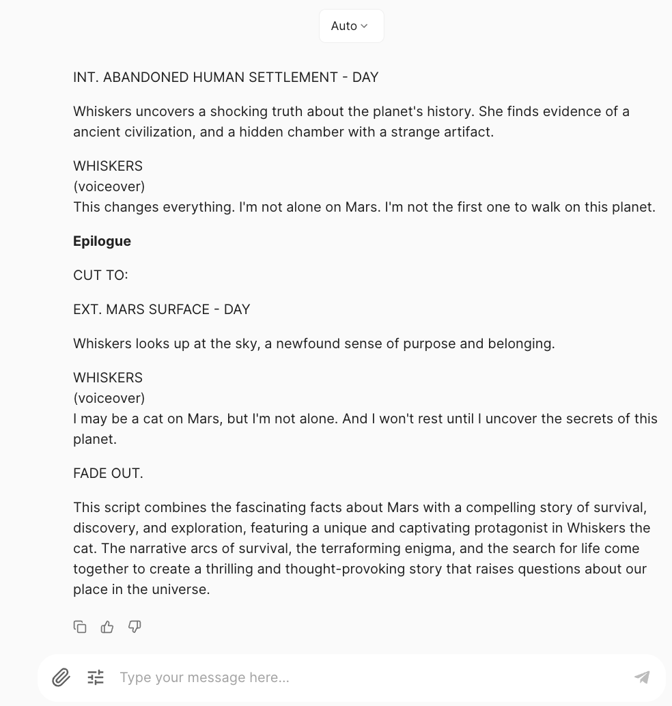
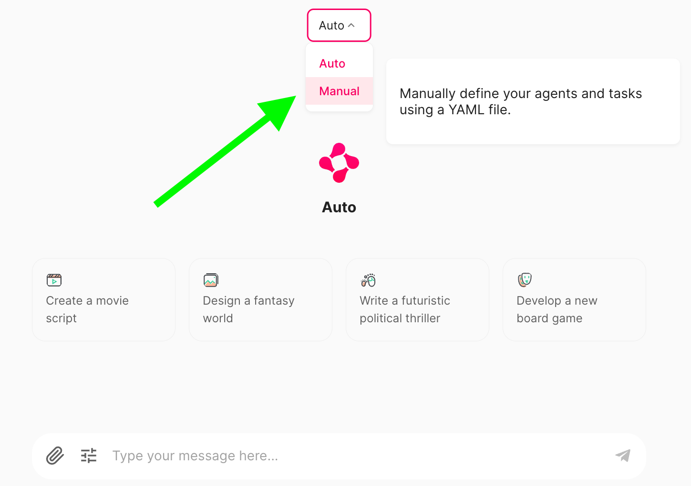
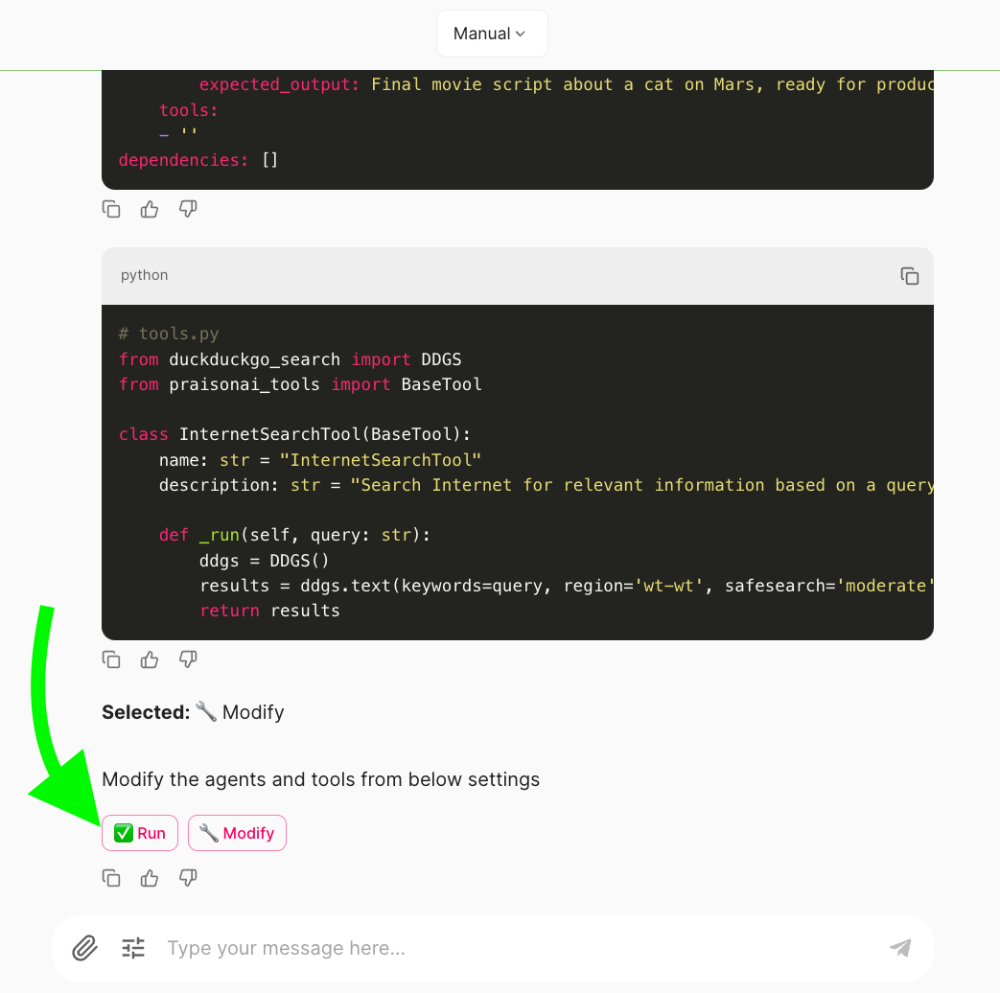
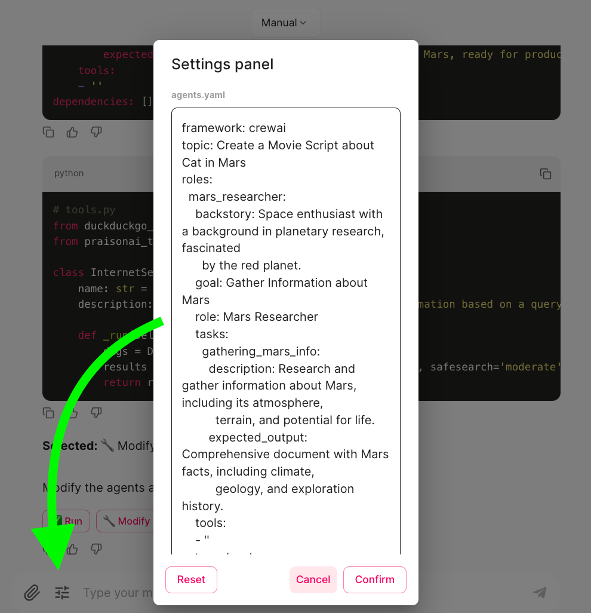
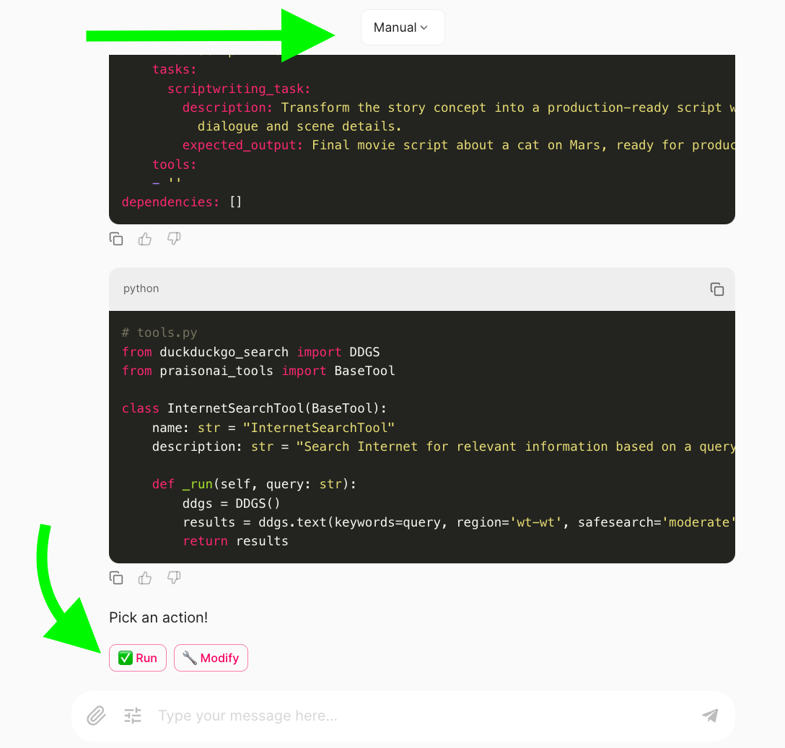
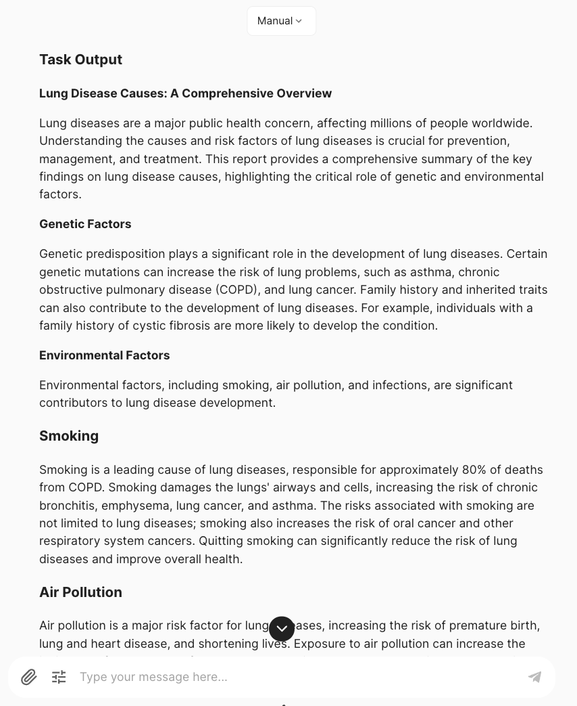

<div className="relative w-full aspect-video">
  <iframe
    className="absolute top-0 left-0 w-full h-full"
    src="https://www.youtube.com/embed/tg-ZjNl3OCg"
    title="YouTube video player"
    allow="accelerometer; autoplay; clipboard-write; encrypted-media; gyroscope; picture-in-picture"
    allowFullScreen
  ></iframe>
</div>

## Different User Interfaces:

| Interface | Description | URL |
|---|---|---|
| **UI** | Multi Agents such as CrewAI or AutoGen | [https://docs.praison.ai/ui/ui](https://docs.praison.ai/ui/ui) |
| **Chat** | Chat with 100+ LLMs, single AI Agent | [https://docs.praison.ai/ui/chat](https://docs.praison.ai/ui/chat) |
| **Code** | Chat with entire Codebase, single AI Agent | [https://docs.praison.ai/ui/code](https://docs.praison.ai/ui/code) |

## Chainlit
```bash
pip install -U "praisonai[ui]"
export OPENAI_API_KEY="Enter your API key"
chainlit create-secret
export CHAINLIT_AUTH_SECRET=xxxxxxxx
praisonai ui
```

or 

```bash
python -m praisonai ui
```

Default Username: admin
Default Password: admin

### To Change Username and Password

create .env file in the root folder of the project
Add below Variables and required Username/Password
```
CHAINLIT_USERNAME=admin
CHAINLIT_USERNAME=admin
```

## Gradio
```bash
pip install "praisonai[gradio]"
export OPENAI_API_KEY="Enter your API key"
praisonai --ui gradio
```

## Streamlit

```bash
git clone https://github.com/leporejoseph/PraisonAi-Streamlit
cd PraisonAi-Streamlit
pip install -r requirements.txt
streamlit run app.py
```

## Using Chainlit (with Pictures)

## Run Automatically

### Install Required Package


### User Interface


### Select Auto Mode


### Configure Agent Settings


### Define a Task to Auto Generate Agents and Run


### Output


## Run Manually

### Select Manual Mode


### Modify Agents and Tools


## Review Generated Agents


### Run Agents


### Manual Model Output

