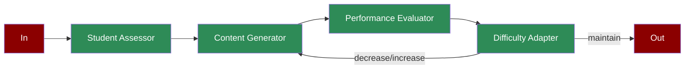

Learn how to implement an adaptive learning system using AI agents for personalized education and dynamic content adjustment.

## Quick Start

<Steps>
    <Step title="Install Package">
        First, install the PraisonAI Agents package:
        ```bash
        pip install praisonaiagents
        ```
    </Step>

    <Step title="Set API Key">
        Set your OpenAI API key as an environment variable in your terminal:
        ```bash
        export OPENAI_API_KEY=your_api_key_here
        ```
    </Step>

    <Step title="Create a file">
        Create a new file `app.py` with the basic setup:
```python
from praisonaiagents import Agent, Task, PraisonAIAgents
import time
from typing import Dict

def assess_student_level():
    """Simulates student assessment"""
    levels = ["beginner", "intermediate", "advanced"]
    current_time = int(time.time())
    return levels[current_time % 3]

def generate_content(level: str):
    """Simulates content generation"""
    content_types = {
        "beginner": "basic concepts and examples",
        "intermediate": "practice problems and applications",
        "advanced": "complex scenarios and projects"
    }
    return content_types.get(level, "basic concepts")

def evaluate_performance():
    """Simulates performance evaluation"""
    scores = ["low", "medium", "high"]
    current_time = int(time.time())
    return scores[current_time % 3]

def adapt_difficulty(performance: str):
    """Simulates difficulty adaptation"""
    adaptations = {
        "low": "decrease",
        "medium": "maintain",
        "high": "increase"
    }
    return adaptations.get(performance, "maintain")

# Create specialized agents
assessor = Agent(
    name="Student Assessor",
    role="Level Assessment",
    goal="Assess student's current level",
    instructions="Evaluate student's knowledge and skills",
    tools=[assess_student_level]
)

generator = Agent(
    name="Content Generator",
    role="Content Creation",
    goal="Generate appropriate learning content",
    instructions="Create content based on student's level",
    tools=[generate_content]
)

evaluator = Agent(
    name="Performance Evaluator",
    role="Performance Assessment",
    goal="Evaluate student's performance",
    instructions="Assess learning outcomes",
    tools=[evaluate_performance]
)

adapter = Agent(
    name="Difficulty Adapter",
    role="Content Adaptation",
    goal="Adapt content difficulty",
    instructions="Adjust difficulty based on performance",
    tools=[adapt_difficulty]
)

# Create workflow tasks
assessment_task = Task(
    name="assess_level",
    description="Assess student's current level",
    expected_output="Student's proficiency level",
    agent=assessor,
    is_start=True,
    next_tasks=["generate_content"]
)

generation_task = Task(
    name="generate_content",
    description="Generate appropriate content",
    expected_output="Learning content",
    agent=generator,
    next_tasks=["evaluate_performance"]
)

evaluation_task = Task(
    name="evaluate_performance",
    description="Evaluate student's performance",
    expected_output="Performance assessment",
    agent=evaluator,
    next_tasks=["adapt_difficulty"]
)

adaptation_task = Task(
    name="adapt_difficulty",
    description="Adapt content difficulty",
    expected_output="Difficulty adjustment",
    agent=adapter,
    task_type="decision",
    condition={
        "decrease": ["generate_content"],
        "maintain": "",
        "increase": ["generate_content"]
    }
)

# Create workflow
workflow = PraisonAIAgents(
    agents=[assessor, generator, evaluator, adapter],
    tasks=[assessment_task, generation_task, evaluation_task, adaptation_task],
    process="workflow",
    verbose=True
)

def main():
    print("\nStarting Adaptive Learning Workflow...")
    print("=" * 50)
    
    # Run workflow
    results = workflow.start()
    
    # Print results
    print("\nAdaptive Learning Results:")
    print("=" * 50)
    for task_id, result in results["task_results"].items():
        if result:
            print(f"\nTask: {task_id}")
            print(f"Result: {result.raw}")
            print("-" * 50)

if __name__ == "__main__":
    main()
```
    </Step>

    <Step title="Start Agents">
        Run your adaptive learning system:
        ```bash
        python app.py
        ```
    </Step>
</Steps>

<Note>
  **Requirements**
  - Python 3.10 or higher
  - OpenAI API key. Generate OpenAI API key [here](https://platform.openai.com/api-keys). Use Other models using [this guide](/models).   
</Note>

## Understanding Adaptive Learning

<Card title="What is Adaptive Learning?" icon="question">
  Adaptive learning enables:
  - Personalized learning experiences
  - Dynamic content adjustment
  - Performance-based progression
  - Continuous skill assessment
  - Intelligent difficulty scaling
</Card>

## Features

<CardGroup cols={2}>
  <Card title="Student Assessment" icon="user-graduate">
    Evaluate student proficiency:
    - Knowledge level assessment
    - Skill gap identification
    - Learning style analysis
  </Card>
  <Card title="Content Generation" icon="book">
    Create personalized content:
    - Level-appropriate materials
    - Custom learning paths
    - Interactive exercises
  </Card>
  <Card title="Performance Tracking" icon="chart-line">
    Monitor learning progress:
    - Real-time evaluation
    - Progress tracking
    - Achievement metrics
  </Card>
  <Card title="Dynamic Adaptation" icon="sliders">
    Adjust learning experience:
    - Difficulty scaling
    - Content optimization
    - Pace adjustment
  </Card>
</CardGroup>

## Next Steps

<CardGroup cols={2}>
  <Card title="Prompt Chaining" icon="link" href="/features/promptchaining">
    Learn about chaining prompts for complex workflows
  </Card>
  <Card title="Evaluator Optimizer" icon="gauge" href="/features/evaluator-optimiser">
    Explore how to optimize and evaluate solutions
  </Card>
</CardGroup> 