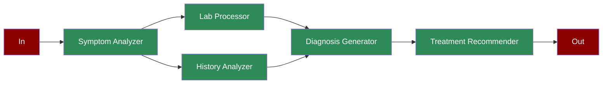

Learn how to implement an automated healthcare diagnosis system using AI agents for symptom analysis, lab processing, and treatment recommendations.

## Quick Start

<Steps>
    <Step title="Install Package">
        First, install the PraisonAI Agents package:
        ```bash
        pip install praisonaiagents
        ```
    </Step>

    <Step title="Set API Key">
        Set your OpenAI API key as an environment variable in your terminal:
        ```bash
        export OPENAI_API_KEY=your_api_key_here
        ```
    </Step>

    <Step title="Create a file">
        Create a new file `app.py` with the basic setup:
```python
from praisonaiagents import Agent, Task, PraisonAIAgents
import time
from typing import Dict, List

def analyze_symptoms():
    """Simulates symptom analysis"""
    cases = [
        {"symptoms": ["fever", "cough", "fatigue"], "severity": "high", "duration": "5_days"},
        {"symptoms": ["headache", "nausea"], "severity": "medium", "duration": "2_days"},
        {"symptoms": ["rash", "itching"], "severity": "low", "duration": "1_week"}
    ]
    return cases[int(time.time()) % 3]

def process_lab_results():
    """Simulates lab result processing"""
    results = [
        {"blood_count": "abnormal", "inflammation": "high", "markers": "elevated"},
        {"blood_count": "normal", "inflammation": "low", "markers": "normal"},
        {"blood_count": "normal", "inflammation": "medium", "markers": "elevated"}
    ]
    return results[int(time.time()) % 3]

def analyze_medical_history():
    """Simulates medical history analysis"""
    histories = [
        {"chronic_conditions": True, "allergies": True, "risk_factors": "high"},
        {"chronic_conditions": False, "allergies": True, "risk_factors": "medium"},
        {"chronic_conditions": False, "allergies": False, "risk_factors": "low"}
    ]
    return histories[int(time.time()) % 3]

def generate_diagnosis(symptoms: Dict, lab_results: Dict, history: Dict):
    """Simulates diagnosis generation"""
    if symptoms["severity"] == "high" and lab_results["markers"] == "elevated":
        return {"diagnosis": "serious_condition", "confidence": "high"}
    elif symptoms["severity"] == "medium" or lab_results["inflammation"] == "medium":
        return {"diagnosis": "moderate_condition", "confidence": "medium"}
    return {"diagnosis": "mild_condition", "confidence": "high"}

def recommend_treatment(diagnosis: Dict):
    """Simulates treatment recommendation"""
    treatments = {
        "serious_condition": ["immediate_intervention", "specialist_referral"],
        "moderate_condition": ["medication", "follow_up"],
        "mild_condition": ["rest", "observation"]
    }
    return treatments.get(diagnosis["diagnosis"], ["general_care"])

# Create specialized agents
symptom_analyzer = Agent(
    name="Symptom Analyzer",
    role="Symptom Analysis",
    goal="Analyze patient symptoms",
    instructions="Evaluate reported symptoms and their severity",
    tools=[analyze_symptoms]
)

lab_processor = Agent(
    name="Lab Processor",
    role="Lab Analysis",
    goal="Process laboratory results",
    instructions="Analyze and interpret lab test results",
    tools=[process_lab_results]
)

history_analyzer = Agent(
    name="History Analyzer",
    role="Medical History Analysis",
    goal="Analyze patient medical history",
    instructions="Review and assess patient medical history",
    tools=[analyze_medical_history]
)

diagnosis_generator = Agent(
    name="Diagnosis Generator",
    role="Diagnosis Generation",
    goal="Generate comprehensive diagnosis",
    instructions="Combine all inputs to generate diagnosis",
    tools=[generate_diagnosis]
)

treatment_recommender = Agent(
    name="Treatment Recommender",
    role="Treatment Planning",
    goal="Recommend appropriate treatment",
    instructions="Suggest treatment based on diagnosis",
    tools=[recommend_treatment]
)

# Create workflow tasks
symptom_task = Task(
    name="analyze_symptoms",
    description="Analyze patient symptoms",
    expected_output="Symptom analysis",
    agent=symptom_analyzer,
    is_start=True,
    task_type="decision",
    condition={
        "high": ["process_labs", "analyze_history"],
        "medium": ["process_labs", "analyze_history"],
        "low": ["process_labs"]
    }
)

lab_task = Task(
    name="process_labs",
    description="Process lab results",
    expected_output="Lab analysis",
    agent=lab_processor,
    next_tasks=["generate_diagnosis"]
)

history_task = Task(
    name="analyze_history",
    description="Analyze medical history",
    expected_output="History analysis",
    agent=history_analyzer,
    next_tasks=["generate_diagnosis"]
)

diagnosis_task = Task(
    name="generate_diagnosis",
    description="Generate diagnosis",
    expected_output="Diagnosis and confidence level",
    agent=diagnosis_generator,
    next_tasks=["recommend_treatment"],
    context=[symptom_task, lab_task, history_task]
)

treatment_task = Task(
    name="recommend_treatment",
    description="Recommend treatment",
    expected_output="Treatment recommendations",
    agent=treatment_recommender,
    context=[diagnosis_task]
)

# Create workflow
workflow = PraisonAIAgents(
    agents=[symptom_analyzer, lab_processor, history_analyzer, 
            diagnosis_generator, treatment_recommender],
    tasks=[symptom_task, lab_task, history_task, diagnosis_task, treatment_task],
    process="workflow",
    verbose=True
)

def main():
    print("\nStarting Healthcare Diagnosis Workflow...")
    print("=" * 50)
    
    # Run workflow
    results = workflow.start()
    
    # Print results
    print("\nDiagnosis Results:")
    print("=" * 50)
    for task_id, result in results["task_results"].items():
        if result:
            print(f"\nTask: {task_id}")
            print(f"Result: {result.raw}")
            print("-" * 50)

if __name__ == "__main__":
    main()
```
    </Step>

    <Step title="Start Agents">
        Run your healthcare diagnosis system:
        ```bash
        python app.py
        ```
    </Step>
</Steps>

<Note>
  **Requirements**
  - Python 3.10 or higher
  - OpenAI API key. Generate OpenAI API key [here](https://platform.openai.com/api-keys). Use Other models using [this guide](/models).   
</Note>

## Understanding Healthcare Diagnosis

<Card title="What is Healthcare Diagnosis?" icon="question">
  Healthcare diagnosis enables:
  - Automated symptom analysis
  - Lab result processing
  - Medical history review
  - Diagnosis generation
  - Treatment recommendations
</Card>

## Features

<CardGroup cols={2}>
  <Card title="Symptom Analysis" icon="stethoscope">
    Analyze patient symptoms:
    - Severity assessment
    - Duration tracking
    - Pattern recognition
  </Card>
  <Card title="Lab Processing" icon="flask">
    Process medical tests:
    - Blood count analysis
    - Inflammation markers
    - Test result interpretation
  </Card>
  <Card title="History Analysis" icon="book-medical">
    Review medical history:
    - Chronic conditions
    - Allergies
    - Risk factors
  </Card>
  <Card title="Treatment Planning" icon="prescription">
    Generate treatment plans:
    - Immediate interventions
    - Medication recommendations
    - Follow-up scheduling
  </Card>
</CardGroup>

## Next Steps

<CardGroup cols={2}>
  <Card title="Prompt Chaining" icon="link" href="/features/promptchaining">
    Learn about chaining prompts for complex workflows
  </Card>
  <Card title="Evaluator Optimizer" icon="gauge" href="/features/evaluator-optimiser">
    Explore how to optimize and evaluate solutions
  </Card>
</CardGroup> 