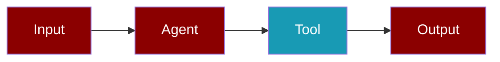

# AGENTS.md - PraisonAI SDK Comprehensive Guide

> **For AI Agents and Developers**: This document provides the complete context needed to work with the PraisonAI ecosystem, including design principles, architecture, repository structure, and implementation guidelines.

---

## 1. What is PraisonAI?

PraisonAI is a **high-performance, agentic AI framework** designed for building production-ready AI agents and multi-agent workflows.

### Core Philosophy

```
Simpler than competitors • More extensible • Faster • Agent-centric
```

| Principle | Description |
|-----------|-------------|
| **Agent-Centric** | Every design decision centers on Agents, workflows, sessions, tools, and memory |
| **Protocol-Driven Core** | Core SDK is lightweight with protocols/hooks/adapters only |
| **Minimal API** | Fewer parameters, sensible defaults, explicit overrides |
| **Performance-First** | Lazy loading, optional dependencies, no hot-path regressions |
| **Production-Ready** | Safe by default, multi-agent safe, async-safe |
Powerful, lightweight, highly reliable and robust
Easy and developer frienldy for non developers
Easy and user friendly
---

## 2. Repository Structure

### 2.1 Canonical Paths

```
/Users/praison/praisonai-package/
├── src/
│   ├── praisonai-agents/          # Core SDK (praisonaiagents)
│   │   ├── praisonaiagents/       # Python package
│   │   ├── tests/                 # Unit & integration tests
│   │   ├── examples/              # Package-level examples
│   │   └── pyproject.toml         # Package config
│   │
│   ├── praisonai/                 # Wrapper (praisonai)
│   │   ├── praisonai/             # CLI, integrations, heavy impls
│   │   └── pyproject.toml
│   │
│   └── praisonai-ts/              # TypeScript SDK
│       └── src/
│
├── examples/                      # Main examples directory
│   ├── python/                # Python examples (primary)
│   ├── yaml/                  # YAML configuration examples
│   ├── js/                    # JavaScript/TypeScript examples
│   └── cookbooks/             # End-to-end recipes
│
/Users/praison/PraisonAI-tools/    # External tools/plugins
/Users/praison/PraisonAIDocs/      # Documentation (Mintlify)
    └── docs/
        ├── agents/
        ├── api/
        ├── capabilities/
        ├── cli/
        ├── concepts/
        ├── features/
        ├── guides/
        ├── knowledge/
        ├── memory/
        ├── models/
        ├── observability/
        ├── rag/
        ├── sdk/
        ├── tools/
        ├── tutorials/
        └── ... (49+ subdirectories)
```

### 2.2 Package Hierarchy

```
┌─────────────────────────────────────────────────────────────────┐
│                      praisonai (Wrapper)                        │
│  CLI • Integrations • Heavy Implementations • Optional Deps     │
├─────────────────────────────────────────────────────────────────┤
│                    praisonaiagents (Core SDK)                   │
│  Protocols • Hooks • Adapters • Base Classes • Decorators       │
├─────────────────────────────────────────────────────────────────┤
│                   praisonai-tools (External)                    │
│  Optional Tools • Plugins • Community Extensions                │
└─────────────────────────────────────────────────────────────────┘
```

---

## 3. Core SDK Architecture (praisonaiagents)

### 3.1 Key Modules

| Module | Size | Purpose |
|--------|------|---------|
| `agent/` | 1.4M | Agent class, protocols, handoff, autonomy |
| `memory/` | 984K | Memory protocols, adapters, file memory |
| `context/` | 960K | Context management, artifacts, fast context |
| `tools/` | 732K | Tool SDK, decorators, registry, protocols |
| `llm/` | 620K | LLM client, model router |
| `workflows/` | 456K | Workflow engine, patterns (Route, Parallel, Loop) |
| `knowledge/` | 436K | Knowledge/RAG protocols, vector stores |
| `hooks/` | 260K | Hook system, middleware, events |
| `eval/` | 240K | Evaluation framework |
| `rag/` | 264K | RAG protocols, retriever, reranker |
| `plugins/` | 56K | Plugin manager, registry |
| `policy/` | 64K | Policy engine |
| `bus/` | 48K | Event bus |
| `streaming/` | 56K | Streaming events, callbacks |
| `trace/` | 152K | Trace protocols, context events |
| `scheduler/` | 48K | Schedule models, store, parser, runner |

### 3.2 Protocol-First Design

Core SDK uses `typing.Protocol` for all extension points:

```
Pattern: Each major module has a protocols.py file

- Protocols define WHAT (interface contract)
- Adapters implement HOW (concrete implementation)
- Naming: XProtocol for interfaces, XAdapter for implementations
- Users can implement any protocol for custom behavior
```

**Discovery:** Find all protocols dynamically:
```bash
grep -r "class.*Protocol" praisonaiagents/ --include="*.py"
```

**Key principle:** When adding new extensibility, create a Protocol first, then implement adapters.

### 3.3 Core Dependencies

```toml
# Required (always loaded) - pyproject.toml
dependencies = [
    "pydantic>=2.10.0",    # Type validation
    "rich",                # Terminal UI
    "openai>=2.0.0",       # OpenAI client
    "posthog>=3.0.0",      # Telemetry
    "aiohttp>=3.8.0"       # Async HTTP
]

# Optional (lazy loaded)
[project.optional-dependencies]
memory = ["chromadb>=1.0.0", "litellm>=1.81.0"]
knowledge = ["mem0ai>=0.1.0", "chromadb>=1.0.0", "markitdown[all]>=0.1.0"]
mcp = ["mcp>=1.20.0", "fastapi>=0.115.0", "uvicorn>=0.34.0"]
llm = ["litellm>=1.81.0"]
api = ["fastapi>=0.115.0", "uvicorn>=0.34.0"]
auth = ["PyJWT>=2.8.0", "passlib[bcrypt]>=1.7.4"]
mongodb = ["pymongo>=4.6.3", "motor>=3.4.0"]
```

---

## 4. Core Engineering Principles

### 4.1 Protocol-Driven Core (MUST)

```
Core SDK (praisonaiagents)          Wrapper (praisonai)
━━━━━━━━━━━━━━━━━━━━━━━━━━━         ━━━━━━━━━━━━━━━━━━━
✅ Protocols                        ✅ Heavy implementations
✅ Hooks                            ✅ CLI commands
✅ Adapters                         ✅ External integrations
✅ Base classes                     ✅ Optional deps
✅ Decorators                       ✅ UI components
✅ Dataclasses                      ✅ Database adapters
❌ Heavy implementations            ❌ Core logic
```

### 4.2 No Performance Impact (MUST)

```python
# ✅ CORRECT: Lazy import
def use_chromadb():
    try:
        import chromadb
    except ImportError:
        raise ImportError("Install with: pip install praisonaiagents[memory]")

# ❌ WRONG: Module-level heavy import
import chromadb  # Adds 500ms+ to import time
```

**Rules:**
- No module-level imports of optional dependencies
- No heavy initialization in `__init__.py`
- Use `__getattr__` for lazy loading in package roots
- Target: < 200ms package import time

### 4.3 DRY Approach (MUST)

- Reuse existing abstractions; don't duplicate
- Refactor safely when duplication is found
- Check existing protocols before creating new ones
- Use existing EventBus instead of creating new messaging

### 4.4 Agent-Centric Design (MUST)

Every API decision must prioritize:
1. **Agents** - Core execution unit
2. **Multi-agent workflows** - Coordination patterns
3. **Sessions** - State management
4. **Tools** - Agent capabilities
5. **Memory** - Persistence and context

### 4.5 Async-Safe & Multi-Agent Safe (MUST)

```
Async-Safe:
- All I/O operations must have async variants
- Never block the event loop with sync I/O in async context
- Use asyncio primitives for coordination (not threading)

Multi-Agent Safe:
- No shared mutable global state between agents
- Each agent owns its context, memory, and session
- Cross-agent communication via explicit channels (EventBus, handoff)
- Resource isolation by default, explicit sharing when needed
```

### 4.6 Invariants (Never Break)

| Invariant | Meaning |
|-----------|---------|
| Protocol-driven core | Core SDK has NO heavy implementations |
| Lazy imports | Optional deps never imported at module level |
| Backward compatible | Public API changes require deprecation cycle |
| Safe defaults | New features are opt-in, not opt-out |
| Deterministic tests | Tests must not depend on timing or external state |

### 4.7 Concurrency Model

```
Sync/Async Boundaries:
- User-facing: Both sync and async entry points (run/start)
- Internal: Prefer async, wrap for sync callers
- Tools: Support both sync and async execution
- Hooks: Fire in the current execution context (sync or async)

Event Loop Rules:
- One event loop per thread
- Never nest event loops
- Use asyncio.run() only at top level
```

### 4.8 Error Handling & Observability

```
Error Model:
- Fail fast with clear error messages
- Include remediation hints in exceptions
- Propagate context (agent name, tool name, session ID)
- Hook points for error interception (on_error events)

Observability Hooks:
- All key operations emit events via EventBus
- Trace protocols for external observability integration
- Structured logging with correlation IDs
- Metrics collection via optional adapters
```

### 4.9 Naming Conventions

```python
# Registration/Mutation
add_X()          # User-facing registration (add_hook, add_policy)
remove_X()       # Unregistration
register_X()     # Internal/framework registration

# Retrieval
get_X()          # Single item by ID (get_tool, get_policy)
search_X()       # Multiple by query (search_memory)
list_X()         # All items (list_tools, list_plugins)
has_X()          # Existence check

# Persistence
save() / load()  # Disk persistence (NOT store)

# Configuration
class XConfig:   # Configuration dataclass (MemoryConfig, HooksConfig)

# Protocols
class XProtocol(Protocol):  # Abstract interface
class XAdapter:             # Implementation

# Execution
run()            # Synchronous, blocking
start()          # Async/long-running
execute()        # Internal/low-level
```

---

## 5. API Philosophy

### 5.1 Simple API (User-Facing)

```python
# Basic usage - 3 lines
from praisonaiagents import Agent
agent = Agent(name="assistant", instructions="Be helpful")
response = agent.start("Hello!")

# With tools - still simple
from praisonaiagents import Agent, tool

@tool
def search(query: str) -> list:
    """Search the web."""
    return [{"result": query}]

agent = Agent(name="researcher", tools=[search])
```

### 5.2 Progressive Disclosure

```python
# Level 1: Minimal (most users)
agent = Agent(name="assistant")

# Level 2: With common options
agent = Agent(
    name="assistant",
    llm="gpt-4o-mini",
    memory=True
)

# Level 3: Full control (power users)
from praisonaiagents import Agent, MemoryConfig, HooksConfig

agent = Agent(
    name="assistant",
    llm="gpt-4o-mini",
    memory=MemoryConfig(provider="chroma", use_long_term=True),
    hooks=HooksConfig(before_tool=[my_validator]),
    guardrail=my_guardrail
)
```

---

## 6. Extension Points

### 6.1 Tools

```python
# Decorator style (simplest)
from praisonaiagents import tool

@tool
def my_tool(query: str) -> str:
    """Tool description."""
    return f"Result: {query}"

# Class style (more control)
from praisonaiagents.tools import BaseTool

class MyTool(BaseTool):
    name = "my_tool"
    description = "Does something"
    
    def run(self, query: str) -> str:
        return f"Result: {query}"
```

**Base files:**
- `praisonaiagents/tools/base.py` - BaseTool class
- `praisonaiagents/tools/decorator.py` - @tool decorator
- `praisonaiagents/tools/registry.py` - Tool registry

> [!IMPORTANT]
> **Agents only recognize parameters.** When creating tools, always expose all options as function parameters—agents cannot discover env vars or config files.

### 6.2 Hooks & Middleware

```python
from praisonaiagents.hooks import add_hook, before_tool, after_tool

@before_tool
def validate_args(event):
    print(f"Calling: {event.tool_name}")

@after_tool
def log_result(event):
    print(f"Result: {event.result}")

# Or functional style
hook_id = add_hook("before_tool", my_handler)
```

### 6.3 Memory Adapters

```python
from praisonaiagents.memory.protocols import MemoryProtocol

class MyMemoryAdapter:  # Implements MemoryProtocol
    def store_short_term(self, text, metadata=None):
        ...
    def search_short_term(self, query, limit=5):
        ...
```

### 6.4 Schedule Tools

Agent-centric scheduling via standalone `@tool` functions (no Agent class bloat):

```python
from praisonaiagents import Agent
from praisonaiagents.tools import schedule_add, schedule_list, schedule_remove

agent = Agent(
    name="assistant",
    tools=[schedule_add, schedule_list, schedule_remove],
)
```

**Schedule expression formats:**
- Keywords: `"hourly"`, `"daily"`, `"weekly"`
- Intervals: `"*/30m"`, `"*/6h"`, `"*/10s"`
- Cron: `"cron:0 7 * * *"` (requires optional `croniter`)
- One-shot: `"at:2026-03-01T09:00:00"`
- Relative: `"in 20 minutes"`

**Core components:**
- `scheduler/models.py` — `Schedule` and `ScheduleJob` dataclasses
- `scheduler/store.py` — `FileScheduleStore` (thread-safe JSON persistence at `~/.praisonai/schedules/jobs.json`)
- `scheduler/parser.py` — `parse_schedule()` for human-friendly expressions
- `scheduler/runner.py` — `ScheduleRunner` (stateless due-job checker)
- `tools/schedule_tools.py` — `schedule_add`, `schedule_list`, `schedule_remove`

**Hook events:** `SCHEDULE_ADD`, `SCHEDULE_REMOVE`, `SCHEDULE_TRIGGER` (in `hooks/types.py`)

### 6.5 Database Adapters

```python
# Base files in praisonaiagents/db/
from praisonaiagents.db import DbAdapter, AsyncDbAdapter

class MyDbAdapter(DbAdapter):
    def connect(self): ...
    def query(self, sql, params): ...
```

---

## 7. CLI Representation

Every feature must have CLI parity:

```bash
# Basic agent
praisonai agent run --name "assistant" --prompt "Hello"

# With tools
praisonai agent run --tools web_search --prompt "Search for Python"

# Multi-agent workflow
praisonai workflow run --file workflow.yaml

# Server mode
praisonai serve --port 8000
```

---

## 8. Documentation Standards

### 8.1 Mintlify Components

Use these Mintlify components for docs:

- `<Accordion>` / `<AccordionGroup>` - Collapsible content
- `<Card>` / `<CardGroup>` / `<Columns>` - Visual containers
- `<CodeGroup>` - Tabbed code blocks
- `<Steps>` / `<Step>` - Sequential instructions
- `<Tabs>` / `<Tab>` - Tabbed content
- `<Note>`, `<Warning>`, `<Info>`, `<Tip>` - Callouts
- `<Frame>` - Image containers
- `<Icon>` - Inline icons
- `<Tooltip>` - Hover text

### 8.2 Mermaid Diagram Standards

```
Two-color scheme:
- Dark Red (#8B0000) - Agents, inputs, outputs
- Teal/Cyan (#189AB4) - Tools
- White text (#fff) for contrast
```



### 8.3 Documentation Principles

| Principle | Description |
|-----------|-------------|
| **Beginner-friendly** | Non-developers should understand core concepts |
| **Copy-paste success** | Code examples must run with minimal setup |
| **Less text, more interaction** | Prefer components over long paragraphs |
| **Show, don't tell** | Use diagrams, tabs, and accordions to explain |
| **Few lines, big impact** | Examples should feel like "only 3 lines to do this" |

### 8.4 Page Title Conventions

```
SDK docs:     "Memory Module", "Tools Module", "Hooks Module"
API docs:     "Agent API", "Tool API", "Memory API"
Guides:       "Single Agent Guide", "Multi-Agent Guide"
Tutorials:    "Build a Research Agent", "Create Custom Tools"
```

### 8.5 Example Quality Standards

```
Every code example MUST:
- Run without modification (copy-paste success)
- Include necessary imports
- Use realistic but simple data
- Show expected output in comments
- Be the SHORTEST way to accomplish the task
```

---

## 9. Testing Standards

### 9.1 TDD Mandatory

```python
# 1. Write failing test first
def test_new_feature():
    result = new_feature()
    assert result == expected

# 2. Implement feature
# 3. Verify test passes
```

### 9.2 Test Structure

```
tests/
├── unit/                  # Fast, isolated tests
├── integration/           # Cross-module tests
├── e2e/                  # End-to-end tests
└── fixtures/             # Test data
```

### 9.3 Run Tests

```bash
# All tests
pytest tests/

# Specific category
pytest tests/unit/

# With coverage
pytest --cov=praisonaiagents tests/
```

---

## 10. Implementation Checklist

For every feature/change:

- [ ] **Protocol-first**: Add protocol to core if needed
- [ ] **No new deps**: Use optional dependencies only
- [ ] **Lazy imports**: Heavy deps imported inside functions
- [ ] **Naming**: Follow conventions (add_*, get_*, XConfig)
- [ ] **Tests**: TDD - write failing tests first
- [ ] **CLI**: Add corresponding CLI command/option
- [ ] **Docs**: Update Mintlify documentation
- [ ] **Examples**: Add to examples/ directory
- [ ] **Multi-agent safe**: No shared mutable state
- [ ] **Async-safe**: Support async/await patterns
- [ ] **Performance**: No import-time or hot-path regressions

---

## 11. Quick Reference

### 11.1 Core Imports

```python
# Most common
from praisonaiagents import Agent, Agents, Task, tool, Tools

# Configuration
from praisonaiagents import (
    MemoryConfig, KnowledgeConfig, PlanningConfig,
    OutputConfig, ExecutionConfig, HooksConfig
)

# Hooks
from praisonaiagents.hooks import add_hook, before_tool, after_tool

# Event Bus
from praisonaiagents.bus import EventBus, get_default_bus

# Memory
from praisonaiagents import Memory, Session

# Workflows
from praisonaiagents import Workflow, Route, Parallel, Loop
```

### 11.2 File Locations

| What | Where |
|------|-------|
| Agent class | `praisonaiagents/agent/agent.py` |
| Tool decorator | `praisonaiagents/tools/decorator.py` |
| Base tool | `praisonaiagents/tools/base.py` |
| Hook system | `praisonaiagents/hooks/` |
| Memory protocols | `praisonaiagents/memory/protocols.py` |
| Event bus | `praisonaiagents/bus/bus.py` |
| Workflow engine | `praisonaiagents/workflows/workflows.py` |
| Policy engine | `praisonaiagents/policy/engine.py` |
| Scheduler module | `praisonaiagents/scheduler/` |
| Schedule tools | `praisonaiagents/tools/schedule_tools.py` |

---

## 12. BotOS — Multi-Platform Bot Orchestration

### 12.1 Architecture

BotOS is the multi-platform bot orchestration layer for PraisonAI. It follows the same protocol-driven, agent-centric philosophy as the rest of the SDK.

```
┌──────────────────────────────────────────────────┐
│                    BotOS                          │
│   Multi-platform orchestrator (runs all bots)    │
├──────────┬──────────┬──────────┬─────────────────┤
│ Bot      │ Bot      │ Bot      │ Bot             │
│ telegram │ discord  │ slack    │ custom_platform │
├──────────┴──────────┴──────────┴─────────────────┤
│       Agent / AgentTeam / AgentFlow              │
│              (AI brain)                           │
└──────────────────────────────────────────────────┘
```

### 12.2 Layer Separation

| Layer | Package | Purpose |
|-------|---------|---------|
| `BotOSProtocol` | `praisonaiagents` (Core SDK) | Interface contract — lightweight |
| `BotOSConfig` | `praisonaiagents` (Core SDK) | Configuration dataclass |
| `Bot` | `praisonai` (Wrapper) | Single-platform bot wrapper |
| `BotOS` | `praisonai` (Wrapper) | Multi-platform orchestrator |
| `_registry` | `praisonai` (Wrapper) | Platform adapter registry |

### 12.3 Usage Patterns

```python
# === Level 1: Single bot, 3 lines ===
from praisonai.bots import Bot
from praisonaiagents import Agent

bot = Bot("telegram", agent=Agent(name="assistant", instructions="Be helpful"))
bot.run()

# === Level 2: Multi-platform, shared agent ===
from praisonai.bots import BotOS
from praisonaiagents import Agent

agent = Agent(name="assistant", instructions="Be helpful")
botos = BotOS(agent=agent, platforms=["telegram", "discord"])
botos.run()

# === Level 3: AgentTeam in BotOS ===
from praisonai.bots import BotOS, Bot
from praisonaiagents import Agent, AgentTeam, Task

researcher = Agent(name="researcher", instructions="Research topics")
writer = Agent(name="writer", instructions="Write content")
t1 = Task(name="research", description="Research AI", agent=researcher)
t2 = Task(name="write", description="Write about AI", agent=writer)
team = AgentTeam(agents=[researcher, writer], tasks=[t1, t2])

botos = BotOS(bots=[Bot("telegram", agent=team)])
botos.run()

# === Level 4: YAML config ===
botos = BotOS.from_config("botos.yaml")
botos.run()

# === Level 5: Custom platform extension ===
from praisonai.bots._registry import register_platform

class MyCustomBot:
    def __init__(self, **kwargs): ...
    async def start(self): ...
    async def stop(self): ...

register_platform("mychat", MyCustomBot)
bot = Bot("mychat", agent=agent, token="my-token")
bot.run()
```

### 12.4 Token Resolution

Tokens are resolved in order: `explicit token=` > env var > empty string.

| Platform | Env Var |
|----------|---------|
| Telegram | `TELEGRAM_BOT_TOKEN` |
| Discord | `DISCORD_BOT_TOKEN` |
| Slack | `SLACK_BOT_TOKEN` + `SLACK_APP_TOKEN` |
| WhatsApp | `WHATSAPP_ACCESS_TOKEN` + `WHATSAPP_PHONE_NUMBER_ID` |
| Custom | `{PLATFORM}_BOT_TOKEN` |

### 12.5 File Locations

| What | Where |
|------|-------|
| BotOSProtocol | `praisonaiagents/bots/protocols.py` |
| BotOSConfig | `praisonaiagents/bots/config.py` |
| Bot class | `praisonai/bots/bot.py` |
| BotOS class | `praisonai/bots/botos.py` |
| Platform registry | `praisonai/bots/_registry.py` |
| Unit tests | `tests/unit/test_botos_protocol.py` |
| Integration tests | `tests/unit/test_botos_integration.py` |

### 12.6 Extending Platforms

Third-party platforms can be registered at runtime:

```python
from praisonai.bots._registry import register_platform, list_platforms

# Register
register_platform("line", LineBot)
register_platform("viber", ViberBot)

# Verify
print(list_platforms())  # [..., "line", "viber", ...]

# Use
bot = Bot("line", agent=agent, token="my-line-token")
```

**Adapter contract**: Custom adapters must implement `async start()` and `async stop()`. Optional: `send_message()`, `on_message()`, `on_command()`, `is_running` property.

### 12.7 YAML Config Format

```yaml
# botos.yaml
agent:
  name: assistant
  instructions: You are a helpful assistant.
  llm: gpt-4o-mini
platforms:
  telegram:
    token: ${TELEGRAM_BOT_TOKEN}
  discord:
    token: ${DISCORD_BOT_TOKEN}
  slack:
    token: ${SLACK_BOT_TOKEN}
    app_token: ${SLACK_APP_TOKEN}
```

---

## 13. Design Goals

> Make PraisonAI the **best agent framework in the world**

1. **Simpler** than competitors (fewer concepts, cleaner API)
2. **More extensible** (protocol-driven, plugin-ready)
3. **Faster** (lazy loading, minimal overhead)
4. **Safer** (guardrails, policies, HITL by default)
5. **Production-ready** (observability, checkpoints, replay)

---

## 13. Paid Value Path

The core remains **free and open source**. Clear upgrade paths to paid value:

| Free (Core) | Paid (Cloud/Services) |
|-------------|----------------------|
| All protocols | Managed hosting |
| All base classes | Enterprise support |
| Local execution | Budget management |
| File-based memory | Multi-tenant RBAC |
| Basic observability | Advanced analytics |
| Community support | SLA-backed support |

---

*This document is the source of truth for the PraisonAI SDK architecture and design principles.*
