<p align="center">
  <picture>
    <source media="(prefers-color-scheme: dark)" srcset="docs/logo/dark.png" />
    <source media="(prefers-color-scheme: light)" srcset="docs/logo/light.png" />
    
  </picture>
</p>

<p align="center">
<a href="https://github.com/MervinPraison/PraisonAI"></a>
<a href="https://github.com/MervinPraison/PraisonAI"></a>
<a href="https://github.com/MervinPraison/PraisonAI"></a>
</p>

<div align="center">

# Praison AI

<a href="https://trendshift.io/repositories/9130" target="_blank"></a>

</div>

PraisonAI is a production-ready Multi-AI Agents framework with self-reflection, designed to create AI Agents to automate and solve problems ranging from simple tasks to complex challenges. By integrating PraisonAI Agents, AG2 (Formerly AutoGen), and CrewAI into a low-code solution, it streamlines the building and management of multi-agent LLM systems, emphasising simplicity, customisation, and effective human-agent collaboration.

<div align="center">
  <a href="https://docs.praison.ai">
    <p align="center">
      
    </p>
  </a>
</div>

## Key Features

| Feature | Code | Docs |
|---------|:----:|:----:|
| 🚀 Single Agent | [Example](examples/python/agents/single-agent.py) | [📖](https://docs.praison.ai/agents/single) |
| 🤝 Multi Agents | [Example](examples/python/general/mini_agents_example.py) | [📖](https://docs.praison.ai/concepts/agents) |
| 🤖 Auto Agents | [Example](examples/python/general/auto_agents_example.py) | [📖](https://docs.praison.ai/features/autoagents) |
| 🔄 Self Reflection AI Agents | [Example](examples/python/concepts/self-reflection-details.py) | [📖](https://docs.praison.ai/features/selfreflection) |
| 🧠 Reasoning AI Agents | [Example](examples/python/concepts/reasoning-extraction.py) | [📖](https://docs.praison.ai/features/reasoning) |
| 👁️ Multi Modal AI Agents | [Example](examples/python/general/multimodal.py) | [📖](https://docs.praison.ai/features/multimodal) |
| **🔄 Workflows** | | |
| ↳ Simple Workflow | [Example](examples/python/workflows/simple_workflow.py) | [📖](https://docs.praison.ai/features/workflows) |
| ↳ Workflow with Agents | [Example](examples/python/workflows/workflow_with_agents.py) | [📖](https://docs.praison.ai/features/workflows) |
| ↳ Agentic Routing (`route()`) | [Example](examples/python/workflows/workflow_routing.py) | [📖](https://docs.praison.ai/features/routing) |
| ↳ Parallel Execution (`parallel()`) | [Example](examples/python/workflows/workflow_parallel.py) | [📖](https://docs.praison.ai/features/parallelisation) |
| ↳ Loop over List/CSV (`loop()`) | [Example](examples/python/workflows/workflow_loop_csv.py) | [📖](https://docs.praison.ai/features/repetitive) |
| ↳ Evaluator-Optimizer (`repeat()`) | [Example](examples/python/workflows/workflow_repeat.py) | [📖](https://docs.praison.ai/features/evaluator-optimiser) |
| ↳ Conditional Steps | [Example](examples/python/workflows/workflow_conditional.py) | [📖](https://docs.praison.ai/features/workflows) |
| ↳ Workflow Branching | [Example](examples/python/workflows/workflow_branching.py) | [📖](https://docs.praison.ai/features/workflows) |
| ↳ Workflow Early Stop | [Example](examples/python/workflows/workflow_early_stop.py) | [📖](https://docs.praison.ai/features/workflows) |
| ↳ Workflow Checkpoints | [Example](examples/python/workflows/workflow_checkpoints.py) | [📖](https://docs.praison.ai/features/workflows) |
| 📚 Add Custom Knowledge | [Example](examples/python/concepts/knowledge-agents.py) | [📖](https://docs.praison.ai/features/knowledge) |
| 🧠 Memory (Short & Long Term) | [Example](examples/python/general/memory_example.py) | [📖](https://docs.praison.ai/concepts/memory) |
| 📄 Chat with PDF Agents | [Example](examples/python/concepts/chat-with-pdf.py) | [📖](https://docs.praison.ai/features/chat-with-pdf) |
| 💻 Code Interpreter Agents | [Example](examples/python/agents/code-agent.py) | [📖](https://docs.praison.ai/features/codeagent) |
| 📚 RAG Agents | [Example](examples/python/concepts/rag-agents.py) | [📖](https://docs.praison.ai/features/rag) |
| 🤔 Async & Parallel Processing | [Example](examples/python/general/async_example.py) | [📖](https://docs.praison.ai/features/async) |
| 🔢 Math Agents | [Example](examples/python/agents/math-agent.py) | [📖](https://docs.praison.ai/features/mathagent) |
| 🎯 Structured Output Agents | [Example](examples/python/general/structured_agents_example.py) | [📖](https://docs.praison.ai/features/structured) |
| 🔗 LangChain Integrated Agents | [Example](examples/python/general/langchain_example.py) | [📖](https://docs.praison.ai/features/langchain) |
| 📞 Callback Agents | [Example](examples/python/general/advanced-callback-systems.py) | [📖](https://docs.praison.ai/features/callbacks) |
| 🛠️ 100+ Custom Tools | [Example](examples/python/general/tools_example.py) | [📖](https://docs.praison.ai/tools/tools) |
| 📄 YAML Configuration | [Example](examples/cookbooks/yaml/secondary_market_research_agents.yaml) | [📖](https://docs.praison.ai/developers/agents-playbook) |
| 💯 100+ LLM Support | [Example](examples/python/providers/openai/openai_gpt4_example.py) | [📖](https://docs.praison.ai/models) |
| 🔬 Deep Research Agents | [Example](examples/python/agents/research-agent.py) | [📖](https://docs.praison.ai/agents/deep-research) |
| 🔄 Query Rewriter Agent | [Example](#5-query-rewriter-agent) | [📖](https://docs.praison.ai/agents/query-rewriter) |
| 🌐 Native Web Search | [Example](examples/python/agents/websearch-agent.py) | [📖](https://docs.praison.ai/agents/websearch) |
| 📥 Web Fetch (Anthropic) | [Example](#web-search-web-fetch--prompt-caching) | [📖](https://docs.praison.ai/features/model-capabilities) |
| 💾 Prompt Caching | [Example](#web-search-web-fetch--prompt-caching) | [📖](https://docs.praison.ai/features/model-capabilities) |
| 🧠 Claude Memory Tool | [Example](#claude-memory-tool-cli) | [📖](https://docs.praison.ai/features/claude-memory-tool) |
| 💾 File-Based Memory | [Example](examples/python/general/memory_example.py) | [📖](https://docs.praison.ai/concepts/memory) |
| 🔍 Built-in Search Tools | [Example](examples/python/agents/websearch-agent.py) | [📖](https://docs.praison.ai/tools/tavily) |
| 📋 Planning Mode | [Example](examples/python/agents/planning-agent.py) | [📖](https://docs.praison.ai/features/planning-mode) |
| 🔧 Planning Tools | [Example](#3-agent-with-planning-mode) | [📖](https://docs.praison.ai/features/planning-mode) |
| 🧠 Planning Reasoning | [Example](#3-agent-with-planning-mode) | [📖](https://docs.praison.ai/features/planning-mode) |
| 🔌 MCP Transports | [Example](examples/python/mcp/mcp-transports-overview.py) | [📖](https://docs.praison.ai/mcp/transports) |
| 🌐 WebSocket MCP | [Example](examples/python/mcp/websocket-mcp.py) | [📖](https://docs.praison.ai/mcp/sse-transport) |
| 🔐 MCP Security | [Example](examples/python/mcp/mcp-security.py) | [📖](https://docs.praison.ai/mcp/transports) |
| 🔄 MCP Resumability | [Example](examples/python/mcp/mcp-resumability.py) | [📖](https://docs.praison.ai/mcp/sse-transport) |
| ⚡ Fast Context | [Example](examples/context/00_agent_fast_context_basic.py) | [📖](https://docs.praison.ai/features/fast-context) |
| 🖼️ Image Generation Agent | [Example](examples/python/image/image-agent.py) | [📖](https://docs.praison.ai/features/image-generation) |
| 📷 Image to Text Agent | [Example](examples/python/agents/image-to-text-agent.py) | [📖](https://docs.praison.ai/agents/image-to-text) |
| 🎬 Video Agent | [Example](examples/python/agents/video-agent.py) | [📖](https://docs.praison.ai/agents/video) |
| 📊 Data Analyst Agent | [Example](examples/python/agents/data-analyst-agent.py) | [📖](https://docs.praison.ai/agents/data-analyst) |
| 💰 Finance Agent | [Example](examples/python/agents/finance-agent.py) | [📖](https://docs.praison.ai/agents/finance) |
| 🛒 Shopping Agent | [Example](examples/python/agents/shopping-agent.py) | [📖](https://docs.praison.ai/agents/shopping) |
| ⭐ Recommendation Agent | [Example](examples/python/agents/recommendation-agent.py) | [📖](https://docs.praison.ai/agents/recommendation) |
| 📖 Wikipedia Agent | [Example](examples/python/agents/wikipedia-agent.py) | [📖](https://docs.praison.ai/agents/wikipedia) |
| 💻 Programming Agent | [Example](examples/python/agents/programming-agent.py) | [📖](https://docs.praison.ai/agents/programming) |
| 📝 Markdown Agent | [Example](examples/python/agents/markdown-agent.py) | [📖](https://docs.praison.ai/agents/markdown) |
| 📝 Prompt Expander Agent | [Example](#prompt-expansion) | [📖](https://docs.praison.ai/agents/prompt-expander) |
| 🔀 Router Agent | [Example](examples/python/agents/router-agent-cost-optimization.py) | [📖](https://docs.praison.ai/features/routing) |
| ⛓️ Prompt Chaining | [Example](examples/python/general/prompt_chaining.py) | [📖](https://docs.praison.ai/features/promptchaining) |
| 🔍 Evaluator Optimiser | [Example](examples/python/general/evaluator-optimiser.py) | [📖](https://docs.praison.ai/features/evaluator-optimiser) |
| 👷 Orchestrator Workers | [Example](examples/python/general/orchestrator-workers.py) | [📖](https://docs.praison.ai/features/orchestrator-worker) |
| ⚡ Parallelisation | [Example](examples/python/general/parallelisation.py) | [📖](https://docs.praison.ai/features/parallelisation) |
| 🔁 Repetitive Agents | [Example](examples/python/concepts/repetitive-agents.py) | [📖](https://docs.praison.ai/features/repetitive) |
| 🤝 Agent Handoffs | [Example](examples/python/handoff/handoff_basic.py) | [📖](https://docs.praison.ai/features/handoffs) |
| 🛡️ Guardrails | [Example](examples/python/guardrails/comprehensive-guardrails-example.py) | [📖](https://docs.praison.ai/features/guardrails) |
| 💬 Sessions Management | [Example](examples/python/sessions/comprehensive-session-management.py) | [📖](https://docs.praison.ai/features/sessions) |
| ✅ Human Approval | [Example](examples/python/general/human_approval_example.py) | [📖](https://docs.praison.ai/features/approval) |
| 🔄 Stateful Agents | [Example](examples/python/stateful/workflow-state-example.py) | [📖](https://docs.praison.ai/features/stateful-agents) |
| 🤖 Autonomous Workflow | [Example](examples/python/general/autonomous-agent.py) | [📖](https://docs.praison.ai/features/autonomous-workflow) |
| 📜 Rules & Instructions | [Example](#6-rules--instructions) | [📖](https://docs.praison.ai/features/rules) |
| 🪝 Hooks | [Example](#9-hooks) | [📖](https://docs.praison.ai/features/hooks) |
| 📈 Telemetry | [Example](examples/python/telemetry/production-telemetry-example.py) | [📖](https://docs.praison.ai/features/telemetry) |
| 📹 Camera Integration | [Example](examples/python/camera/) | [📖](https://docs.praison.ai/features/camera-integration) |
| 📄 Project Docs (.praison/docs/) | [Example](#docs-cli) | [📖](https://docs.praison.ai/cli/docs) |
| 🔌 MCP Config Management | [Example](#mcp-config-cli) | [📖](https://docs.praison.ai/cli/mcp) |
| 💬 AI Commit Messages | [Example](#ai-commit-cli) | [📖](https://docs.praison.ai/cli/commit) |
| @ @Mentions in Prompts | [Example](#mentions-in-prompts) | [📖](https://docs.praison.ai/cli/mentions) |
| 💾 Auto-Save Sessions | [Example](#session-management-python) | [📖](https://docs.praison.ai/cli/session) |
| 📜 History in Context | [Example](#session-management-python) | [📖](https://docs.praison.ai/cli/session) |

## Supported Providers

| Provider | Example |
|----------|:-------:|
| OpenAI | [Example](examples/python/providers/openai/openai_gpt4_example.py) |
| Anthropic | [Example](examples/python/providers/anthropic/anthropic_claude_example.py) |
| Google Gemini | [Example](examples/python/providers/google/google_gemini_example.py) |
| Ollama | [Example](examples/python/providers/ollama/ollama-agents.py) |
| Groq | [Example](examples/python/providers/groq/kimi_with_groq_example.py) |
| DeepSeek | [Example](examples/python/providers/deepseek/deepseek_example.py) |
| xAI Grok | [Example](examples/python/providers/xai/xai_grok_example.py) |
| Mistral | [Example](examples/python/providers/mistral/mistral_example.py) |
| Cohere | [Example](examples/python/providers/cohere/cohere_example.py) |
| Perplexity | [Example](examples/python/providers/perplexity/perplexity_example.py) |
| Fireworks | [Example](examples/python/providers/fireworks/fireworks_example.py) |
| Together AI | [Example](examples/python/providers/together/together_ai_example.py) |
| OpenRouter | [Example](examples/python/providers/openrouter/openrouter_example.py) |
| HuggingFace | [Example](examples/python/providers/huggingface/huggingface_example.py) |
| Azure OpenAI | [Example](examples/python/providers/azure/azure_openai_example.py) |
| AWS Bedrock | [Example](examples/python/providers/aws/aws_bedrock_example.py) |
| Google Vertex | [Example](examples/python/providers/vertex/vertex_example.py) |
| Databricks | [Example](examples/python/providers/databricks/databricks_example.py) |
| Cloudflare | [Example](examples/python/providers/cloudflare/cloudflare_example.py) |
| AI21 | [Example](examples/python/providers/ai21/ai21_example.py) |
| Replicate | [Example](examples/python/providers/replicate/replicate_example.py) |
| SageMaker | [Example](examples/python/providers/sagemaker/sagemaker_example.py) |
| Moonshot | [Example](examples/python/providers/moonshot/moonshot_example.py) |
| vLLM | [Example](examples/python/providers/vllm/vllm_example.py) |

## Using Python Code

Light weight package dedicated for coding:
```bash
pip install praisonaiagents
```

```bash
export OPENAI_API_KEY=xxxxxxxxxxxxxxxxxxxxxx
```

### 1. Single Agent

Create app.py file and add the code below:
```python
from praisonaiagents import Agent
agent = Agent(instructions="Your are a helpful AI assistant")
agent.start("Write a movie script about a robot in Mars")
```

Run:
```bash
python app.py
```

### 2. Multi Agents

Create app.py file and add the code below:
```python
from praisonaiagents import Agent, PraisonAIAgents

research_agent = Agent(instructions="Research about AI")
summarise_agent = Agent(instructions="Summarise research agent's findings")
agents = PraisonAIAgents(agents=[research_agent, summarise_agent])
agents.start()
```

Run:
```bash
python app.py
```

### 3. Agent with Planning Mode

Enable planning for any agent - the agent creates a plan, then executes step by step:

```python
from praisonaiagents import Agent

def search_web(query: str) -> str:
    return f"Search results for: {query}"

agent = Agent(
    name="AI Assistant",
    instructions="Research and write about topics",
    planning=True,              # Enable planning mode
    planning_tools=[search_web], # Tools for planning research
    planning_reasoning=True      # Chain-of-thought reasoning
)

result = agent.start("Research AI trends in 2025 and write a summary")
```

**What happens:**
1. 📋 Agent creates a multi-step plan
2. 🚀 Executes each step sequentially
3. 📊 Shows progress with context passing
4. ✅ Returns final result

### 4. Deep Research Agent

Automated research with real-time streaming, web search, and citations using OpenAI or Gemini Deep Research APIs.

```python
from praisonaiagents import DeepResearchAgent

# OpenAI Deep Research
agent = DeepResearchAgent(
    model="o4-mini-deep-research",  # or "o3-deep-research"
    verbose=True
)

result = agent.research("What are the latest AI trends in 2025?")
print(result.report)
print(f"Citations: {len(result.citations)}")
```

```python
# Gemini Deep Research
from praisonaiagents import DeepResearchAgent

agent = DeepResearchAgent(
    model="deep-research-pro",  # Auto-detected as Gemini
    verbose=True
)

result = agent.research("Research quantum computing advances")
print(result.report)
```

**Features:**
- 🔍 Multi-provider support (OpenAI, Gemini, LiteLLM)
- 📡 Real-time streaming with reasoning summaries
- 📚 Structured citations with URLs
- 🛠️ Built-in tools: web search, code interpreter, MCP, file search
- 🔄 Automatic provider detection from model name

### 5. Query Rewriter Agent

Transform user queries to improve RAG retrieval quality using multiple strategies.

```python
from praisonaiagents import QueryRewriterAgent, RewriteStrategy

agent = QueryRewriterAgent(model="gpt-4o-mini")

# Basic - expands abbreviations, adds context
result = agent.rewrite("AI trends")
print(result.primary_query)  # "What are the current trends in Artificial Intelligence?"

# HyDE - generates hypothetical document for semantic matching
result = agent.rewrite("What is quantum computing?", strategy=RewriteStrategy.HYDE)

# Step-back - generates broader context question
result = agent.rewrite("GPT-4 vs Claude 3?", strategy=RewriteStrategy.STEP_BACK)

# Sub-queries - decomposes complex questions
result = agent.rewrite("RAG setup and best embedding models?", strategy=RewriteStrategy.SUB_QUERIES)

# Contextual - resolves references using chat history
result = agent.rewrite("What about cost?", chat_history=[...])
```

**Strategies:**
- **BASIC**: Expand abbreviations, fix typos, add context
- **HYDE**: Generate hypothetical document for semantic matching
- **STEP_BACK**: Generate higher-level concept questions
- **SUB_QUERIES**: Decompose multi-part questions
- **MULTI_QUERY**: Generate multiple paraphrased versions
- **CONTEXTUAL**: Resolve references using conversation history
- **AUTO**: Automatically detect best strategy

### 6. Agent Memory (Zero Dependencies)

Enable persistent memory for agents - works out of the box without any extra packages.

```python
from praisonaiagents import Agent
from praisonaiagents.memory import FileMemory

# Enable memory with a single parameter
agent = Agent(
    name="Personal Assistant",
    instructions="You are a helpful assistant that remembers user preferences.",
    memory=True,  # Enables file-based memory (no extra deps!)
    user_id="user123"  # Isolate memory per user
)

# Memory is automatically injected into conversations
result = agent.start("My name is John and I prefer Python")
# Agent will remember this for future conversations
```

**Memory Types:**
- **Short-term**: Rolling buffer of recent context (auto-expires)
- **Long-term**: Persistent important facts (sorted by importance)
- **Entity**: People, places, organizations with attributes
- **Episodic**: Date-based interaction history

**Advanced Features:**
```python
from praisonaiagents.memory import FileMemory

memory = FileMemory(user_id="user123")

# Session Save/Resume
memory.save_session("project_session", conversation_history=[...])
memory.resume_session("project_session")

# Context Compression
memory.compress(llm_func=lambda p: agent.chat(p), max_items=10)

# Checkpointing
memory.create_checkpoint("before_refactor", include_files=["main.py"])
memory.restore_checkpoint("before_refactor", restore_files=True)

# Slash Commands
memory.handle_command("/memory show")
memory.handle_command("/memory save my_session")
```

**Storage Options:**
| Option | Dependencies | Description |
|--------|-------------|-------------|
| `memory=True` | None | File-based JSON storage (default) |
| `memory="file"` | None | Explicit file-based storage |
| `memory="sqlite"` | Built-in | SQLite with indexing |
| `memory="chromadb"` | chromadb | Vector/semantic search |

### 6. Rules & Instructions

PraisonAI auto-discovers instruction files from your project root and git root:

| File | Description | Priority |
|------|-------------|----------|
| `PRAISON.md` | PraisonAI native instructions | High |
| `PRAISON.local.md` | Local overrides (gitignored) | Higher |
| `CLAUDE.md` | Claude Code memory file | High |
| `CLAUDE.local.md` | Local overrides (gitignored) | Higher |
| `AGENTS.md` | OpenAI Codex CLI instructions | High |
| `GEMINI.md` | Gemini CLI memory file | High |
| `.cursorrules` | Cursor IDE rules | High |
| `.windsurfrules` | Windsurf IDE rules | High |
| `.claude/rules/*.md` | Claude Code modular rules | Medium |
| `.windsurf/rules/*.md` | Windsurf modular rules | Medium |
| `.cursor/rules/*.mdc` | Cursor modular rules | Medium |
| `.praison/rules/*.md` | Workspace rules | Medium |
| `~/.praison/rules/*.md` | Global rules | Low |

```python
from praisonaiagents import Agent

# Agent auto-discovers CLAUDE.md, AGENTS.md, GEMINI.md, etc.
agent = Agent(name="Assistant", instructions="You are helpful.")
# Rules are injected into system prompt automatically
```

**@Import Syntax:**
```markdown
# CLAUDE.md
See @README for project overview
See @docs/architecture.md for system design
@~/.praison/my-preferences.md
```

**Rule File Format (with YAML frontmatter):**
```markdown
---
description: Python coding guidelines
globs: ["**/*.py"]
activation: always  # always, glob, manual, ai_decision
---

# Guidelines
- Use type hints
- Follow PEP 8
```

### 7. Auto-Generated Memories

```python
from praisonaiagents.memory import FileMemory, AutoMemory

memory = FileMemory(user_id="user123")
auto = AutoMemory(memory, enabled=True)

# Automatically extracts and stores memories from conversations
memories = auto.process_interaction(
    "My name is John and I prefer Python for backend work"
)
# Extracts: name="John", preference="Python for backend"
```

### 8. Workflows

Create reusable multi-step workflows with context passing and per-step agents:

```python
from praisonaiagents import Agent
from praisonaiagents.memory import WorkflowManager, Workflow, WorkflowStep

# Simple execution with default agent
agent = Agent(name="Assistant", llm="gpt-4o-mini")
manager = WorkflowManager()

result = manager.execute(
    "deploy",
    default_agent=agent,
    variables={"environment": "production"}
)

# Advanced: Per-step agent configuration
workflow = Workflow(
    name="research_pipeline",
    default_llm="gpt-4o-mini",
    steps=[
        WorkflowStep(
            name="research",
            action="Research {{topic}}",
            agent_config={"role": "Researcher", "goal": "Find information"},
            tools=["tavily_search"]
        ),
        WorkflowStep(
            name="write",
            action="Write report based on {{previous_output}}",
            agent_config={"role": "Writer", "goal": "Write content"},
            context_from=["research"]  # Only include research output
        )
    ]
)

# Async execution
import asyncio
result = asyncio.run(manager.aexecute("deploy", default_llm="gpt-4o-mini"))
```

**Key Features:**
- **Context Passing**: Use `{{previous_output}}` and `{{step_name_output}}` variables
- **Per-Step Agents**: Configure different agents with roles, goals, tools for each step
- **Async Execution**: Use `aexecute()` for async workflows
- **Planning Mode**: Enable at workflow level with `planning=True`
- **Branching**: Use `next_steps` and `branch_condition` for conditional routing
- **Loops**: Use `loop_over` and `loop_var` to iterate over data

### Choosing the Right Workflow System

| Use Case | Recommended |
|----------|-------------|
| Simple function pipelines | `Workflow` class ⭐ |
| Agent-only pipelines | `Workflow` class |
| CSV batch processing | `Workflow` + `loop()` |
| Complex task routing | `Workflow` + `route()` |
| Markdown templates | `WorkflowManager` |
| Early stop / conditional | `Workflow` class |

### Simple Workflow (Recommended)

The easiest way to create workflows - just pass functions as steps:

```python
from praisonaiagents import Workflow, WorkflowContext, StepResult

# Define simple handler functions
def validate(ctx: WorkflowContext) -> StepResult:
    if not ctx.input:
        return StepResult(output="No input", stop_workflow=True)
    return StepResult(output=f"Valid: {ctx.input}")

def process(ctx: WorkflowContext) -> StepResult:
    return StepResult(output=f"Processed: {ctx.previous_result}")

# Create and run workflow
workflow = Workflow(steps=[validate, process])
result = workflow.start("Hello World", verbose=True)
print(result["output"])  # "Processed: Valid: Hello World"
```

**Key Features:**
- **Just pass functions** - No complex configuration needed
- **Early stop** - Return `stop_workflow=True` to stop the workflow
- **Context passing** - Access `ctx.input`, `ctx.previous_result`, `ctx.variables`
- **Verbose mode** - See step-by-step progress

### Workflow Branching & Loops

```python
from praisonaiagents import WorkflowStep

# Branching step
decision_step = WorkflowStep(
    name="decide",
    action="Evaluate if task is complete",
    next_steps=["success_step", "retry_step"],
    branch_condition={"success": ["success_step"], "failure": ["retry_step"]}
)

# Loop step
loop_step = WorkflowStep(
    name="process_items",
    action="Process {{item}}",
    loop_over="items",  # Variable containing list
    loop_var="item"     # Current item variable name
)
```

### Workflow Patterns (route, parallel, loop, repeat)

```python
from praisonaiagents import Workflow, WorkflowContext, StepResult
# Or use Pipeline (alias for Workflow)
from praisonaiagents import Pipeline
from praisonaiagents.workflows import route, parallel, loop, repeat

# 1. ROUTING - Decision-based branching
workflow = Workflow(steps=[
    classify_request,  # Returns "approve" or "reject"
    route({
        "approve": [approve_handler],
        "reject": [reject_handler],
        "default": [fallback_handler]
    })
])

# 2. PARALLEL - Concurrent execution
workflow = Workflow(steps=[
    parallel([research_market, research_competitors, research_customers]),
    summarize_results  # Gets all parallel outputs
])

# 3. LOOP - Iterate over list or CSV
workflow = Workflow(
    steps=[loop(process_item, over="items")],
    variables={"items": ["a", "b", "c"]}
)
# Or from CSV file:
workflow = Workflow(steps=[loop(process_row, from_csv="data.csv")])

# 4. REPEAT - Evaluator-Optimizer pattern
workflow = Workflow(steps=[
    repeat(
        generator,
        until=lambda ctx: "done" in ctx.previous_result,
        max_iterations=5
    )
])

# 5. CALLBACKS - Monitor workflow execution
workflow = Workflow(
    steps=[step1, step2],
    on_workflow_start=lambda w, i: print(f"Starting: {i}"),
    on_step_complete=lambda name, r: print(f"{name}: {r.output[:50]}"),
    on_workflow_complete=lambda w, r: print(f"Done: {r['status']}")
)

# 6. GUARDRAILS - Validate and retry
def validate(result):
    return ("error" not in result.output, "Fix the error")

workflow = Workflow(steps=[
    WorkflowStep(name="gen", handler=generator, guardrail=validate, max_retries=3)
])
```

### Workflow with Agents

Use Agent objects directly as workflow steps:

```python
from praisonaiagents import Agent, Workflow
from praisonaiagents.workflows import route, parallel

# 1. SEQUENTIAL AGENTS
researcher = Agent(name="Researcher", role="Research expert", tools=[tavily_search])
writer = Agent(name="Writer", role="Content writer")
editor = Agent(name="Editor", role="Editor")

workflow = Workflow(steps=[researcher, writer, editor])
result = workflow.start("Research and write about AI")

# 2. PARALLEL AGENTS
workflow = Workflow(steps=[
    parallel([researcher1, researcher2, researcher3]),
    aggregator_agent
])

# 3. ROUTE TO AGENTS
workflow = Workflow(steps=[
    classifier_function,
    route({
        "technical": [tech_agent],
        "creative": [creative_agent],
        "default": [general_agent]
    })
])

# 4. WITH PLANNING & REASONING
workflow = Workflow(
    steps=[researcher, writer, editor],
    planning=True,           # Create execution plan
    planning_llm="gpt-4o",   # LLM for planning
    reasoning=True,          # Chain-of-thought reasoning
    verbose=True
)

# 5. TOOLS PER STEP
workflow = Workflow(steps=[
    WorkflowStep(
        name="research",
        action="Research {{topic}}",
        tools=[tavily_search, web_scraper],
        agent_config={"name": "Researcher", "role": "Expert"}
    )
])

# 6. OUTPUT TO FILE / IMAGES / PYDANTIC
from pydantic import BaseModel

class Report(BaseModel):
    title: str
    content: str

workflow = Workflow(steps=[
    WorkflowStep(name="analyze", action="Analyze image", images=["image.jpg"]),
    WorkflowStep(name="report", action="Generate report", output_pydantic=Report),
    WorkflowStep(name="save", action="Save results", output_file="output/report.txt")
])

# 7. ASYNC EXECUTION
import asyncio

async def main():
    result = await workflow.astart("input")
    print(result)

asyncio.run(main())

# 8. STATUS TRACKING
workflow.status  # "not_started" | "running" | "completed"
workflow.step_statuses  # {"step1": "completed", "step2": "skipped"}

# 9. MEMORY CONFIG
workflow = Workflow(
    steps=[researcher, writer],
    memory_config={"provider": "chroma", "persist": True, "collection": "my_workflow"}
)
result1 = workflow.start("Research AI")
result2 = workflow.start("Continue the research")  # Remembers first run
```

### YAML Workflow Template

```yaml
# .praison/workflows/research.yaml
name: Research Workflow
description: Research and write content with all patterns

agents:
  researcher:
    role: Research Expert
    goal: Find accurate information
    tools: [tavily_search, web_scraper]
  writer:
    role: Content Writer
    goal: Write engaging content
  editor:
    role: Editor
    goal: Polish content

steps:
  # Sequential
  - agent: researcher
    action: Research {{topic}}
    output_variable: research_data

  # Routing
  - name: classifier
    action: Classify content type
    route:
      technical: [tech_handler]
      creative: [creative_handler]
      default: [general_handler]

  # Parallel
  - name: parallel_research
    parallel:
      - agent: researcher
        action: Research market
      - agent: researcher
        action: Research competitors

  # Loop
  - agent: writer
    action: Write about {{item}}
    loop_over: topics
    loop_var: item

  # Repeat (evaluator-optimizer)
  - agent: editor
    action: Review and improve
    repeat:
      until: "quality > 8"
      max_iterations: 3

  # Output to file
  - agent: writer
    action: Write final report
    output_file: output/{{topic}}_report.md

variables:
  topic: AI trends
  topics: [ML, NLP, Vision]

planning: true
planning_llm: gpt-4o
memory_config:
  provider: chroma
  persist: true
```

### 9. Hooks

Configure in `.praison/hooks.json`:

```python
from praisonaiagents.memory import HooksManager

hooks = HooksManager()

# Register Python hooks
hooks.register("pre_write_code", lambda ctx: print(f"Writing {ctx['file']}"))

# Execute hooks
result = hooks.execute("pre_write_code", {"file": "main.py"})
```

## Using No Code

### Auto Mode:
```bash
pip install praisonai
export OPENAI_API_KEY=xxxxxxxxxxxxxxxxxxxxxx
praisonai --auto create a movie script about Robots in Mars
```

### Query Rewriting (works with any command):
```bash
# Rewrite query for better results (uses QueryRewriterAgent)
praisonai "AI trends" --query-rewrite

# Rewrite with search tools (agent decides when to search)
praisonai "latest developments" --query-rewrite --rewrite-tools "internet_search"

# Works with any prompt
praisonai "explain quantum computing" --query-rewrite -v
```

### Deep Research CLI:
```bash
# Default: OpenAI (o4-mini-deep-research)
praisonai research "What are the latest AI trends in 2025?"

# Use Gemini
praisonai research --model deep-research-pro "Your research query"

# Rewrite query before research
praisonai research --query-rewrite "AI trends"

# Rewrite with search tools
praisonai research --query-rewrite --rewrite-tools "internet_search" "AI trends"

# Use custom tools from file (gathers context before deep research)
praisonai research --tools tools.py "Your research query"
praisonai research -t my_tools.py "Your research query"

# Use built-in tools by name (comma-separated)
praisonai research --tools "internet_search,wiki_search" "Your query"
praisonai research -t "yfinance,calculator_tools" "Stock analysis query"

# Save output to file (output/research/{query}.md)
praisonai research --save "Your research query"
praisonai research -s "Your research query"

# Combine options
praisonai research --query-rewrite --tools tools.py --save "Your research query"

# Verbose mode (show debug logs)
praisonai research -v "Your research query"
```

### Planning Mode CLI:
```bash
# Enable planning mode - agent creates a plan before execution
praisonai "Research AI trends and write a summary" --planning

# Planning with tools for research
praisonai "Analyze market trends" --planning --planning-tools tools.py

# Planning with chain-of-thought reasoning
praisonai "Complex analysis task" --planning --planning-reasoning

# Auto-approve plans without confirmation
praisonai "Task" --planning --auto-approve-plan
```

### Memory CLI:
```bash
# Enable memory for agent (persists across sessions)
praisonai "My name is John" --memory

# Memory with user isolation
praisonai "Remember my preferences" --memory --user-id user123

# Memory management commands
praisonai memory show                      # Show memory statistics
praisonai memory add "User prefers Python" # Add to long-term memory
praisonai memory search "Python"           # Search memories
praisonai memory clear                     # Clear short-term memory
praisonai memory clear all                 # Clear all memory
praisonai memory save my_session           # Save session
praisonai memory resume my_session         # Resume session
praisonai memory sessions                  # List saved sessions
praisonai memory checkpoint                # Create checkpoint
praisonai memory restore <checkpoint_id>   # Restore checkpoint
praisonai memory checkpoints               # List checkpoints
praisonai memory help                      # Show all commands
```

### Rules CLI:
```bash
# List all loaded rules (from PRAISON.md, CLAUDE.md, etc.)
praisonai rules list

# Show specific rule details
praisonai rules show <rule_name>

# Create a new rule
praisonai rules create my_rule "Always use type hints"

# Delete a rule
praisonai rules delete my_rule

# Show rules statistics
praisonai rules stats

# Include manual rules with prompts
praisonai "Task" --include-rules security,testing
```

### Workflow CLI:
```bash
# List available workflows
praisonai workflow list

# Execute a workflow with tools and save output
praisonai workflow run "Research Blog" --tools tavily --save

# Execute with variables
praisonai workflow run deploy --workflow-var environment=staging --workflow-var branch=main

# Execute with planning mode (AI creates sub-steps for each workflow step)
praisonai workflow run "Research Blog" --planning --verbose

# Execute with reasoning mode (chain-of-thought)
praisonai workflow run "Analysis" --reasoning --verbose

# Execute with memory enabled
praisonai workflow run "Research" --memory

# Show workflow details
praisonai workflow show deploy

# Create a new workflow template
praisonai workflow create my_workflow

# Inline workflow (no template file needed)
praisonai "What is AI?" --workflow "Research,Summarize" --save

# Inline workflow with step actions
praisonai "GPT-5" --workflow "Research:Search for info,Write:Write blog" --tools tavily

# Workflow CLI help
praisonai workflow help
```

**Workflow CLI Options:**
| Flag | Description |
|------|-------------|
| `--workflow-var key=value` | Set workflow variable (can be repeated) |
| `--llm <model>` | LLM model (e.g., openai/gpt-4o-mini) |
| `--tools <tools>` | Tools (comma-separated, e.g., tavily) |
| `--planning` | Enable planning mode |
| `--reasoning` | Enable reasoning mode |
| `--memory` | Enable memory |
| `--verbose` | Enable verbose output |
| `--save` | Save output to file |

### Hooks CLI:
```bash
# List configured hooks
praisonai hooks list

# Show hooks statistics
praisonai hooks stats

# Create hooks.json template
praisonai hooks init
```

### Claude Memory Tool CLI:
```bash
# Enable Claude Memory Tool (Anthropic models only)
praisonai "Research and remember findings" --claude-memory --llm anthropic/claude-sonnet-4-20250514
```

### Guardrail CLI:
```bash
# Validate output with LLM guardrail
praisonai "Write code" --guardrail "Ensure code is secure and follows best practices"

# Combine with other flags
praisonai "Generate SQL query" --guardrail "No DROP or DELETE statements" --save
```

### Metrics CLI:
```bash
# Display token usage and cost metrics
praisonai "Analyze this data" --metrics

# Combine with other features
praisonai "Complex task" --metrics --planning
```

### Image Processing CLI:
```bash
# Process images with vision-based tasks
praisonai "Describe this image" --image path/to/image.png

# Analyze image content
praisonai "What objects are in this photo?" --image photo.jpg --llm openai/gpt-4o
```

### Telemetry CLI:
```bash
# Enable usage monitoring and analytics
praisonai "Task" --telemetry

# Combine with metrics for full observability
praisonai "Complex analysis" --telemetry --metrics
```

### MCP (Model Context Protocol) CLI:
```bash
# Use MCP server tools
praisonai "Search files" --mcp "npx -y @modelcontextprotocol/server-filesystem ."

# MCP with environment variables
praisonai "Search web" --mcp "npx -y @modelcontextprotocol/server-brave-search" --mcp-env "BRAVE_API_KEY=your_key"

# Multiple MCP options
praisonai "Task" --mcp "npx server" --mcp-env "KEY1=value1,KEY2=value2"
```

### Fast Context CLI:
```bash
# Search codebase for relevant context
praisonai "Find authentication code" --fast-context ./src

# Add code context to any task
praisonai "Explain this function" --fast-context /path/to/project
```

### Knowledge CLI:
```bash
# Add documents to knowledge base
praisonai knowledge add document.pdf
praisonai knowledge add ./docs/

# Search knowledge base
praisonai knowledge search "API authentication"

# List indexed documents
praisonai knowledge list

# Clear knowledge base
praisonai knowledge clear

# Show knowledge base info
praisonai knowledge info

# Show all commands
praisonai knowledge help
```

### Session CLI:
```bash
# List all saved sessions
praisonai session list

# Show session details
praisonai session show my-project

# Resume a session (load into memory)
praisonai session resume my-project

# Delete a session
praisonai session delete my-project

# Auto-save session after each run
praisonai "Analyze this code" --auto-save my-project

# Load history from last N sessions into context
praisonai "Continue our discussion" --history 5
```

### Session Management (Python):
```python
from praisonaiagents import Agent

# Auto-save session after each run
agent = Agent(
    name="Assistant",
    memory=True,
    auto_save="my-project"
)

# Load history from last 5 sessions
agent = Agent(
    name="Assistant",
    memory=True,
    history_in_context=5
)
```

### Workflow Checkpoints:
```python
from praisonaiagents.memory.workflows import WorkflowManager

manager = WorkflowManager()

# Save checkpoint after each step
result = manager.execute("deploy", checkpoint="deploy-v1")

# Resume from checkpoint
result = manager.execute("deploy", resume="deploy-v1")

# List/delete checkpoints
manager.list_checkpoints()
manager.delete_checkpoint("deploy-v1")
```

### Tools CLI:
```bash
# List all available tools
praisonai tools list

# Get info about a specific tool
praisonai tools info internet_search

# Search for tools
praisonai tools search "web"

# Show all commands
praisonai tools help
```

### Handoff CLI:
```bash
# Enable agent-to-agent task delegation
praisonai "Research and write article" --handoff "researcher,writer,editor"

# Complex multi-agent workflow
praisonai "Analyze data and create report" --handoff "analyst,visualizer,writer"
```

### Auto Memory CLI:
```bash
# Enable automatic memory extraction
praisonai "Learn about user preferences" --auto-memory

# Combine with user isolation
praisonai "Remember my settings" --auto-memory --user-id user123
```

### Todo CLI:
```bash
# Generate todo list from task
praisonai "Plan the project" --todo

# Add a todo item
praisonai todo add "Implement feature X"

# List all todos
praisonai todo list

# Complete a todo
praisonai todo complete 1

# Delete a todo
praisonai todo delete 1

# Clear all todos
praisonai todo clear

# Show all commands
praisonai todo help
```

### Router CLI:
```bash
# Auto-select best model based on task complexity
praisonai "Simple question" --router

# Specify preferred provider
praisonai "Complex analysis" --router --router-provider anthropic

# Router automatically selects:
# - Simple tasks → gpt-4o-mini, claude-3-haiku
# - Complex tasks → gpt-4-turbo, claude-3-opus
```

### Flow Display CLI:
```bash
# Enable visual workflow tracking
praisonai agents.yaml --flow-display

# Combine with other features
praisonai "Multi-step task" --planning --flow-display
```

### Docs CLI:
```bash
# List all project docs
praisonai docs list

# Create a new doc
praisonai docs create project-overview "This project is a Python web app..."

# Show a specific doc
praisonai docs show project-overview

# Delete a doc
praisonai docs delete old-doc

# Show all commands
praisonai docs help
```

### MCP Config CLI:
```bash
# List all MCP configurations
praisonai mcp list

# Create a new MCP config
praisonai mcp create filesystem npx -y @modelcontextprotocol/server-filesystem .

# Show a specific config
praisonai mcp show filesystem

# Enable/disable a config
praisonai mcp enable filesystem
praisonai mcp disable filesystem

# Delete a config
praisonai mcp delete filesystem

# Show all commands
praisonai mcp help
```

### AI Commit CLI:
```bash
# Generate AI commit message for staged changes
praisonai commit

# Generate, commit, and push
praisonai commit --push
```

### @Mentions in Prompts:
```bash
# Include file content in prompt
praisonai "@file:src/main.py explain this code"

# Include project doc
praisonai "@doc:project-overview help me add a feature"

# Search the web
praisonai "@web:python best practices give me tips"

# Fetch URL content
praisonai "@url:https://docs.python.org summarize this"

# Combine multiple mentions
praisonai "@file:main.py @doc:coding-standards review this code"
```

## Prompt Expansion

Expand short prompts into detailed, actionable prompts:

### CLI Usage
```bash
# Expand a short prompt into detailed prompt
praisonai "write a movie script in 3 lines" --expand-prompt

# With verbose output
praisonai "blog about AI" --expand-prompt -v

# With tools for context gathering
praisonai "latest AI trends" --expand-prompt --expand-tools tools.py

# Combine with query rewrite
praisonai "AI news" --query-rewrite --expand-prompt
```

### Programmatic Usage
```python
from praisonaiagents import PromptExpanderAgent, ExpandStrategy

# Basic usage
agent = PromptExpanderAgent()
result = agent.expand("write a movie script in 3 lines")
print(result.expanded_prompt)

# With specific strategy
result = agent.expand("blog about AI", strategy=ExpandStrategy.DETAILED)

# Available strategies: BASIC, DETAILED, STRUCTURED, CREATIVE, AUTO
```

**Key Difference:**
- `--query-rewrite`: Optimizes queries for search/retrieval (RAG)
- `--expand-prompt`: Expands prompts for detailed task execution

## Web Search, Web Fetch & Prompt Caching

### CLI Usage
```bash
# Web Search - Get real-time information
praisonai "What are the latest AI news today?" --web-search --llm openai/gpt-4o-search-preview

# Web Fetch - Retrieve and analyze URL content (Anthropic only)
praisonai "Summarize https://docs.praison.ai" --web-fetch --llm anthropic/claude-sonnet-4-20250514

# Prompt Caching - Reduce costs for repeated prompts
praisonai "Analyze this document..." --prompt-caching --llm anthropic/claude-sonnet-4-20250514
```

### Programmatic Usage
```python
from praisonaiagents import Agent

# Web Search
agent = Agent(
    instructions="You are a research assistant",
    llm="openai/gpt-4o-search-preview",
    web_search=True
)

# Web Fetch (Anthropic only)
agent = Agent(
    instructions="You are a content analyzer",
    llm="anthropic/claude-sonnet-4-20250514",
    web_fetch=True
)

# Prompt Caching
agent = Agent(
    instructions="You are an AI assistant..." * 50,  # Long system prompt
    llm="anthropic/claude-sonnet-4-20250514",
    prompt_caching=True
)
```

**Supported Providers:**
| Feature | Providers |
|---------|----------|
| Web Search | OpenAI, Gemini, Anthropic, xAI, Perplexity |
| Web Fetch | Anthropic |
| Prompt Caching | OpenAI (auto), Anthropic, Bedrock, Deepseek |

## MCP (Model Context Protocol)

PraisonAI supports MCP Protocol Revision 2025-11-25 with multiple transports.

### MCP Client (Consume MCP Servers)
```python
from praisonaiagents import Agent, MCP

# stdio - Local NPX/Python servers
agent = Agent(tools=MCP("npx @modelcontextprotocol/server-memory"))

# Streamable HTTP - Production servers
agent = Agent(tools=MCP("https://api.example.com/mcp"))

# WebSocket - Real-time bidirectional
agent = Agent(tools=MCP("wss://api.example.com/mcp", auth_token="token"))

# SSE (Legacy) - Backward compatibility
agent = Agent(tools=MCP("http://localhost:8080/sse"))

# With environment variables
agent = Agent(
    tools=MCP(
        command="npx",
        args=["-y", "@modelcontextprotocol/server-brave-search"],
        env={"BRAVE_API_KEY": "your-key"}
    )
)
```

### MCP Server (Expose Tools as MCP Server)

Expose your Python functions as MCP tools for Claude Desktop, Cursor, and other MCP clients:

```python
from praisonaiagents.mcp import ToolsMCPServer

def search_web(query: str, max_results: int = 5) -> dict:
    """Search the web for information."""
    return {"results": [f"Result for {query}"]}

def calculate(expression: str) -> dict:
    """Evaluate a mathematical expression."""
    return {"result": eval(expression)}

# Create and run MCP server
server = ToolsMCPServer(name="my-tools")
server.register_tools([search_web, calculate])
server.run()  # stdio for Claude Desktop
# server.run_sse(host="0.0.0.0", port=8080)  # SSE for web clients
```

### MCP Features
| Feature | Description |
|---------|-------------|
| Session Management | Automatic Mcp-Session-Id handling |
| Protocol Versioning | Mcp-Protocol-Version header |
| Resumability | SSE stream recovery via Last-Event-ID |
| Security | Origin validation, DNS rebinding prevention |
| WebSocket | Auto-reconnect with exponential backoff |

## CLI Features

| Feature | Docs |
|---------|:----:|
| 🔄 Query Rewrite - RAG optimization | [📖](https://docs.praison.ai/cli/query-rewrite) |
| 🔬 Deep Research - Automated research | [📖](https://docs.praison.ai/cli/deep-research) |
| 📋 Planning - Step-by-step execution | [📖](https://docs.praison.ai/cli/planning) |
| 💾 Memory - Persistent agent memory | [📖](https://docs.praison.ai/cli/memory) |
| 📜 Rules - Auto-discovered instructions | [📖](https://docs.praison.ai/cli/rules) |
| 🔄 Workflow - Multi-step workflows | [📖](https://docs.praison.ai/cli/workflow) |
| 🪝 Hooks - Event-driven actions | [📖](https://docs.praison.ai/cli/hooks) |
| 🧠 Claude Memory - Anthropic memory tool | [📖](https://docs.praison.ai/cli/claude-memory) |
| 🛡️ Guardrail - Output validation | [📖](https://docs.praison.ai/cli/guardrail) |
| 📊 Metrics - Token usage tracking | [📖](https://docs.praison.ai/cli/metrics) |
| 🖼️ Image - Vision processing | [📖](https://docs.praison.ai/cli/image) |
| 📡 Telemetry - Usage monitoring | [📖](https://docs.praison.ai/cli/telemetry) |
| 🔌 MCP - Model Context Protocol | [📖](https://docs.praison.ai/cli/mcp) |
| ⚡ Fast Context - Codebase search | [📖](https://docs.praison.ai/cli/fast-context) |
| 📚 Knowledge - RAG management | [📖](https://docs.praison.ai/cli/knowledge) |
| 💬 Session - Conversation management | [📖](https://docs.praison.ai/cli/session) |
| 🔧 Tools - Tool discovery | [📖](https://docs.praison.ai/cli/tools) |
| 🤝 Handoff - Agent delegation | [📖](https://docs.praison.ai/cli/handoff) |
| 🧠 Auto Memory - Memory extraction | [📖](https://docs.praison.ai/cli/auto-memory) |
| 📋 Todo - Task management | [📖](https://docs.praison.ai/cli/todo) |
| 🎯 Router - Smart model selection | [📖](https://docs.praison.ai/cli/router) |
| 📈 Flow Display - Visual workflow | [📖](https://docs.praison.ai/cli/flow-display) |
| ✨ Prompt Expansion - Detailed prompts | [📖](https://docs.praison.ai/cli/prompt-expansion) |
| 🌐 Web Search - Real-time search | [📖](https://docs.praison.ai/cli/web-search) |
| 📥 Web Fetch - URL content retrieval | [📖](https://docs.praison.ai/cli/web-fetch) |
| 💾 Prompt Caching - Cost reduction | [📖](https://docs.praison.ai/cli/prompt-caching) |

## Using JavaScript Code

```bash
npm install praisonai
export OPENAI_API_KEY=xxxxxxxxxxxxxxxxxxxxxx
```

```javascript
const { Agent } = require('praisonai');
const agent = new Agent({ instructions: 'You are a helpful AI assistant' });
agent.start('Write a movie script about a robot in Mars');
```


## Star History

[](https://docs.praison.ai)

## AI Agents Flow

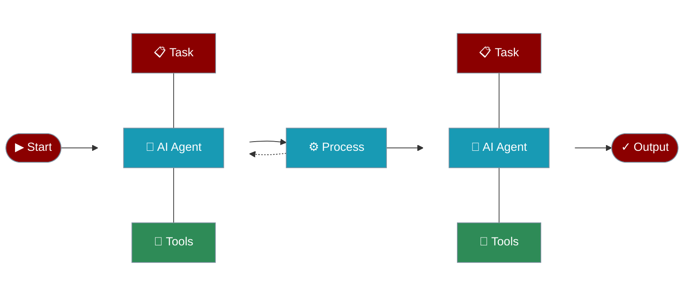

## AI Agents with Tools

Create AI agents that can use tools to interact with external systems and perform actions.

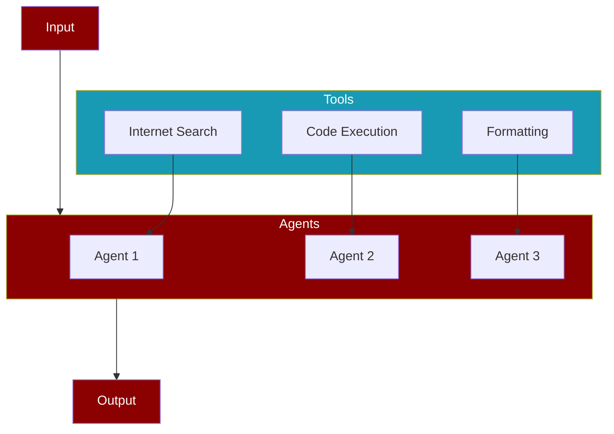

## AI Agents with Memory

Create AI agents with memory capabilities for maintaining context and information across tasks.

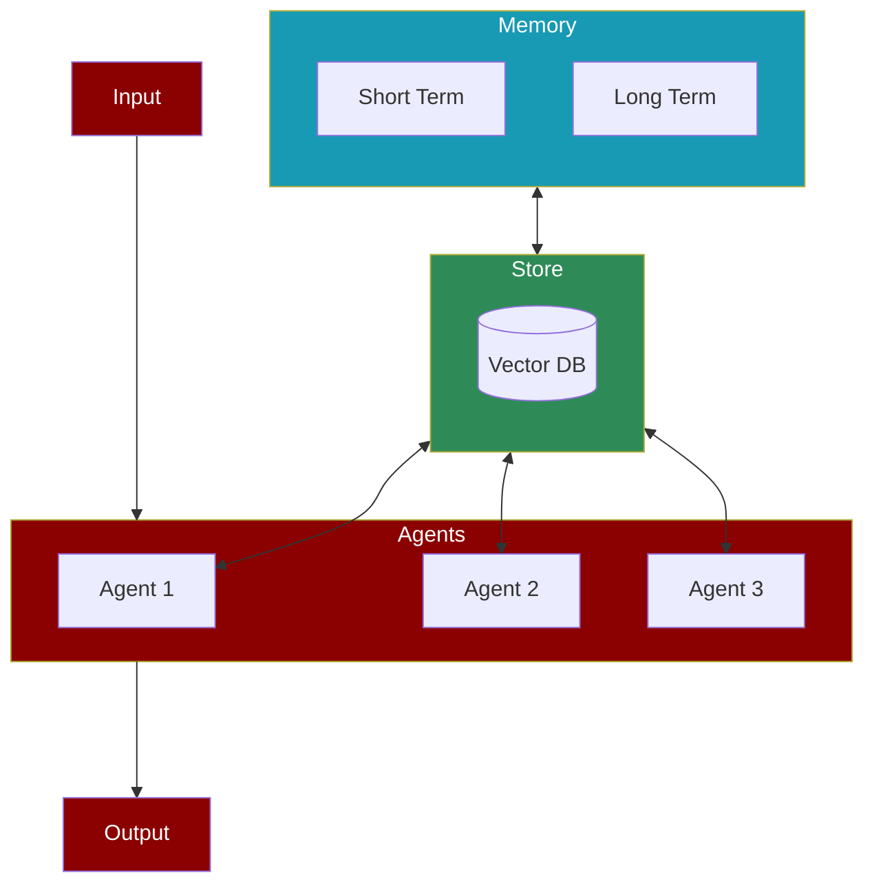

## AI Agents with Different Processes

### Sequential Process

The simplest form of task execution where tasks are performed one after another.

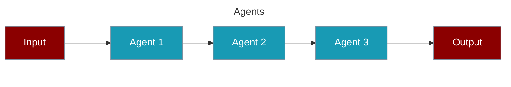

### Hierarchical Process

Uses a manager agent to coordinate task execution and agent assignments.

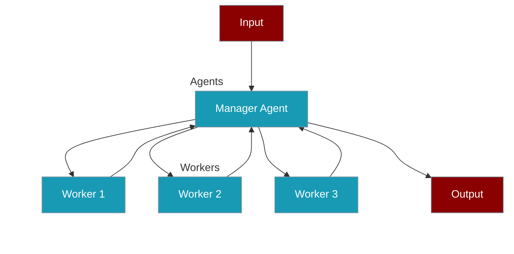

### Workflow Process

Advanced process type supporting complex task relationships and conditional execution.

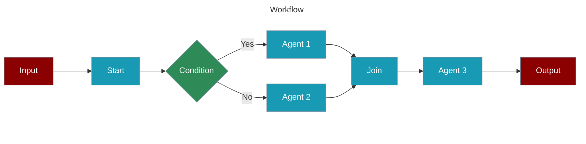

#### Agentic Routing Workflow

Create AI agents that can dynamically route tasks to specialized LLM instances.

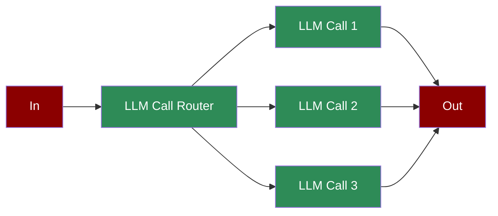

#### Agentic Orchestrator Worker

Create AI agents that orchestrate and distribute tasks among specialized workers.

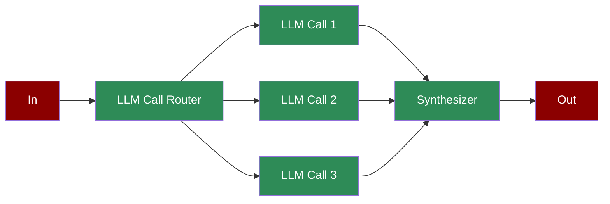

#### Agentic Autonomous Workflow

Create AI agents that can autonomously monitor, act, and adapt based on environment feedback.

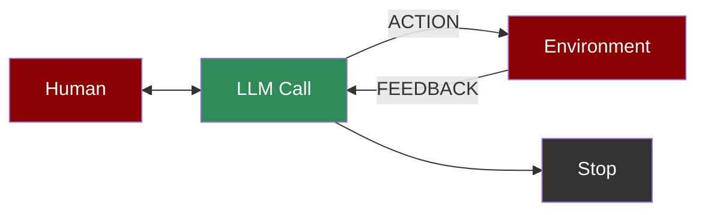

#### Agentic Parallelization

Create AI agents that can execute tasks in parallel for improved performance.

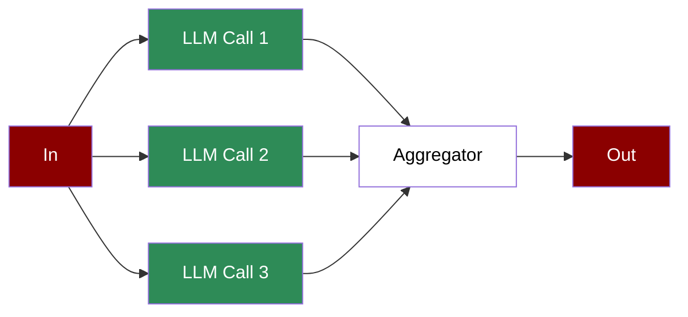

#### Agentic Prompt Chaining

Create AI agents with sequential prompt chaining for complex workflows.

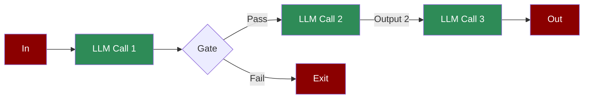

#### Agentic Evaluator Optimizer

Create AI agents that can generate and optimize solutions through iterative feedback.


#### Repetitive Agents

Create AI agents that can efficiently handle repetitive tasks through automated loops.

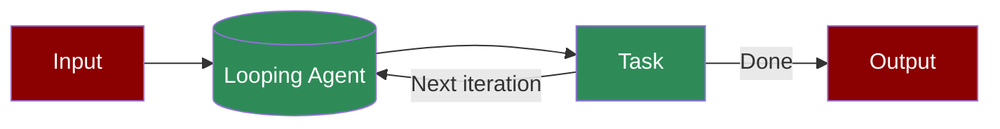

## Adding Models

<div align="center">
  <a href="https://docs.praison.ai/models">
    <p align="center">
      
    </p>
  </a>
</div>

## Ollama Integration
```bash
export OPENAI_BASE_URL=http://localhost:11434/v1
```

## Groq Integration
Replace xxxx with Groq API KEY:
```bash
export OPENAI_API_KEY=xxxxxxxxxxx
export OPENAI_BASE_URL=https://api.groq.com/openai/v1
```

## No Code Options

## Agents Playbook

### Simple Playbook Example

Create `agents.yaml` file and add the code below:

```yaml
framework: praisonai
topic: Artificial Intelligence
roles:
  screenwriter:
    backstory: "Skilled in crafting scripts with engaging dialogue about {topic}."
    goal: Create scripts from concepts.
    role: Screenwriter
    tasks:
      scriptwriting_task:
        description: "Develop scripts with compelling characters and dialogue about {topic}."
        expected_output: "Complete script ready for production."
```

*To run the playbook:*
```bash
praisonai agents.yaml
```

## Use 100+ Models

- https://docs.praison.ai/models/
<div align="center">
  <a href="https://docs.praison.ai">
    <p align="center">
      
    </p>
  </a>
</div>

## Custom Tools

### Using `@tool` Decorator

```python
from praisonaiagents import Agent, tool

@tool
def search(query: str) -> str:
    """Search the web for information."""
    return f"Results for: {query}"

@tool
def calculate(expression: str) -> float:
    """Evaluate a math expression."""
    return eval(expression)

agent = Agent(
    instructions="You are a helpful assistant",
    tools=[search, calculate]
)
agent.start("Search for AI news and calculate 15*4")
```

### Using `BaseTool` Class

```python
from praisonaiagents import Agent, BaseTool

class WeatherTool(BaseTool):
    name = "weather"
    description = "Get current weather for a location"
    
    def run(self, location: str) -> str:
        return f"Weather in {location}: 72°F, Sunny"

agent = Agent(
    instructions="You are a weather assistant",
    tools=[WeatherTool()]
)
agent.start("What's the weather in Paris?")
```

### Creating a Tool Package (pip installable)

```toml
# pyproject.toml
[project]
name = "my-praisonai-tools"
version = "1.0.0"
dependencies = ["praisonaiagents"]

[project.entry-points."praisonaiagents.tools"]
my_tool = "my_package:MyTool"
```

```python
# my_package/__init__.py
from praisonaiagents import BaseTool

class MyTool(BaseTool):
    name = "my_tool"
    description = "My custom tool"
    
    def run(self, param: str) -> str:
        return f"Result: {param}"
```

After `pip install`, tools are auto-discovered:
```python
agent = Agent(tools=["my_tool"])  # Works automatically!
```


## Prompt Expansion

Expand short prompts into detailed, actionable prompts:

### CLI Usage

```bash
# Expand a short prompt into detailed prompt
praisonai "write a movie script in 3 lines" --expand-prompt

# With verbose output
praisonai "blog about AI" --expand-prompt -v

# With tools for context gathering
praisonai "latest AI trends" --expand-prompt --expand-tools tools.py

# Combine with query rewrite
praisonai "AI news" --query-rewrite --expand-prompt
```

### Programmatic Usage

```python
from praisonaiagents import PromptExpanderAgent, ExpandStrategy

# Basic usage
agent = PromptExpanderAgent()
result = agent.expand("write a movie script in 3 lines")
print(result.expanded_prompt)

# With specific strategy
result = agent.expand("blog about AI", strategy=ExpandStrategy.DETAILED)

# Available strategies: BASIC, DETAILED, STRUCTURED, CREATIVE, AUTO
```

**Key Difference:**
- `--query-rewrite`: Optimizes queries for **search/retrieval** (RAG)
- `--expand-prompt`: Expands prompts for **detailed task execution**


## Web Search, Web Fetch & Prompt Caching

### CLI Usage

```bash
# Web Search - Get real-time information
praisonai "What are the latest AI news today?" --web-search --llm openai/gpt-4o-search-preview

# Web Fetch - Retrieve and analyze URL content (Anthropic only)
praisonai "Summarize https://docs.praison.ai" --web-fetch --llm anthropic/claude-sonnet-4-20250514

# Prompt Caching - Reduce costs for repeated prompts
praisonai "Analyze this document..." --prompt-caching --llm anthropic/claude-sonnet-4-20250514
```

### Programmatic Usage

```python
from praisonaiagents import Agent

# Web Search
agent = Agent(
    instructions="You are a research assistant",
    llm="openai/gpt-4o-search-preview",
    web_search=True
)

# Web Fetch (Anthropic only)
agent = Agent(
    instructions="You are a content analyzer",
    llm="anthropic/claude-sonnet-4-20250514",
    web_fetch=True
)

# Prompt Caching
agent = Agent(
    instructions="You are an AI assistant..." * 50,  # Long system prompt
    llm="anthropic/claude-sonnet-4-20250514",
    prompt_caching=True
)
```

**Supported Providers:**
| Feature | Providers |
|---------|-----------|
| Web Search | OpenAI, Gemini, Anthropic, xAI, Perplexity |
| Web Fetch | Anthropic |
| Prompt Caching | OpenAI (auto), Anthropic, Bedrock, Deepseek |


## MCP (Model Context Protocol)

PraisonAI supports MCP Protocol Revision 2025-11-25 with multiple transports.

### MCP Client (Consume MCP Servers)

```python
from praisonaiagents import Agent, MCP

# stdio - Local NPX/Python servers
agent = Agent(tools=MCP("npx @modelcontextprotocol/server-memory"))

# Streamable HTTP - Production servers
agent = Agent(tools=MCP("https://api.example.com/mcp"))

# WebSocket - Real-time bidirectional
agent = Agent(tools=MCP("wss://api.example.com/mcp", auth_token="token"))

# SSE (Legacy) - Backward compatibility
agent = Agent(tools=MCP("http://localhost:8080/sse"))

# With environment variables
agent = Agent(
    tools=MCP(
        command="npx",
        args=["-y", "@modelcontextprotocol/server-brave-search"],
        env={"BRAVE_API_KEY": "your-key"}
    )
)
```

### MCP Server (Expose Tools as MCP Server)

Expose your Python functions as MCP tools for Claude Desktop, Cursor, and other MCP clients:

```python
from praisonaiagents.mcp import ToolsMCPServer

def search_web(query: str, max_results: int = 5) -> dict:
    """Search the web for information."""
    return {"results": [f"Result for {query}"]}

def calculate(expression: str) -> dict:
    """Evaluate a mathematical expression."""
    return {"result": eval(expression)}

# Create and run MCP server
server = ToolsMCPServer(name="my-tools")
server.register_tools([search_web, calculate])
server.run()  # stdio for Claude Desktop
# server.run_sse(host="0.0.0.0", port=8080)  # SSE for web clients
```

### MCP Features

| Feature | Description |
|---------|-------------|
| **Session Management** | Automatic `Mcp-Session-Id` handling |
| **Protocol Versioning** | `Mcp-Protocol-Version` header |
| **Resumability** | SSE stream recovery via `Last-Event-ID` |
| **Security** | Origin validation, DNS rebinding prevention |
| **WebSocket** | Auto-reconnect with exponential backoff |


## Development:

Below is used for development only.

### Using uv
```bash
# Install uv if you haven't already
pip install uv

# Install from requirements
uv pip install -r pyproject.toml

# Install with extras
uv pip install -r pyproject.toml --extra code
uv pip install -r pyproject.toml --extra "crewai,autogen"
```

### Bump and Release

```bash
# From project root - bumps version and releases in one command
python src/praisonai/scripts/bump_and_release.py 2.2.99

# With praisonaiagents dependency
python src/praisonai/scripts/bump_and_release.py 2.2.99 --agents 0.0.169

# Then publish
cd src/praisonai && uv publish
```

## Contributing

- Fork on GitHub: Use the "Fork" button on the repository page.
- Clone your fork: `git clone https://github.com/yourusername/praisonAI.git`
- Create a branch: `git checkout -b new-feature`
- Make changes and commit: `git commit -am "Add some feature"`
- Push to your fork: `git push origin new-feature`
- Submit a pull request via GitHub's web interface.
- Await feedback from project maintainers.

## Advanced Features

**Research & Intelligence:**
- 🔬 **Deep Research Agents** (OpenAI & Gemini)
- 🔄 **Query Rewriter Agent** (HyDE, Step-back, Multi-query)
- 🌐 **Native Web Search** (OpenAI, Gemini, Anthropic, xAI, Perplexity)
- 📥 **Web Fetch** (Retrieve full content from URLs - Anthropic)
- 📝 **Prompt Expander Agent** (Expand short prompts into detailed instructions)

**Memory & Caching:**
- 💾 **Prompt Caching** (Reduce costs & latency - OpenAI, Anthropic, Bedrock, Deepseek)
- 🧠 **Claude Memory Tool** (Persistent cross-conversation memory - Anthropic Beta)
- 💾 **File-Based Memory** (Zero-dependency persistent memory for all agents)
- 🔍 **Built-in Search Tools** (Tavily, You.com, Exa - web search, news, content extraction)

**Planning & Workflows:**
- 📋 **Planning Mode** (Plan before execution - Agent & Multi-Agent)
- 🔧 **Planning Tools** (Research with tools during planning)
- 🧠 **Planning Reasoning** (Chain-of-thought planning)
- ⛓️ **Prompt Chaining** (Sequential prompt workflows with gates)
- 🔍 **Evaluator Optimiser** (Generate and optimize through iterative feedback)
- 👷 **Orchestrator Workers** (Distribute tasks among specialized workers)
- ⚡ **Parallelisation** (Execute tasks in parallel for improved performance)
- 🔁 **Repetitive Agents** (Handle repetitive tasks through automated loops)
- 🤖 **Autonomous Workflow** (Monitor, act, adapt based on environment feedback)

**Agent Types:**
- 🖼️ **Image Generation Agent** (Create images from text descriptions)
- 📷 **Image to Text Agent** (Extract text and descriptions from images)
- 🎬 **Video Agent** (Analyze and process video content)
- 📊 **Data Analyst Agent** (Analyze data and generate insights)
- 💰 **Finance Agent** (Financial analysis and recommendations)
- 🛒 **Shopping Agent** (Price comparison and shopping assistance)
- ⭐ **Recommendation Agent** (Personalized recommendations)
- 📖 **Wikipedia Agent** (Search and extract Wikipedia information)
- 💻 **Programming Agent** (Code development and analysis)
- 📝 **Markdown Agent** (Generate and format Markdown content)
- 🔀 **Router Agent** (Dynamic task routing with cost optimization)

**MCP Protocol:**
- 🔌 **MCP Transports** (stdio, Streamable HTTP, WebSocket, SSE - Protocol 2025-11-25)
- 🌐 **WebSocket MCP** (Real-time bidirectional connections with auto-reconnect)
- 🔐 **MCP Security** (Origin validation, DNS rebinding prevention, secure sessions)
- 🔄 **MCP Resumability** (SSE stream recovery via Last-Event-ID)

**Safety & Control:**
- 🤝 **Agent Handoffs** (Transfer context between specialized agents)
- 🛡️ **Guardrails** (Input/output validation and safety checks)
- ✅ **Human Approval** (Require human confirmation for critical actions)
- 💬 **Sessions Management** (Isolated conversation contexts)
- 🔄 **Stateful Agents** (Maintain state across interactions)

**Developer Tools:**
- ⚡ **Fast Context** (Rapid parallel code search - 10-20x faster than traditional methods)
- 📜 **Rules & Instructions** (Auto-discover CLAUDE.md, AGENTS.md, GEMINI.md)
- 🪝 **Hooks** (Pre/post operation hooks for custom logic)
- 📈 **Telemetry** (Track agent performance and usage)
- 📹 **Camera Integration** (Capture and analyze camera input)

## Other Features

- 🔄 Use CrewAI or AG2 (Formerly AutoGen) Framework
- 💻 Chat with ENTIRE Codebase
- 🎨 Interactive UIs
- 📄 YAML-based Configuration
- 🛠️ Custom Tool Integration
- 🔍 Internet Search Capability (Tavily, You.com, Exa, DuckDuckGo, Crawl4AI)
- 🖼️ Vision Language Model (VLM) Support
- 🎙️ Real-time Voice Interaction

## Video Tutorials

| Topic | Video |
|-------|--------|
| AI Agents with Self Reflection | [](https://www.youtube.com/watch?v=vLXobEN2Vc8) |
| Reasoning Data Generating Agent | [](https://www.youtube.com/watch?v=fUT332Y2zA8) |
| AI Agents with Reasoning | [](https://www.youtube.com/watch?v=KNDVWGN3TpM) |
| Multimodal AI Agents | [](https://www.youtube.com/watch?v=hjAWmUT1qqY) |
| AI Agents Workflow | [](https://www.youtube.com/watch?v=yWTH44QPl2A) |
| Async AI Agents | [](https://www.youtube.com/watch?v=VhVQfgo00LE) |
| Mini AI Agents | [](https://www.youtube.com/watch?v=OkvYp5aAGSg) |
| AI Agents with Memory | [](https://www.youtube.com/watch?v=1hVfVxvPnnQ) |
| Repetitive Agents | [](https://www.youtube.com/watch?v=dAYGxsjDOPg) |
| Introduction | [](https://www.youtube.com/watch?v=Fn1lQjC0GO0) |
| Tools Overview | [](https://www.youtube.com/watch?v=XaQRgRpV7jo) |
| Custom Tools | [](https://www.youtube.com/watch?v=JSU2Rndh06c) |
| Firecrawl Integration | [](https://www.youtube.com/watch?v=UoqUDcLcOYo) |
| User Interface | [](https://www.youtube.com/watch?v=tg-ZjNl3OCg) |
| Crawl4AI Integration | [](https://www.youtube.com/watch?v=KAvuVUh0XU8) |
| Chat Interface | [](https://www.youtube.com/watch?v=sw3uDqn2h1Y) |
| Code Interface | [](https://www.youtube.com/watch?v=_5jQayO-MQY) |
| Mem0 Integration | [](https://www.youtube.com/watch?v=KIGSgRxf1cY) |
| Training | [](https://www.youtube.com/watch?v=aLawE8kwCrI) |
| Realtime Voice Interface | [](https://www.youtube.com/watch?v=frRHfevTCSw) |
| Call Interface | [](https://www.youtube.com/watch?v=m1cwrUG2iAk) |
| Reasoning Extract Agents | [](https://www.youtube.com/watch?v=2PPamsADjJA) |

