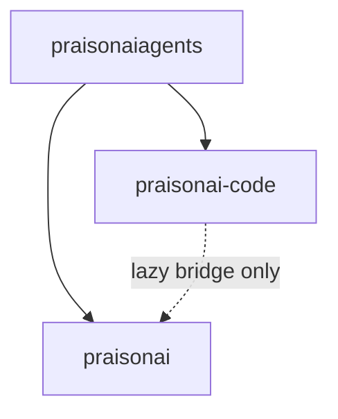

# C8 Architecture Backlog — Reverse Import Elimination

Planning document for **C8**: reduce lazy wrapper imports in `praisonai-code` from
225 → ~40–60 without new PyPI packages. See [`C7.1_BOUNDARIES.md`](C7.1_BOUNDARIES.md)
and [`ARCHITECTURE.md`](../../../ARCHITECTURE.md) §2.

**Status:** Complete on branch `feat/c8-reverse-import-elimination` — **0** reverse import lines (baseline 50).

---

## Phase tracker

| Phase | Scope | Baseline target | Status |
|-------|-------|-----------------|--------|
| C8.1 | `_WRAPPER_RESIDENT_COMMANDS`, import gate regex, tests | 50 | Done |
| C8.2A–E | Command repatriation + serve bridge | 0 | Done |
| C8.3 | cli/features/* repatriation | 0 | Done |
| C8.4 | legacy/ modules (inbuilt_tools, prompt_dispatch) | 0 | Done |
| C8.5 | Bridge normalisation + SDK protocols | 0 | Done |

**Out of scope:** `praisonai-bot`, `praisonai-frameworks` PyPI splits.

---

## Current state

| Item | Value |
|------|-------|
| Lazy wrapper import lines | 0 (regression-gated; baseline 50) |
| Allowlisted files | 0 (empty — add only after review) |
| Agentic hot path | Standalone — no module-level `praisonai` import |
| Cross-tier access | `praisonai_code._wrapper_bridge` only |

---

## Repatriation pattern (per command/feature)

1. Move impl from `praisonai_code/...` → `praisonai/...` (replace C5 shim).
2. Delete code copy; add command name to `_WRAPPER_RESIDENT_COMMANDS`.
3. Remove path from allowlist; lower baseline in `check_c7_imports.sh`.
4. Run gates: `check_c7_imports.sh`, `test_c7_1_boundaries.py`, `test_c5_backward_compat.py`.

---

## Dependency rules (must hold through C8)



- **`praisonai-code` must not declare `praisonai` in `pyproject.toml`**
- **`praisonaiagents` must not depend on `praisonai` or `praisonai-code`**
- **Wrapper may depend on code + agents** (one-way chain)

---

## Verification

```bash
bash scripts/check_c7_imports.sh
pytest src/praisonai/tests/unit/test_c7_1_boundaries.py
pytest src/praisonai/tests/unit/test_c5_backward_compat.py
```

---

## Out of scope (product gaps)

| Issue | Topic |
|-------|-------|
| #1328 | Channel plugin packs vs in-tree registration |
| #1325 | Canvas-class macOS shell vs Claw |
| #1872 | Runtime Open Federation |
