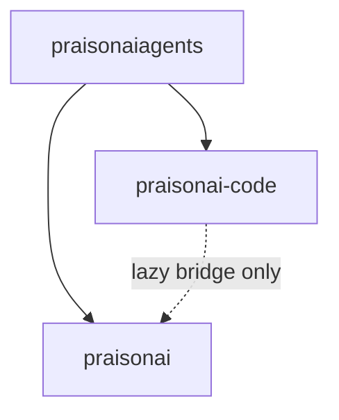

# C8 Architecture Backlog — Reverse Import Elimination

Planning document for **C8**: reduce lazy wrapper imports in `praisonai-code` from
225 → ~40–60 without new PyPI packages. See [`C7.1_BOUNDARIES.md`](C7.1_BOUNDARIES.md)
and [`ARCHITECTURE.md`](../../../ARCHITECTURE.md) §2.

**Status:** **Complete on main** (merged PR #2590, #2592, #2605) — **0** direct reverse import lines (regression baseline 50).

---

## Phase tracker

| Phase | Scope | Baseline target | Status |
|-------|-------|-----------------|--------|
| C8.1 | `_WRAPPER_RESIDENT_COMMANDS`, import gate regex, tests | 50 | Done |
| C8.2A–E | Command repatriation + serve bridge | 0 | Done |
| C8.3 | cli/features/* repatriation | 0 | Done |
| C8.4 | legacy/ modules (inbuilt_tools, prompt_dispatch) | 0 | Done (partial — see deferred) |
| C8.5 | Bridge normalisation + SDK protocols | 0 | Done |

**Out of scope:** `praisonai-bot`, `praisonai-frameworks` PyPI splits.

**Deferred (C8.4 follow-up epic):** Physical move of ~6k-line `PraisonAI` class to `praisonai/cli/legacy/praison_class.py`; thin code `main.py` (≤300 lines).

---

## Current state

| Item | Value |
|------|-------|
| Direct wrapper import lines | 0 (regression-gated; baseline 50) |
| Bridge call sites (`import_wrapper_module`) | ~45 (by design — not counted by gate) |
| Allowlisted files | 0 (empty — add only after review) |
| Wrapper-resident commands | 33 in `_WRAPPER_RESIDENT_COMMANDS` |
| Agentic hot path | Standalone — no module-level `praisonai` import |
| Cross-tier access | `praisonai_code._wrapper_bridge` + hybrid re-export shims |

---

## Hybrid module patterns (post-C8)

| Pattern | Example | Resolution |
|---------|---------|------------|
| Code-only | `mcp`, `doctor`, TUI widgets | `praisonai.cli.features` extends `__path__` to code |
| Wrapper-only + code bridge | `tools`, `workflow`, `core`, `async_tui` | Wrapper impl; code `_wrapper_reexport` shim |
| Split hybrid | `tui` (app in wrapper, widgets in code) | Wrapper `tui/__init__.py` extends `__path__` to code |

Audit: `python scripts/audit_hybrid_modules.py` or `pytest test_c7_1_boundaries.py::test_c8_hybrid_module_imports`.

---

## Repatriation pattern (per command/feature)

1. Move impl from `praisonai_code/...` → `praisonai/...` (replace C5 shim).
2. Delete code copy; add command name to `_WRAPPER_RESIDENT_COMMANDS`.
3. Remove path from allowlist; lower baseline in `check_c7_imports.sh`.
4. Run gates: `check_c7_imports.sh`, `audit_hybrid_modules.py`, `test_c7_1_boundaries.py`, `test_c5_backward_compat.py`.

---

## Dependency rules (must hold through C8)



- **`praisonai-code` must not declare `praisonai` in `pyproject.toml`**
- **`praisonaiagents` must not depend on `praisonai` or `praisonai-code`**
- **Wrapper may depend on code + agents** (one-way chain)

---

## Verification

```bash
bash scripts/check_c7_imports.sh
python scripts/audit_hybrid_modules.py
pytest src/praisonai/tests/unit/test_c7_1_boundaries.py
pytest src/praisonai/tests/unit/test_c5_backward_compat.py
```

---

## Out of scope (product gaps)

| Issue | Topic |
|-------|-------|
| #1328 | Channel plugin packs vs in-tree registration |
| #1325 | Canvas-class macOS shell vs Claw |
| #1872 | Runtime Open Federation |
