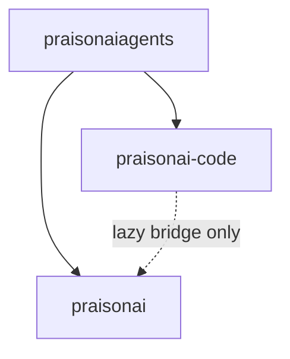

# C8+ Architecture Backlog

Planning document for work **after** C7 (hot path) and C7.1 (boundary hardening).
See [`C7.1_BOUNDARIES.md`](C7.1_BOUNDARIES.md) for completed scope and
[`ARCHITECTURE.md`](../../../ARCHITECTURE.md) §2 for the current three-tier model.

**Status:** Not started — prioritise when product needs justify the migration cost.

---

## Current state (post v4.6.110)

| Item | Value |
|------|-------|
| Lazy wrapper import lines in `praisonai-code` | 225 (regression-gated) |
| Allowlisted files | ~47 (see `scripts/c7_wrapper_import_allowlist.txt`) |
| Agentic hot path | Standalone — no module-level `praisonai` import |
| Cross-tier access | `praisonai_code._wrapper_bridge` only |

---

## C8 goals (proposed)

### 1. Zero reverse-import elimination

**Objective:** Reduce or remove the 225 lazy `from praisonai` / `import praisonai`
lines in `praisonai-code` without breaking standalone `run`/`chat`/`code`.

**Approach options:**

| Option | Pros | Cons |
|--------|------|------|
| **A. Move implementations down** | Cleaner dependency graph | Large moves; duplicates wrapper logic |
| **B. Extract shared protocols to SDK** | Protocol-first; minimal coupling | Does not remove all wrapper calls |
| **C. RPC / subprocess boundary** | Hard isolation | Latency, complexity |
| **D. Incremental allowlist shrink** | Low risk per PR | Long tail; needs per-file justification |

**Recommended phasing:** Option D first (shrink allowlist file-by-file), then B for
shared interfaces, defer A/C unless a feature explicitly requires hard isolation.

**Acceptance criteria:**

- [ ] Baseline count decreases with each approved migration PR
- [ ] `bash scripts/check_c7_imports.sh` still passes
- [ ] Standalone CI smoke unchanged
- [ ] No new PyPI dependency from `praisonai-code` → `praisonai`

---

### 2. Separate PyPI packages

**Objective:** Optional install targets for heavy subsystems currently bundled in
the `praisonai` wrapper.

| Proposed package | Would own | Depends on |
|------------------|-----------|------------|
| `praisonai-frameworks` | CrewAI, AutoGen, Agno, ADK adapters (already partially aliased in wrapper extras) | `praisonaiagents`, `praisonai-code` |
| `praisonai-bot` | BotOS, platform adapters (Telegram, Discord, Slack, …) | `praisonaiagents`, `praisonai-code` |
| `praisonai-gateway` | WebSocket gateway server + client registry | `praisonaiagents`, optional `praisonai-bot` |

**Publish order (unchanged core):** `praisonaiagents` → `praisonai-code` → optional extras → `praisonai` meta-package

**Acceptance criteria:**

- [ ] `pip install praisonai` remains the full install (meta-package pulls extras)
- [ ] `pip install praisonai-code` stays standalone for terminal agents
- [ ] Each new package has its own import gate / test shard
- [ ] Mintlify docs updated per package

---

### 3. Legacy `cli/main.py` rewrite

**Objective:** Replace the ~7k-line legacy argparse body in
`praisonai_code/cli/main.py` with Typer-native paths or thin delegation, without
breaking `praisonai agents.yaml` / multi-framework YAML workflows.

**Scope:**

- Invocation boundary only — not wholesale feature removal
- Preserve `praisonai.__main__` router (Typer-first, legacy fallback)
- Framework YAML paths continue to use `praisonai.framework_adapters` via bridge

**Acceptance criteria:**

- [ ] `test_c5_backward_compat.py` passes
- [ ] Legacy entry points documented in C7.1 invocation matrix
- [ ] No regression in `--framework crewai` / `--file agents.yaml` flows

---

## Dependency rules (must hold through C8)



- **`praisonai-code` must not declare `praisonai` in `pyproject.toml`**
- **`praisonaiagents` must not depend on `praisonai` or `praisonai-code`**
- **Wrapper may depend on code + agents** (one-way chain)

---

## Suggested prioritisation

| Priority | Item | Rationale |
|----------|------|-----------|
| P2 | Allowlist shrink (incremental) | Low risk; measurable progress |
| P2 | `praisonai-frameworks` split | Already partially aliased in wrapper extras |
| P3 | `praisonai-bot` split | Large surface; BotOS docs exist |
| P3 | Legacy `main.py` rewrite | High regression risk; defer until test coverage improves |
| P4 | Zero lazy imports | End state; not blocking releases |

---

## Verification (unchanged from C7.1)

```bash
bash scripts/check_c7_imports.sh
pytest src/praisonai/tests/unit/test_c7_1_boundaries.py
pytest src/praisonai/tests/unit/test_c5_backward_compat.py
```

---

## Out of scope (product gaps, not C8 packaging)

| Issue | Topic |
|-------|-------|
| #1328 | Channel plugin packs vs in-tree registration |
| #1325 | Canvas-class macOS shell vs Claw |
| #1872 | Runtime Open Federation |

---

## Sign-off

- [ ] C8 scope agreed by Architecture Review Council
- [ ] First incremental allowlist-shrink PR merged
- [ ] Optional package naming published on PyPI
